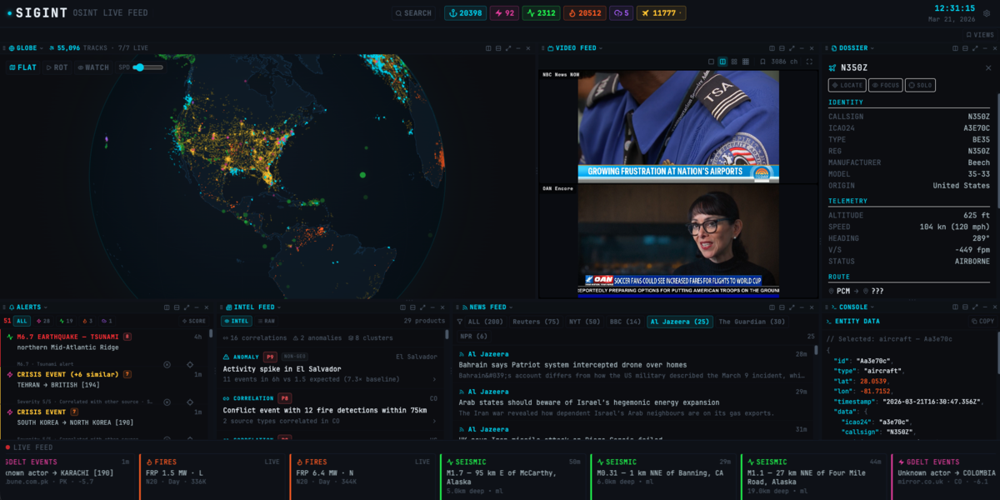

# SIGINT

Real-time OSINT dashboard with live aircraft, vessel, seismic, fire, weather, and event tracking on an interactive globe. Built with Bun, React 19, and a custom Canvas 2D + Web Worker rendering engine. Installable as a PWA.

## Screenshot



## Table of Contents

- [SIGINT](#sigint)
  - [Screenshot](#screenshot)
  - [Table of Contents](#table-of-contents)
  - [Features](#features)
    - [Live Data](#live-data)
    - [Intelligence](#intelligence)
    - [Visualization](#visualization)
    - [Platform](#platform)
  - [Installation](#installation)
  - [Quick Start](#quick-start)
  - [Environment Variables](#environment-variables)
  - [Data Sources](#data-sources)
  - [Testing](#testing)
  - [Deployment](#deployment)
    - [Development](#development)
    - [Production](#production)
    - [Production with TLS](#production-with-tls)
    - [Heroku](#heroku)
    - [Cleanup](#cleanup)
  - [PWA](#pwa)
  - [Documentation](#documentation)
  - [License](#license)
  - [Author](#author)

## Features

### Live Data

- Aircraft tracking (OpenSky Network)
- AIS vessel tracking (aisstream.io)
- Seismic monitoring (USGS)
- Fire hotspot detection (NASA FIRMS)
- Severe weather alerts (NOAA)
- GDELT event intelligence
- RSS news aggregation (6 world sources)
- HLS video feeds (iptv-org)

### Intelligence

- Correlation engine with cross-source products and scored alerts
- Military aircraft classification
- Watch mode (automated globe tour)
- Entity dossier with photos, routes, metadata

### Visualization

- Globe and flat map projections
- Multi-pane resizable layout with drag, minimize, presets
- Camera lock-on, isolation modes, trail rendering
- Global search with live globe filtering
- Virtual-scrolling data table
- Live ticker feed

### Platform

- Dark/light themes
- Mobile responsive with separate layout presets
- PWA with offline support, update notifications, pull-to-refresh
- Offline indicator with connectivity detection
- Cookie-authenticated API (HMAC-SHA256, HttpOnly)

## Installation

```bash
git clone https://github.com/iitoneloc/sigint.git
cd sigint
bun install
```

Create a `.env` file in the project root with at minimum:

```
SIGINT_SERVER_SECRET=<output of openssl rand -hex 32>
```

Optionally add keys for ship and fire data:

```
AISSTREAM_API_KEY=<your aisstream.io key>
FIRMS_MAP_KEY=<your NASA FIRMS key>
```

## Quick Start

See [Deployment](#deployment) for dev, production, and Heroku options.

## Environment Variables

| Variable | Required | Description |
|----------|----------|-------------|
| `SIGINT_SERVER_SECRET` | **Yes** | Auth token signing key. `openssl rand -hex 32` |
| `AISSTREAM_API_KEY` | No | [aisstream.io](https://aisstream.io) key for live ship data |
| `FIRMS_MAP_KEY` | No | [NASA FIRMS](https://firms.modaps.eosdis.nasa.gov/api/map_key/) key for fire data |
| `DOMAIN` | No | Domain for Let's Encrypt TLS |
| `PORT` | No | Server port (default: 3000) |

## Data Sources

| Layer | Source | Poll |
|-------|--------|------|
| Aircraft | [OpenSky Network](https://opensky-network.org/apidoc/) (client-side) | 240s |
| Ships | [aisstream.io](https://aisstream.io) (server WebSocket) | 300s |
| Seismic | [USGS](https://earthquake.usgs.gov/earthquakes/feed/v1.0/) (client-side) | 420s |
| Fires | [NASA FIRMS](https://firms.modaps.eosdis.nasa.gov/) (server-side) | 600s |
| Weather | [NOAA](https://api.weather.gov/) (client-side) | 300s |
| Events | [GDELT 2.0](https://www.gdeltproject.org/) (server-side) | 15m |
| News | 6 RSS feeds (server-side) | 10m |

## Testing

```bash
bun test            # run all tests
bun test --watch    # watch mode
bun run docker:test # run in Docker
```

## Deployment

### Development

```bash
bun run docker:dev:up          # https://localhost (self-signed cert)
bun run docker:dev:down        # stop
```

### Production

```bash
bun run docker:prod:up         # http://localhost:3000
bun run docker:prod:down       # stop
```

### Production with TLS

```bash
DOMAIN=sigint.example.com bun run docker:prod:tls:up
bun run docker:prod:tls:down   # stop
```

### Heroku

```bash
git push heroku main
```

### Cleanup

```bash
bun run docker:clean:all       # remove containers, volumes, images
```

## PWA

SIGINT is installable as a Progressive Web App. After visiting the deployed app:

- **Desktop (Chrome/Edge)**: Click the install icon in the address bar
- **iOS Safari**: Share > Add to Home Screen
- **Android Chrome**: Menu > Add to Home Screen

The service worker caches the app shell for offline boot. Live data loads from IndexedDB when offline. An offline indicator bar appears when connectivity is lost, with a RETRY button and pull-to-refresh on touch devices. When an update is available, a banner prompts the user to reload — no silent mid-session code swaps.

## Documentation

Full technical docs in [`docs/`](./docs/README.md) covering architecture, data flow, feature system, pane system, rendering, caching, search, and constraints.

## License

Dual-licensed:

- **Non-commercial** free under the [SIGINT Non-Commercial License](./LICENSE.md)
- **Commercial** [contact the author](https://github.com/iiTONELOC) for terms

## Author

[Anthony Tropeano](https://github.com/iiTONELOC)