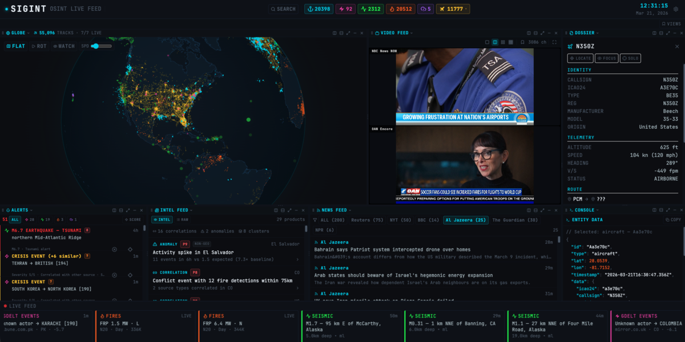

# SIGINT

Real-time OSINT dashboard with live aircraft, vessel, seismic, fire, weather, and event tracking on an interactive globe. Built with Bun, React 19, and a custom Canvas 2D + Web Worker rendering engine. Installable as a PWA.

## Screenshot



## Table of Contents

- [SIGINT](#sigint)
  - [Screenshot](#screenshot)
  - [Table of Contents](#table-of-contents)
  - [Features](#features)
    - [Live Data](#live-data)
    - [Intelligence](#intelligence)
    - [Visualization](#visualization)
    - [Platform](#platform)
  - [Installation](#installation)
  - [Quick Start](#quick-start)
  - [Environment Variables](#environment-variables)
  - [Data Sources](#data-sources)
  - [Testing](#testing)
  - [Deployment](#deployment)
    - [Development](#development)
    - [Production](#production)
    - [Production with TLS](#production-with-tls)
    - [Heroku](#heroku)
    - [Cleanup](#cleanup)
  - [PWA](#pwa)
  - [Documentation](#documentation)
  - [License](#license)
  - [Author](#author)

## Features

### Live Data

- Aircraft tracking ([adsb.fi](https://opendata.adsb.fi))
- AIS vessel tracking (aisstream.io)
- Seismic monitoring (USGS)
- Fire hotspot detection (NASA FIRMS)
- Severe weather alerts (NOAA)
- Tropical cyclone tracking (NHC: active storms, 5-day forecast cone, advisories)
- GDELT event intelligence
- RSS news aggregation (6 world sources)
- HLS video feeds (iptv-org)

### Tropical Cyclone Tracking

Active Atlantic, Eastern Pacific, and Central Pacific basins from the [NHC `CurrentStorms.json`](https://www.nhc.noaa.gov/CurrentStorms.json) feed (server-proxied every 30 min). For each active storm:

- Current position, max wind, classification, basin
- Official NHC 5-day forecast cone (KMZ parsed server-side into a GeoJSON polygon)
- Forecast track points (12h–120h)
- Text products: Public Advisory, Forecast Discussion, Wind Probabilities
- Storm dossier pane with the full advisory text and forecast table
- Correlation rules: Hurricane Hunter aircraft proximity, ships sheltering in the lee, GDELT events on the forecast track

Out-of-season returns an empty `activeStorms: []` as a 200, not a 503. The three in-scope NHC basin gates are closed from December 16 through May 14 when the cache is empty. A non-empty cache continues to refresh until the active storm clears.

### Intelligence

- Correlation engine with cross-source products and scored alerts
- Military aircraft classification
- Watch mode (automated globe tour)
- Entity dossier with photos, routes, metadata

### Visualization

- Globe and flat map projections
- Multi-pane resizable layout with drag, minimize, presets
- Camera lock-on, isolation modes, trail rendering
- Global search with live globe filtering
- Virtual-scrolling data table
- Live ticker feed

### Platform

- Dark/light themes
- Mobile responsive with separate live layouts and shared layout presets
- PWA with offline support, update notifications, pull-to-refresh
- Offline indicator with connectivity detection
- Cookie-authenticated API (HMAC-SHA256, HttpOnly)

## Installation

```bash
git clone https://github.com/iitoneloc/sigint.git
cd sigint
bun install
```

Create a `.env` file in the project root with at minimum:

```
SIGINT_SERVER_SECRET=<output of openssl rand -hex 32>
```

Optionally add a key for ship data. NASA FIRMS uses keyless bulk feeds.

```
AISSTREAM_API_KEY=<your aisstream.io key>
```

## Quick Start

See [Deployment](#deployment) for dev, production, and Heroku options.

## Environment Variables

| Variable                       | Required | Description                                                                                                            |
| ------------------------------ | -------- | ---------------------------------------------------------------------------------------------------------------------- |
| `SIGINT_SERVER_SECRET`         | **Yes**  | Auth token signing key. Must be ≥32 chars. `openssl rand -hex 32`. Server exits 78 without it.                         |
| `AISSTREAM_API_KEY`            | No       | [aisstream.io](https://aisstream.io) key for live ship data                                                            |
| `DOMAIN`                       | No       | Domain for Let's Encrypt TLS                                                                                            |
| `PORT`                         | No       | Server port (default: 5500)                                                                                            |
| `SIGINT_RATE_LIMIT_PER_MINUTE` | No       | Per-client rate-limit cap (default 60). Sliding-window limiter applied to every route.                                  |
| `SIGINT_TRUSTED_PROXY_HOPS`    | No       | Number of trusted proxies in front of the app (default 0). Drives `X-Forwarded-For` rightmost-N client IP extraction.   |

## Data Sources

The browser refresh value is the DataWorker or news-provider request interval. Server collectors can use a different cadence.

| Layer    | Source                                                                                                      | Browser refresh |
| -------- | ----------------------------------------------------------------------------------------------------------- | --------------- |
| Aircraft | [adsb.fi](https://opendata.adsb.fi) (continuous server tile acquisition, 108 tiles × 250 nm, priority hubs) | 15s             |
| Ships    | [aisstream.io](https://aisstream.io) (server WebSocket)                                                     | 15s             |
| Seismic  | [USGS](https://earthquake.usgs.gov/earthquakes/feed/v1.0/) (direct DataWorker fetch)                        | 420s            |
| Fires    | [NASA FIRMS](https://firms.modaps.eosdis.nasa.gov/) (keyless server bulk-feed failover)                     | 600s            |
| Weather  | [NOAA](https://api.weather.gov/) (direct DataWorker fetch)                                                  | 300s            |
| Cyclones | [NHC](https://www.nhc.noaa.gov/CurrentStorms.json) (server-side; KMZ cone + advisory text products)         | 25m             |
| Events   | [GDELT 2.0](https://www.gdeltproject.org/) (server-side)                                                    | 15m             |
| News     | 6 RSS feeds (server-side)                                                                                   | 10m             |

### Aircraft data source: adsb.fi (replaces OpenSky)

Aircraft data is served by [adsb.fi](https://opendata.adsb.fi), a community-supported ADS-B aggregator. Earlier versions of this project used OpenSky Network as the upstream; OpenSky deprecated their free anonymous read tier, so the aircraft path migrated to adsb.fi end-to-end:

- The server runs continuous 108-tile acquisition with a 250 nm radius and at least 3 s between requests. It starts each cold acquisition with 20 priority tiles. The browser never hits adsb.fi directly; adsb.fi enforces a 1 req/sec/IP cap that a per-user budget would burn instantly.
- Records are enriched against the read-only `ac-db.sqlite` (~617k records) before they hit the cache. The SQLite is built from a one-time export of the OpenSky aircraft metadata database via `scripts/convert-aircraft-csv.ts` and is checked in as the bundled NDJSON source (`src/server/data/ac-db.ndjson` → `ac-db.sqlite` at build time). No live calls to OpenSky remain anywhere in the runtime.
- The hex-prefix → country mapping in `src/server/data/icao24CountryRanges.ts` is derived from ICAO Annex 10 and replaces the previous OpenSky country field.

The current browser path starts in `src/client/workers/data/sources/aircraft.ts`. It calls `src/client/features/tracking/aircraft/data/parseAdsbV2.ts`, which requests `/api/aircraft/states`. The DataWorker does not call adsb.fi or OpenSky directly.

## Testing

```bash
bun run tsc --noEmit # check TypeScript
bun test             # run unit and component tests
bun test --watch     # run unit and component tests in watch mode
bun run docker:test  # build and run headless E2E tests in Docker
```

## Deployment

### Development

```bash
bun run docker:dev:up          # https://localhost (self-signed cert)
bun run docker:dev:down        # stop
```

#### Dev-only fixture overrides

Two env vars short-circuit live data fetches in development so you can
work against a known frozen state. Both are gated on
`NODE_ENV !== "production"` and ignored in production builds.

| Env var            | Source it overrides                                        | Valid labels                                                                                                     |
| ------------------ | ---------------------------------------------------------- | ---------------------------------------------------------------------------------------------------------------- |
| `CYCLONES_FIXTURE` | `/api/cyclones/latest` (server fetches NHC)                | `active-season`, `single-cat3`, `empty-out-of-season`                     |
| `AIRCRAFT_FIXTURE` | `/api/aircraft/states` (server fetches adsb.fi tile sweep) | `dossier-baseline`, `hunter-near-cyclone`, `test-snapshot`                |

Labels match `/^[a-z0-9-]+$/` (OWASP A01, with a strict allowlist before any
file lookup) and resolve to `tests/fixtures/<source>/<label>.json`.
Invalid labels throw at startup; missing files throw with the resolved
path. To use:

```bash
CYCLONES_FIXTURE=active-season bun run dev
AIRCRAFT_FIXTURE=test-snapshot bun run dev
```

Or via Docker Compose (`docker-compose.dev.yml` passes both through):

```bash
CYCLONES_FIXTURE=single-cat3 bun run docker:dev:up
```

### Production

```bash
bun run docker:prod:up         # http://localhost:5500
bun run docker:prod:down       # stop
```

### Production with TLS

```bash
DOMAIN=sigint.example.com bun run docker:prod:tls:up
bun run docker:prod:tls:down   # stop
```

### Heroku

```bash
git push heroku main
```

### Cleanup

```bash
bun run docker:clean:all       # remove containers, volumes, images
```

## PWA

SIGINT is installable as a Progressive Web App. After visiting the deployed app:

- **Desktop (Chrome/Edge)**: Click the install icon in the address bar
- **iOS Safari**: Share > Add to Home Screen
- **Android Chrome**: Menu > Add to Home Screen

The service worker caches the app shell for offline boot. Live data loads from IndexedDB when offline. An offline indicator bar appears when connectivity is lost, with a RETRY button and pull-to-refresh on touch devices. When an update is available, a banner prompts the user to reload. The service worker does not replace code during a session.

## Documentation

Full technical docs in [`docs/`](./docs/README.md) covering architecture, data flow, feature system, pane system, rendering, caching, search, and constraints.

## License

Dual-licensed:

- **Non-commercial** free under the [SIGINT Non-Commercial License](./LICENSE)
- **Commercial** [contact the author](https://github.com/iiTONELOC) for terms

## Author

[Anthony Tropeano](https://github.com/iiTONELOC)
