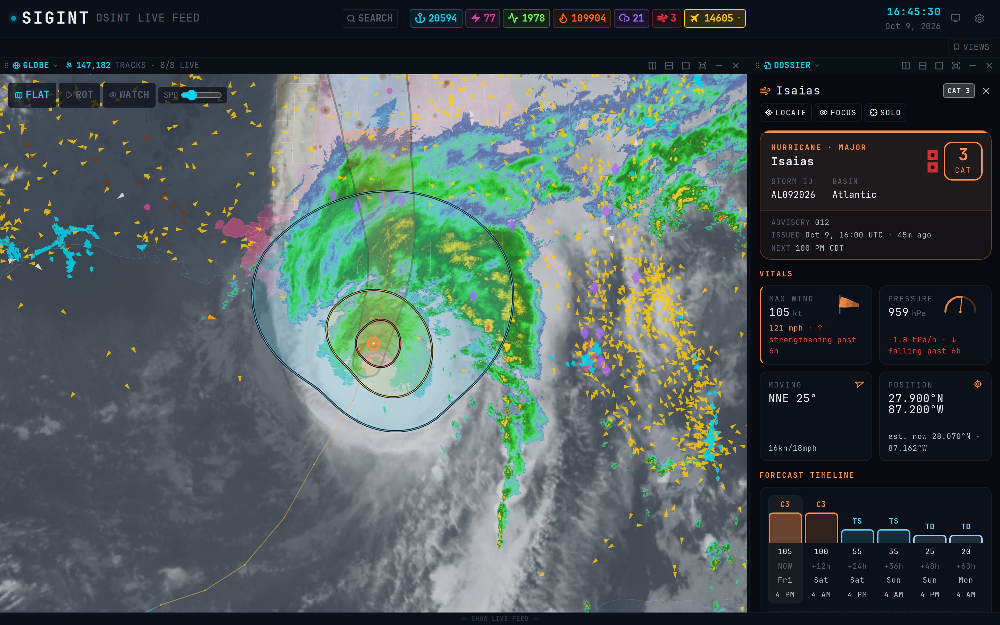

# SIGINT

Real-time OSINT dashboard with live aircraft, vessel, seismic, fire, weather, and event tracking on an interactive globe. Built with Bun, React 19, and a custom Canvas 2D + Web Worker rendering engine. Installable as a PWA.

## Screenshot



Watch the [hurricane center demo](https://drive.google.com/file/d/1JyJ1LLzaks5_ypofQaAbmLkIQhlW2ld3/view?usp=sharing) (57 s).

See the [user guide](./docs/guide.md) for each part of the interface.

## Table of Contents

- [SIGINT](#sigint)
  - [Screenshot](#screenshot)
  - [Table of Contents](#table-of-contents)
  - [Features](#features)
    - [Live Data](#live-data)
    - [Intelligence](#intelligence)
    - [Visualization](#visualization)
    - [Platform](#platform)
  - [Installation](#installation)
  - [Quick Start](#quick-start)
  - [Environment Variables](#environment-variables)
  - [Data Sources](#data-sources)
  - [Testing](#testing)
  - [Deployment](#deployment)
    - [Development](#development)
    - [Production](#production)
    - [Production with TLS](#production-with-tls)
    - [Cleanup](#cleanup)
  - [PWA](#pwa)
  - [Documentation](#documentation)
  - [License](#license)
  - [Author](#author)

## Features

### Live Data

- Aircraft tracking ([adsb.fi](https://opendata.adsb.fi))
- AIS vessel tracking (aisstream.io)
- Seismic monitoring (USGS)
- Fire hotspot detection (NASA FIRMS)
- Severe weather alerts (NOAA)
- Tropical cyclone tracking (NHC: active storms, 5-day forecast cone, advisories)
- GDELT event intelligence
- RSS news aggregation (6 world sources)
- HLS video feeds (iptv-org)

### Tropical Cyclone Tracking

Active Atlantic, Eastern Pacific, and Central Pacific basins from the [NHC `CurrentStorms.json`](https://www.nhc.noaa.gov/CurrentStorms.json) feed (server-proxied every 30 min). For each active storm:

- Current position, max wind, pressure, motion, classification, basin
- Estimated position between advisories along the forecast track
- Official NHC 5-day forecast cone (KMZ parsed server-side into a GeoJSON polygon)
- Forecast track points (12h–120h)
- Past track from the NHC best track, colored by intensity at each fix
- Model tracks from the NHC ATCF guidance
- Hazards: wind speed probabilities, tropical-storm-force wind arrival times, peak storm surge, threats and potential impacts
- Satellite infrared (NOAA GOES) and radar (NOAA MRMS) loops around the storm
- Text products: Public Advisory, Forecast Discussion, Wind Probabilities
- Storm dossier pane with vitals, forecast timeline, track map, wind field, intensity forecast and history, threats, surge, wind chances, assets in the cone, and NHC text products
- Correlation rules: Hurricane Hunter aircraft proximity, ships sheltering in the lee, GDELT events on the forecast track

### Intelligence

- Correlation engine with cross-source products and scored alerts
- Military aircraft classification
- Watch mode (automated globe tour)
- Entity dossier with photos, routes, metadata

### Visualization

- Globe and flat map projections
- Multi-pane resizable layout with drag, minimize, presets
- Camera lock-on, isolation modes, trail rendering
- Global search with live globe filtering
- Virtual-scrolling data table
- Live ticker feed

### Platform

- Dark/light themes
- Mobile responsive with separate live layouts and shared layout presets
- PWA with offline support, update notifications, pull-to-refresh
- Offline indicator with connectivity detection
- Cookie-authenticated API (HMAC-SHA256, HttpOnly)

## Installation

```bash
git clone https://github.com/iitoneloc/sigint.git
cd sigint
bun install
```

For development, create a `.env` file in the project root with at minimum:

```
SIGINT_SERVER_SECRET=<output of openssl rand -hex 32>
```

Optionally add a key for ship data.

```
AISSTREAM_API_KEY=<your aisstream.io key>
```

See [Production](#production) for secret files.

## Quick Start

See [Deployment](#deployment) for dev and production options.

## Environment Variables

In production, the app reads `SIGINT_SERVER_SECRET` and `AISSTREAM_API_KEY` from secret files.

| Variable                       | Required | Description                                                                                                                    |
| ------------------------------ | -------- | ------------------------------------------------------------------------------------------------------------------------------ |
| `SIGINT_SERVER_SECRET`         | **Yes**  | Auth token signing key. Must be ≥32 chars. `openssl rand -hex 32`.                                                                |
| `AISSTREAM_API_KEY`            | No       | [aisstream.io](https://aisstream.io) key for live ship data.                                                                    |
| `SECRETS_DIR`                  | No       | Folder the app reads secret files from (default `/run/secrets`).                                                               |
| `DOMAIN`                       | No       | Domain for Let's Encrypt TLS                                                                                                   |
| `PORT`                         | Yes      | Listening port, supplied by the platform                                                                                        |
| `SIGINT_RATE_LIMIT_PER_MINUTE` | No       | Per-client rate-limit cap (default 60). Sliding-window limiter applied to every route.                                         |
| `SIGINT_TRUSTED_PROXY_HOPS`    | No       | Trusted proxy count (default 0).                                                                                               |

## Data Sources

Browser refresh is how often the browser requests each layer.

| Layer    | Source                                                                                                      | Browser refresh |
| -------- | ----------------------------------------------------------------------------------------------------------- | --------------- |
| Aircraft | [adsb.fi](https://opendata.adsb.fi) (server tile acquisition, 108 tiles × 250 nm, priority hubs)          | 15s             |
| Ships    | [aisstream.io](https://aisstream.io) (server WebSocket)                                                     | 15s             |
| Seismic  | [USGS](https://earthquake.usgs.gov/earthquakes/feed/v1.0/) (direct DataWorker fetch)                        | 420s            |
| Fires    | [NASA FIRMS](https://firms.modaps.eosdis.nasa.gov/) (server bulk feeds)                                     | 600s            |
| Weather  | [NOAA](https://api.weather.gov/) (direct DataWorker fetch)                                                  | 300s            |
| Cyclones | [NHC](https://www.nhc.noaa.gov/CurrentStorms.json) (server-side; KMZ cone, advisory text products, ATCF model and best tracks, hazard products) | 25m             |
| Storm imagery | [NOAA nowCOAST](https://nowcoast.noaa.gov) GOES infrared and [NOAA MRMS](https://opengeo.ncep.noaa.gov) radar (direct browser fetch) | 5m satellite, 2m radar |
| Aircraft dossier | [FlightAware](https://www.flightaware.com) schedule and filed route, [hexdb.io](https://hexdb.io) metadata, [Planespotters](https://www.planespotters.net) photos, FAA nav data for route fixes | On selection |
| Events   | [GDELT 2.0](https://www.gdeltproject.org/) (server-side)                                                    | 15m             |
| News     | 6 RSS feeds (server-side)                                                                                   | 10m             |

## Testing

```bash
bun run tsc --noEmit # check TypeScript
bun test             # run unit and component tests
bun test --watch     # run unit and component tests in watch mode
bun run docker:test  # build and run headless E2E tests in Docker
```

## Deployment

### Development

```bash
bun run docker:dev:up          # https://localhost (self-signed cert)
bun run docker:dev:down        # stop
```

#### Dev-only fixture overrides

Two env vars load frozen fixture data in development.

| Env var            | Source it overrides                                        | Valid labels                                                                                                     |
| ------------------ | ---------------------------------------------------------- | ---------------------------------------------------------------------------------------------------------------- |
| `CYCLONES_FIXTURE` | `/api/cyclones/latest` (server fetches NHC)                | `active-season`, `single-cat3`, `empty-out-of-season`, `isaias`           |
| `AIRCRAFT_FIXTURE` | `/api/aircraft/states` (server runs the tile sweep)          | `dossier-baseline`, `hunter-near-cyclone`, `test-snapshot`                |

Labels match `/^[a-z0-9-]+$/` and resolve to `tests/fixtures/<source>/<label>.json`. To use:

```bash
CYCLONES_FIXTURE=active-season bun run dev
AIRCRAFT_FIXTURE=test-snapshot bun run dev
```

Or via Docker Compose (`docker-compose.dev.yml` passes both through):

```bash
CYCLONES_FIXTURE=single-cat3 bun run docker:dev:up
```

### Production

Production reads secrets from files.
Put each secret in its own file, named after the variable, in one host folder.
Each file holds only the value.
Give each file mode 0400 and owner UID 710.
The container runs as `710:710` and mounts the folder read-only at `/run/secrets`.

Set `HOST_SECRETS_DIR` to the host folder for every compose command:

```bash
HOST_SECRETS_DIR=/path/to/secrets bun run docker:prod:up     # http://localhost:5500
HOST_SECRETS_DIR=/path/to/secrets bun run docker:prod:down   # stop
```

### Production with TLS

```bash
HOST_SECRETS_DIR=/path/to/secrets DOMAIN=sigint.example.com bun run docker:prod:tls:up
HOST_SECRETS_DIR=/path/to/secrets bun run docker:prod:tls:down   # stop
```

### Cleanup

```bash
HOST_SECRETS_DIR=/path/to/secrets bun run docker:clean:all   # remove containers, volumes, images
```

## PWA

SIGINT is installable as a Progressive Web App. After visiting the deployed app:

- **Desktop (Chrome/Edge)**: Click the install icon in the address bar
- **iOS Safari**: Share > Add to Home Screen
- **Android Chrome**: Menu > Add to Home Screen

The service worker caches the app shell for offline boot. Live data loads from IndexedDB when offline. An offline indicator bar appears when connectivity is lost, with a RETRY button and pull-to-refresh on touch devices. When an update is available, a banner prompts the user to reload.

## Documentation

The [user guide](./docs/guide.md) shows how to use the interface.

Full technical docs in [`docs/`](./docs/README.md) covering architecture, data flow, feature system, pane system, rendering, caching, search, and constraints.

## License

Dual-licensed:

- **Non-commercial** free under the [SIGINT Non-Commercial License](./LICENSE)
- **Commercial** [contact the author](https://github.com/iiTONELOC) for terms

## Author

[Anthony Tropeano](https://github.com/iiTONELOC)
