# SIGINT Dashboard — Architecture & Data Flow

Internal technical documentation for the SIGINT OSINT Live Feed dashboard application.

**Runtime**: Bun  
**Frontend**: React 19, Tailwind 4, Canvas 2D  
**Last updated**: March 2026

---

## 1. System Overview

SIGINT is a real-time geospatial intelligence dashboard that renders live aircraft tracking data (via OpenSky Network) alongside mock ship, event, and seismic data onto an interactive globe or flat map projection. A single Bun process serves the bundled React SPA and a small set of API routes used for aircraft metadata enrichment.

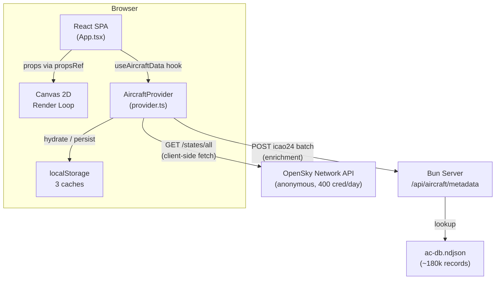

### Why client-side fetching?

The OpenSky Network API blocks requests from Heroku's IP ranges. All OpenSky calls are made directly from the browser. This means API keys cannot be used — only anonymous access at 400 credits/day. The server is involved only for aircraft metadata enrichment (model, registration, operator) via a local NDJSON database.

---

## 2. Directory Structure

```
src/
  index.html                          Entry HTML
  server/
    index.ts                          Dev server (Bun)
    index.prod.ts                     Prod server
    api/
      index.ts                        API route registration
      aircraftMetadata.ts             Metadata lookup from ac-db.ndjson
    data/
      ac-db.ndjson                    Local aircraft database (~180k records)
  client/
    App.tsx                           Root component, all top-level state
    frontend.tsx                      React DOM entry point
    config/
      theme.ts                        Color definitions, ThemeColors type, getColorMap()
    context/
      ThemeContext.tsx                 Theme provider (dark/light)
    features/
      base/
        types.ts                      FeatureDefinition<TData, TFilter> contract
        dataPoints.ts                 DataPoint union type, per-feature data shapes
      aircraft/
        types.ts                      AircraftData, AircraftFilter, SquawkCode types
        provider.ts                   AircraftProvider — fetch, cache, enrich
        useAircraftData.ts            React hook — orchestrates polling + enrichment
        definition.ts                 aircraftFeature: FeatureDefinition instance
        utils.ts                      matchesAircraftFilter()
        filterUrl.ts                  URL sync for aircraft filter state
        typeLookup.ts                 getAircraftMetadataBatch() — server enrichment
        detailRows.ts                 buildAircraftDetailRows()
        AircraftFilterControl.tsx     Filter dropdown UI
        AircraftTickerContent.tsx     Ticker rendering for aircraft items
        index.ts                      Barrel exports
      registry.tsx                    Feature registry + inline ship/event/quake defs
    components/
      GlobeVisualization.tsx          Canvas 2D renderer (~1400 lines)
      Search.tsx                      Global search with zoom-to
      Header.tsx                      Top bar: logo, search, toggles, view controls, clock
      SettingsDropdown.tsx            Mobile-only gear dropdown
      DetailPanel.tsx                 Selected item detail (draggable/bottom sheet)
      Ticker.tsx                      Bottom live feed scroll
      LayerLegend.tsx                 Bottom-left layer counts
      StatusBadge.tsx                 Bottom-right connection status
      styles.tsx                      mono() helper, responsive font constants
    lib/
      trailService.ts                 Position recording, interpolation, trail storage
      landService.ts                  HD coastline data fetch + cache
      tickerFeed.ts                   Builds ticker items from filtered data
      uiSelectors.ts                  Derived counts, active totals, country lists
    providers/
      DataOrchestrator.ts             Generic multi-provider coordinator
    data/
      mockData.ts                     Mock ships, events, quakes, fallback aircraft
```

---

## 3. The Feature System

Every data type in the application (aircraft, ships, events, quakes) is a **feature** — a self-contained module that implements the `FeatureDefinition` contract. This keeps rendering, filtering, and display logic colocated with the data type it belongs to.

### 3.1 FeatureDefinition Contract

Defined in `features/base/types.ts`:

```typescript
interface FeatureDefinition<TData, TFilter> {
  id: string;                   // Discriminator matching DataPoint.type
  label: string;                // Display name ("AIRCRAFT", "AIS VESSELS")
  icon: LucideIcon;             // Icon component for UI

  matchesFilter(item, filter): boolean;   // Does this item pass the current filter?
  defaultFilter: TFilter;                 // Initial filter state

  buildDetailRows(data, timestamp?): [string, string][];  // Detail panel rows
  TickerContent: React.ComponentType;     // How this type renders in the ticker

  FilterControl?: React.ComponentType;    // Optional header filter UI
  getSearchText?: (data) => string;       // Optional searchable text builder
}
```

### 3.2 Feature Registry

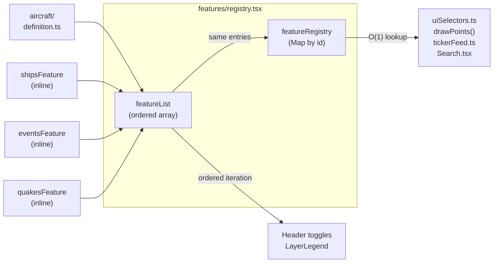

`features/registry.tsx` collects all features into two exports:

- **`featureList`** — ordered array for iteration (determines UI rendering order)
- **`featureRegistry`** — `Map<string, FeatureDefinition>` for O(1) lookup by id

Aircraft has its own folder (`features/aircraft/`) with a full provider, filter system, and UI components. Ships, events, and quakes are defined inline in the registry since they currently use mock data.

### 3.3 DataPoint Union

`features/base/dataPoints.ts` defines the discriminated union:

```typescript
type DataPoint =
  | (BasePoint & { type: "ships";    data: ShipData })
  | (BasePoint & { type: "aircraft"; data: AircraftData })
  | (BasePoint & { type: "events";   data: EventData })
  | (BasePoint & { type: "quakes";   data: QuakeData });
```

Every `BasePoint` carries `id`, `type`, `lat`, `lon`, and optional `timestamp`. The `data` field contains type-specific payload. All downstream code switches on `type` to access the correct shape.

---

## 4. Data Flow

### 4.1 Boot & Polling Lifecycle

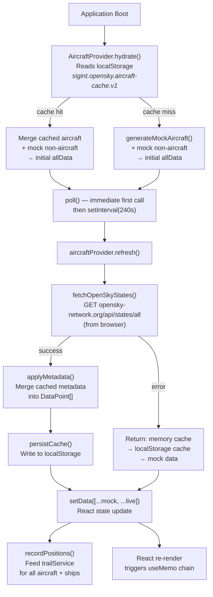

### 4.2 The `allData` Array

`allData` is the **single source of truth** for all renderable points. It is assembled in `useAircraftData`:

```
allData = [...nonAircraftBaseRef.current, ...aircraftData]
```

- **`nonAircraftBaseRef.current`**: Generated once on mount (`generateMockNonAircraft()`). Ships, events, quakes. Static for the session lifetime — stored in a `useRef` so it never triggers re-renders.
- **`aircraftData`**: Live from OpenSky, refreshed every 240 seconds. The only part that changes.

When `setData()` is called, React re-renders `App.tsx`, which recomputes derived values (`counts`, `tickerItems`, `selectedCurrent`, etc.) via `useMemo` and passes fresh props down.

### 4.3 Data Distribution from App.tsx

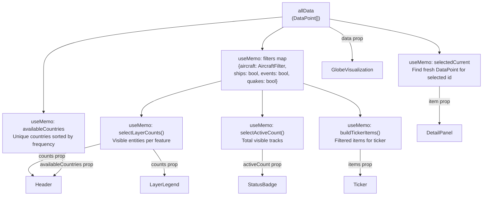

### 4.4 The `filters` Map

`App.tsx` maintains a unified filter map consumed by `uiSelectors.ts`:

```typescript
const filters = {
  aircraft: aircraftFilter,  // AircraftFilter object (enabled, squawks, countries, etc.)
  ships:    layers.ships,     // boolean
  events:   layers.events,    // boolean
  quakes:   layers.quakes,    // boolean
};
```

Each feature's `matchesFilter()` receives its corresponding filter value. For aircraft this is a complex object; for the others it's a simple boolean toggle.

---

## 5. Caching Architecture

The application maintains three independent caches in `localStorage`. They serve different purposes and have different lifecycles.

### 5.1 Cache Overview

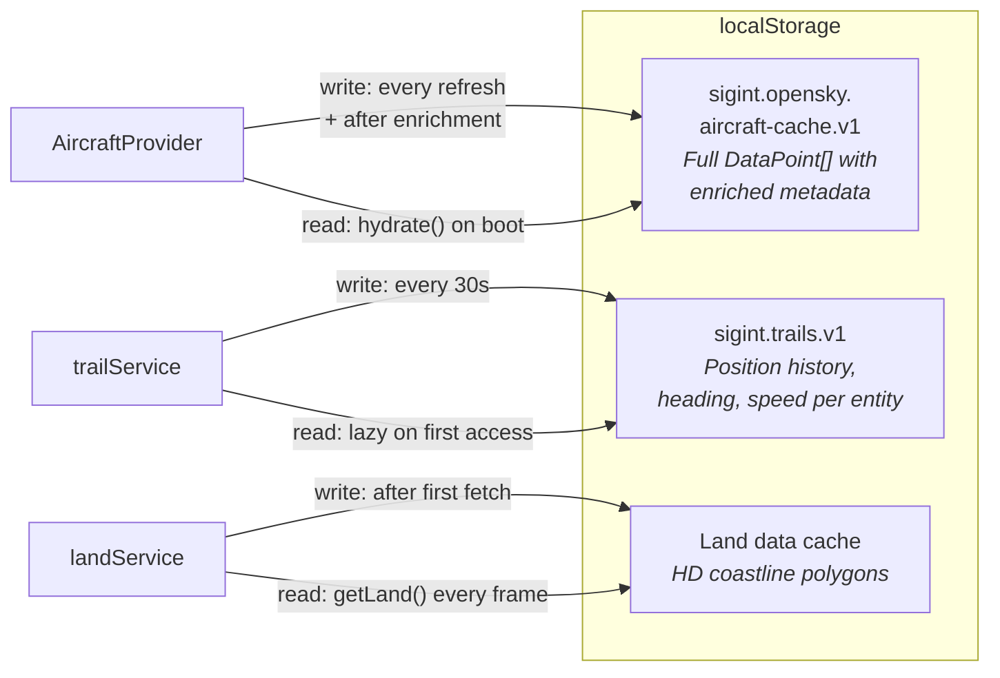

### 5.2 Aircraft Data Cache

| Key | `sigint.opensky.aircraft-cache.v1` |
|---|---|
| Owner | `AircraftProvider` (`provider.ts`) |
| Contains | Full `DataPoint[]` array with aircraft positions + any enriched metadata |
| Written | After every successful OpenSky fetch (with metadata applied) and after enrichment |
| Read | On `hydrate()` at boot — provides instant first render before first API call |
| Staleness | Overwritten every 240s on successful refresh; stale data returned as fallback on error |

The provider has a two-tier cache: an in-memory object (`this.cache`) and `localStorage`. On boot, `hydrate()` checks memory first, then falls back to `localStorage`. The in-memory cache is authoritative during a session; `localStorage` is for cross-session persistence.

When metadata enrichment succeeds, both tiers are updated and re-persisted. This means the cache progressively improves — a callsign that was "Unknown" on first fetch gains its real type, registration, and operator after enrichment, and that enriched data survives page reloads.

### 5.3 Trail Cache

| Key | `sigint.trails.v1` |
|---|---|
| Owner | `trailService.ts` |
| Contains | Map of entity ID → `{ points[], lastSeen, missedRefreshes, heading, speedMps }` |
| Written | Every 30 seconds (`PERSIST_INTERVAL_MS`) |
| Read | On first access (lazy load) |
| Staleness | Entries purged after 3 consecutive missed refreshes |

The trail service records actual positions from each data refresh and uses speed + heading for between-refresh interpolation. It is consumed both for drawing trail lines behind selected items and for smoothly animating all moving points between 240-second refresh intervals.

### 5.4 Land Data Cache

| Key | Managed by `landService.ts` |
|---|---|
| Contains | HD coastline polygon data |
| Written | After first successful fetch |
| Read | On every render frame via `getLand()` |

Fetched once in the background when GlobeVisualization mounts. The render loop calls `getLand()` each frame — if HD data hasn't loaded yet, it falls back to a simpler built-in dataset.

### 5.5 Metadata Deduplication

`AircraftProvider` also maintains two in-memory-only structures for metadata enrichment:

```mermaid
flowchart TD
    subgraph "In-memory only (not persisted directly)"
        MetaMap["metadataByIcao<br/>Map&lt;string, StoredMetadata&gt;<br/><i>Successfully resolved metadata</i>"]
        AttemptSet["attemptedMetadataIcao<br/>Set&lt;string&gt;<br/><i>All ICAO24s ever attempted</i>"]
    end

    Hydrate["hydrate() on boot"] -->|"Populate from cached DataPoints<br/>where acType ≠ 'Unknown'"| MetaMap
    Hydrate -->|"Same ICAO24s added"| AttemptSet

    EnrichReq["enrichAircraftByIcao24(icao24List)"] --> FilterStep{"Filter out<br/>already in<br/>attemptedMetadataIcao?"}
    FilterStep -->|"new ICAO24s only"| ServerCall["POST /api/aircraft/metadata"]
    FilterStep -->|"all known → skip"| NoOp["Return null<br/>(no work needed)"]

    ServerCall -->|"results"| StoreStep["Store in metadataByIcao<br/>+ mark in attemptedMetadataIcao"]
    StoreStep --> Reapply["applyMetadata() on cached DataPoints<br/>→ re-persist to localStorage"]
```

On boot, `hydrate()` populates both maps from the cached `DataPoint[]` — any entity whose `acType` is not "Unknown" is treated as already resolved. This prevents re-fetching metadata the server already returned in a previous session.

During a session, `enrichAircraftByIcao24()` filters out any ICAO24 already in `attemptedMetadataIcao` before hitting the server. This means:

1. First refresh: all aircraft have `acType: "Unknown"`
2. Ticker/detail panel triggers enrichment for visible aircraft
3. Server returns metadata, `metadataByIcao` is populated
4. `applyMetadata()` merges it into the DataPoint array
5. Cache is re-persisted with enriched data
6. On next page load, `hydrate()` restores both the data and the deduplication maps

---

## 6. Rendering Pipeline

### 6.1 GlobeVisualization Architecture

`GlobeVisualization.tsx` (~1400 lines) is a Canvas 2D renderer that runs outside React's render cycle for performance.

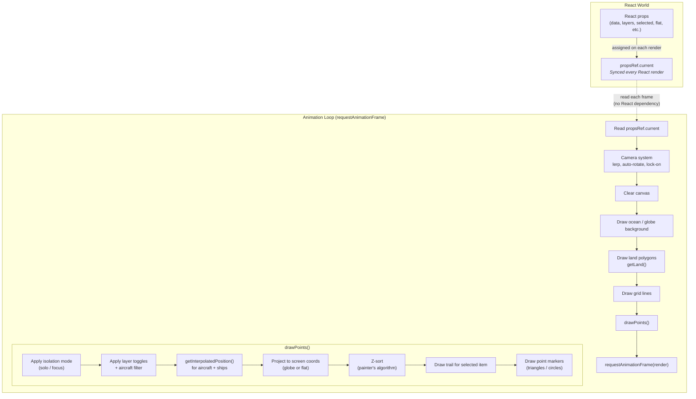

The key insight: **React never directly drives rendering.** Props are synced into `propsRef` on every React render, but the animation loop reads from the ref independently at ~60fps. This means data updates (which trigger React re-renders) are picked up on the next animation frame without any useEffect dependencies or re-registration of the render loop.

### 6.2 Camera System

The camera uses a target + lerp model for smooth transitions:

- **`camRef`** — current camera state: `{ rotY, rotX, vy, zoomGlobe, zoomFlat, panX, panY }`
- **`camTargetRef`** — animation target: `{ rotY, rotX, zoom, panX, panY, active, lockedId }`

```mermaid
flowchart TD
    Init(("start")) --> Idle

    Idle["Idle<br/><i>Auto-rotate in globe mode</i>"]
    Idle -->|"Double-click point<br/>or zoomToId prop"| Animating

    Animating["Animating<br/><i>Lerps camRef → camTargetRef<br/>at 8% per frame</i>"]
    Animating -->|"lockedId is set"| Locked
    Animating -->|"Reached target<br/>dZoom &lt; 0.01 &amp; dRot &lt; 0.001"| Idle

    Locked["Locked<br/><i>camTargetRef.lockedId = item.id<br/>Target recalculated each frame</i>"]
    Locked -->|"Each frame: follow<br/>interpolated position"| Locked
    Locked -->|"Drag starts"| Idle
    Locked -->|"Selection cleared"| Idle
```

| Action | Effect |
|---|---|
| Double-click a point | Set `camTargetRef` to point's position, set `lockedId` |
| Drag | Breaks lock-on (`lockedId = null`, `active = false`) |
| Scroll wheel (locked) | Adjusts `camTargetRef.zoom`, stays locked |
| Scroll wheel (unlocked) | Directly modifies `camRef` zoom |
| Auto-rotate | Only active when: globe mode, not dragging, not animating to target |

### 6.3 Interpolation

All moving entities (aircraft, ships) have their positions interpolated between data refreshes for smooth animation:

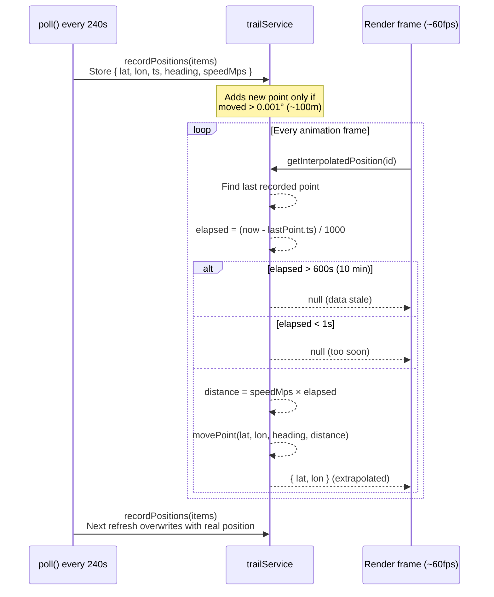

This means even though OpenSky data refreshes every 4 minutes, aircraft appear to move continuously on screen.

### 6.4 Projection Functions

Two projection modes, selected by the `flat` prop:

- **Globe** (`projGlobe`): Orthographic projection onto a sphere. Points behind the globe (`z <= 0`) are culled.
- **Flat** (`projFlat`): Equirectangular projection. Supports pan and zoom via `cam.panX`, `cam.panY`, `cam.zoomFlat`.

Both return `{ x, y, z }` where `z` is used for depth sorting (globe) or always positive (flat).

---

## 7. Isolation Modes

Two modes for focusing on specific data, controlled by `isolateMode` state in `App.tsx`:

| Mode | Icon | Color | Behavior |
|---|---|---|---|
| **FOCUS** | Eye | Cyan | Shows only the selected item's layer type. Other layers hidden. Filters within the layer still apply. |
| **SOLO** | Crosshair | Red | Shows only the single selected point. Everything else is gone. |

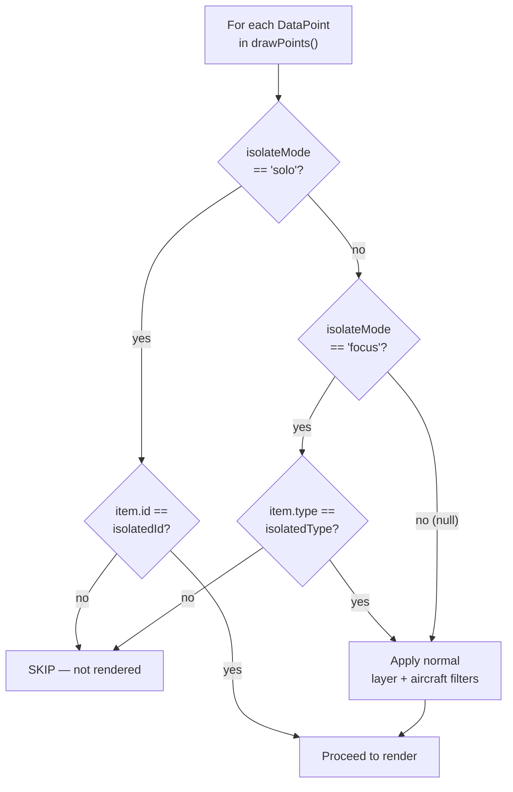

The detail panel controls toggling between modes. Closing the panel clears isolation.

---

## 8. Enrichment Pipeline

Aircraft metadata enrichment runs as a side effect in `App.tsx`:

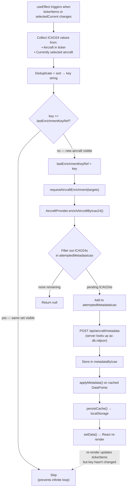

The `lastEnrichmentKeyRef` prevents infinite loops: enrichment updates `allData`, which updates `tickerItems`, which would re-trigger the effect — but the key check short-circuits because the same set of ICAO24s is still visible.

---

## 9. Global Search

Search provides a unified way to find, filter, and zoom to entities across all data layers. It operates in two phases: live dropdown preview while typing, and globe-wide filtering on execution.

### 9.1 Architecture

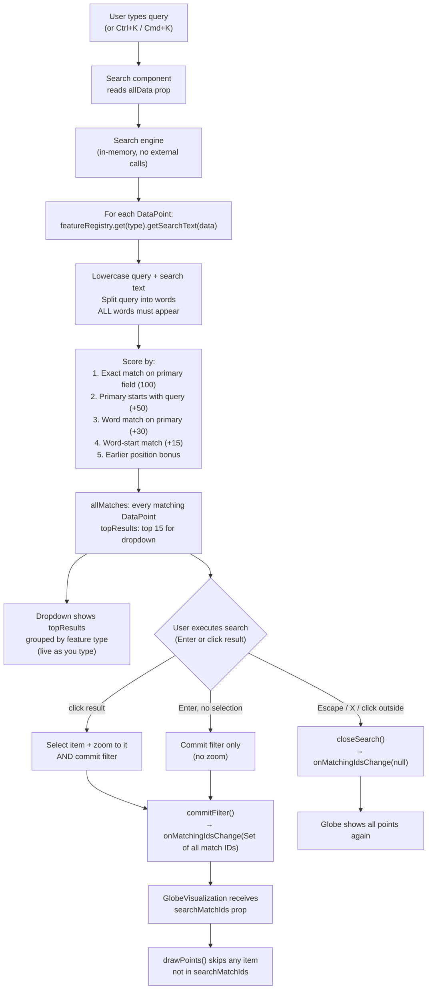

### 9.2 Two-Phase Behavior

| Phase | What happens | Globe affected? |
|---|---|---|
| **Typing** | Dropdown shows top 15 results live, grouped by feature type | No — globe is untouched |
| **Execute** (Enter or click result) | Commits filter: all matching IDs sent to GlobeVisualization via `searchMatchIds` prop | Yes — only matching points rendered |
| **Close** (Escape / X / click outside) | Filter cleared, `searchMatchIds` set to null | Yes — all points visible again |

Clicking a result selects + zooms to that specific point AND commits the filter. Pressing Enter with no result highlighted commits the filter without selecting or zooming to anything — useful for queries like "737" where you want to see all matches on the globe.

### 9.3 Search Text per Feature

Each feature provides a `getSearchText(data)` method that concatenates all searchable fields into a single string:

| Feature | Fields |
|---|---|
| Aircraft | callsign, icao24, acType, registration, operator, manufacturerName, model, categoryDescription, originCountry, squawk |
| Ships | name, flag, vesselType |
| Events | headline, category, source |
| Quakes | location, magnitude |

### 9.4 UI Integration

Search is rendered into the Header via a `searchSlot` prop — the Header doesn't know about search internals, it just renders a React node in the correct position (left of layer toggles). This keeps the components loosely coupled.

On desktop, the search button shows a search icon + "SEARCH" label. Clicking it expands into an input with a results dropdown showing the match count. On mobile, the icon alone is shown to save space. The dropdown is z-[60] to sit above the detail panel and layer legend.

Keyboard support: arrow keys navigate results, Enter executes search (with or without a selected result), Escape closes and clears filter, Ctrl+K/Cmd+K opens from anywhere.

### 9.5 Globe Filter Mechanism

The filter flows through the existing `propsRef` bridge:

1. Search calls `onMatchingIdsChange(Set<string>)` on execute
2. App.tsx stores it as `searchMatchIds` state
3. Passed to GlobeVisualization as a prop, synced into `propsRef`
4. `drawPoints()` checks `searchMatchIds` before any other filter — if the set exists and the item's ID isn't in it, the item is skipped
5. Isolation modes (FOCUS/SOLO) and layer toggles still apply on top of the search filter

### 9.6 Zoom-to Mechanism

When a specific search result is clicked, two things happen simultaneously:

1. `setSelected(item)` — opens the detail panel with the item's data
2. `setZoomToId(item.id)` — triggers a `useEffect` in GlobeVisualization that sets `camTargetRef` with the item's position (using interpolated position if available) and locks the camera onto it

`zoomToId` is cleared after 100ms via `setTimeout` so the same item can be re-searched. The `lastZoomToIdRef` inside GlobeVisualization prevents duplicate triggers within the same cycle.

---

## 10. Component Hierarchy

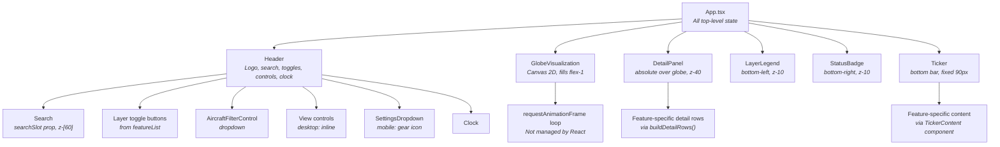

### Z-Index Stack

| z-index | Component |
|---|---|
| z-10 | LayerLegend, StatusBadge |
| (none) | Header — uses `relative` only, no stacking context that could trap dropdowns |
| z-40 | DetailPanel |
| z-[60] | AircraftFilterControl dropdown, SettingsDropdown, Search dropdown |

The Header deliberately avoids a z-index to prevent creating a stacking context that would clip dropdown menus appearing below it.

---

## 11. State Management

All state lives in `App.tsx` as React hooks. There is no external state management library.

| State | Type | Purpose |
|---|---|---|
| `flat` | `boolean` | Globe vs flat map toggle |
| `autoRotate` | `boolean` | Globe auto-rotation |
| `rotationSpeed` | `number` | Rotation speed multiplier |
| `chromeHidden` | `boolean` | Toggle all UI overlays (click empty globe area) |
| `selected` | `DataPoint \| null` | Currently selected item |
| `isolateMode` | `null \| "solo" \| "focus"` | Active isolation mode |
| `layers` | `Record<string, boolean>` | Non-aircraft layer toggles |
| `aircraftFilter` | `AircraftFilter` | Complex aircraft filter (squawks, countries, airborne/ground) |
| `zoomToId` | `string \| null` | Triggers camera zoom-to in GlobeVisualization, cleared after one tick |
| `searchMatchIds` | `Set<string> \| null` | When non-null, globe only renders points whose IDs are in this set |

Derived values computed via `useMemo`:

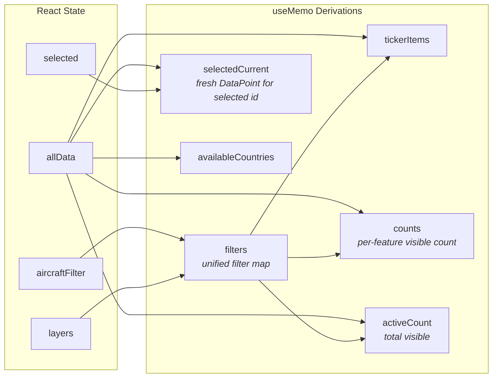

| Derived | Recomputes when |
|---|---|
| `filters` | `aircraftFilter` or `layers` changes |
| `tickerItems` | Data refresh or filter change |
| `selectedCurrent` | Data refresh or selection change |
| `counts` | Data refresh or filter change |
| `activeCount` | Data refresh or filter change |
| `availableCountries` | Data refresh |

`selectedCurrent` is notable: when data refreshes, the previously selected item's `DataPoint` object is replaced by a new one with the same `id`. `selectedCurrent` finds the updated version so the detail panel always shows fresh data.

---

## 12. Key Constraints & Gotchas

**OpenSky rate limiting**: Anonymous access = 400 credits/day. Each `/states/all` call costs credits. The 240-second poll interval is chosen to stay well under the limit for a full day of use.

**Client-side fetching**: Cannot proxy through the server. Cannot add authentication headers. Any OpenSky-related code must run in the browser.

**Canvas vs React**: The globe is pure Canvas 2D. React components (Header, DetailPanel, etc.) are overlaid on top with absolute/fixed positioning. They communicate with the canvas via refs and props, not DOM events on canvas elements.

**propsRef pattern**: The animation loop never re-registers. It reads `propsRef.current` each frame, which is synced from React props on every render. This means there's a max 1-frame delay between a React state change and the canvas reflecting it — imperceptible to users.

**Metadata enrichment is best-effort**: If the server is down or the ICAO24 isn't in the database, the aircraft just shows "Unknown" type. The UI never blocks on enrichment.

**Trail purging**: If an aircraft disappears from OpenSky data for 3 consecutive refreshes (~12 minutes), its trail is deleted. This prevents stale trails from accumulating for aircraft that have landed or left coverage.