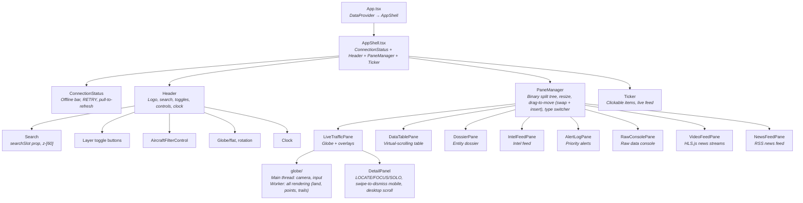

# Architecture Overview

[← Back to Docs Index](./README.md)

**Runtime**: Bun | **Frontend**: React 19, Tailwind 4, Canvas 2D + Web Worker | **Last updated**: March 2026

**Related docs**: [Data Flow](./data-flow.md) · [Feature System](./features.md) · [Pane System](./panes.md) · [Rendering](./rendering.md)

---

## System Overview

SIGINT is a real-time geospatial intelligence dashboard that renders live aircraft tracking data (via OpenSky Network), live seismic data (via USGS), live geolocated news events (via GDELT 2.0), live AIS vessel positions (via aisstream.io), live fire hotspots (via NASA FIRMS), and severe weather alerts (via NOAA) onto an interactive globe or flat map projection. A non-geographic RSS news feed aggregates world news from 6 major sources. A correlation engine derives intelligence products and context-scored alerts from cross-source spatial-temporal matching, anomaly detection, and news linking. A single Bun process serves the bundled React SPA, maintains a persistent WebSocket to aisstream.io for AIS data, fetches and caches GDELT event data, FIRMS fire data, and RSS news feeds server-side, and provides API routes for aircraft metadata enrichment and token-authenticated data delivery.

The rendering pipeline uses a dedicated Web Worker (`public/workers/pointWorker.js`) with its own OffscreenCanvas. The worker renders everything — land, ocean, grid, glow, rim, data points, trails, and selection rings — on a separate CPU core. The main thread handles camera updates, input handling, and composites the finished `ImageBitmap` via a single `drawImage` call.

```mermaid
graph TB
    subgraph Browser
        SPA["React SPA<br/>(App → DataProvider → AppShell)"]
        MainCanvas["Main Canvas<br/>(composite only)"]
        Worker["Web Worker<br/>(pointWorker.js — OffscreenCanvas)<br/>land, grid, ocean, points, trails"]
        IDB["IndexedDB<br/>(sigint-cache)"]
        AircraftProv["AircraftProvider"]
        QuakeProv["earthquakeProvider<br/>(BaseProvider)"]
        GdeltProv["gdeltProvider<br/>(BaseProvider)"]
        ShipProv["shipProvider<br/>(BaseProvider)"]
        FireProv["fireProvider<br/>(BaseProvider)"]
        WeatherProv["weatherProvider<br/>(BaseProvider)"]

        SPA -->|"props via propsRef"| MainCanvas
        MainCanvas -->|"drawImage bitmap"| Worker
        SPA -->|"data + camera msgs"| Worker
        SPA -->|"useAircraftData hook"| AircraftProv
        SPA -->|"useEarthquakeData hook"| QuakeProv
        SPA -->|"useEventData hook"| GdeltProv
        SPA -->|"useShipData hook"| ShipProv
        SPA -->|"useFireData hook"| FireProv
        SPA -->|"useWeatherData hook"| WeatherProv
        AircraftProv -->|"hydrate / persist"| IDB
        QuakeProv -->|"hydrate / persist"| IDB
        GdeltProv -->|"hydrate / persist"| IDB
        ShipProv -->|"hydrate / persist"| IDB
        FireProv -->|"hydrate / persist"| IDB
        WeatherProv -->|"hydrate / persist"| IDB
    end

    OpenSky["OpenSky Network API<br/>(anonymous, 400 cred/day)"]
    USGS["USGS Earthquake API<br/>(free, no auth)"]
    NOAA["NOAA Weather API<br/>(free, User-Agent only)"]
    BunServer["Bun Server<br/>(api routes + GDELT cache + AIS cache + FIRMS cache)"]
    NDJSON["ac-db.ndjson<br/>(~180k records)"]
    GdeltRaw["GDELT Raw Export Files<br/>(data.gdeltproject.org)"]
    AISStream["aisstream.io<br/>(WebSocket, global AIS)"]
    FIRMS["NASA FIRMS API<br/>(VIIRS NOAA-20 CSV)"]

    AircraftProv -->|"GET /states/all<br/>(client-side fetch)"| OpenSky
    AircraftProv -->|"GET /metadata/db/v1<br/>(one-time, cached in IDB)"| BunServer
    QuakeProv -->|"GET all_week.geojson<br/>(client-side fetch)"| USGS
    WeatherProv -->|"GET /alerts/active<br/>(client-side fetch)"| NOAA
    GdeltProv -->|"GET /api/events/latest<br/>(token auth)"| BunServer
    ShipProv -->|"GET /api/ships/latest<br/>(token auth)"| BunServer
    FireProv -->|"GET /api/fires/latest<br/>(token auth)"| BunServer
    BunServer -->|"lookup"| NDJSON
    BunServer -->|"serve cached"| GdeltCache["gdeltCache.ts<br/>(in-memory)"]
    BunServer -->|"serve cached"| AISCache["aisCache.ts<br/>(in-memory)"]
    BunServer -->|"serve cached"| FIRMSCache["firmsCache.ts<br/>(in-memory)"]
    GdeltCache -->|"fetch + unzip + parse<br/>(every 15 min)"| GdeltRaw
    AISCache -->|"persistent WebSocket<br/>(real-time stream)"| AISStream
    FIRMSCache -->|"fetch CSV<br/>(every 30 min)"| FIRMS
```



### Why client-side fetching for some sources?

The OpenSky Network API blocks requests from Heroku's IP ranges. All OpenSky calls are made directly from the browser — anonymous access only, 400 credits/day. The USGS earthquake API is also fetched client-side — free, no auth, no CORS restrictions.

GDELT raw export files have CORS restrictions and are large CSV zips — these are fetched server-side. The server downloads, unzips, and parses the export CSV every 15 minutes, caches the result in memory, and serves it to clients via `/api/events/latest` with token authentication.

AIS data from aisstream.io requires an API key and does not support browser CORS. The server maintains a persistent WebSocket connection to aisstream.io, accumulates vessel positions in an in-memory Map, and serves snapshots to clients via `/api/ships/latest` with token authentication.

NASA FIRMS fire data requires an API key and returns large CSV payloads (30-100k records). Fetched server-side every 30 minutes, parsed, and cached in memory. Served from `/api/fires/latest` with token auth and gzip compression. Clients poll every 600 seconds.

NOAA Weather alerts are fetched client-side directly from `api.weather.gov/alerts/active`. No API key required — only a `User-Agent` header. Free, no CORS restrictions. The NWS API returns a GeoJSON FeatureCollection. Clients poll every 300 seconds.

### Server API Routes

| Route | Method | Auth | Rate Limit | Purpose |
|-------|--------|------|------------|---------|
| `/api/auth/token` | GET | None | 60 req/min per IP | Sets HttpOnly auth cookie (HMAC-SHA256, 30 min TTL) |
| `/api/events/latest` | GET | HttpOnly cookie | 60 req/min per IP | Returns cached GDELT events (gzip compressed) |
| `/api/ships/latest` | GET | HttpOnly cookie | 60 req/min per IP | Returns cached AIS vessel positions (gzip compressed) |
| `/api/aircraft/metadata/db/v1` | GET | HttpOnly cookie | 60 req/min per IP | Full aircraft metadata NDJSON (~8.5MB gzip). Versioned route — client caches in IndexedDB, never re-fetches same version. `Cache-Control: immutable`. |
| `/api/fires/latest` | GET | HttpOnly cookie | 60 req/min per IP | Returns cached NASA FIRMS fire hotspots (gzip compressed) |
| `/api/news/latest` | GET | HttpOnly cookie | 60 req/min per IP | Returns cached RSS news articles (gzip compressed) |
| `/api/dossier/aircraft/:icao24` | GET | HttpOnly cookie | 60 req/min per IP | Aircraft dossier (hexdb.io info + planespotters photos) |

### Auth + Rate Limiting

All API routes are rate limited at 60 requests per minute per IP (sliding window). Protected routes require a valid auth token in an HttpOnly cookie (`sigint_token`). Auth and rate limiting live in `api/auth.ts` — every route calls either `guardAuth` (cookie token + rate limit) or `guardRateLimit` (rate limit only, for the token endpoint).

Tokens are generated via Web Crypto API (async HMAC-SHA256) and verified with `crypto.timingSafeEqual`. The token endpoint sets the token as an `HttpOnly; Secure; SameSite=Strict` cookie.

Clients use `lib/authService.ts` which wraps `fetch()` with `credentials: "same-origin"`. On 401, the cookie is refreshed and the request retried. Concurrent 401s share a single token refresh (deduped via an in-flight promise) to prevent boot stampede when multiple providers hit 401 simultaneously.

### Environment Variables

| Variable | Required | Description |
|----------|----------|-------------|
| `SIGINT_SERVER_SECRET` | **Yes** | Server-only secret for signing auth tokens. Generate with `openssl rand -hex 32`. Server refuses to start without it. |
| `AISSTREAM_API_KEY` | No | Free API key from [aisstream.io](https://aisstream.io) (sign up via GitHub). Enables live global AIS vessel data. Without it, ships layer is empty. |
| `FIRMS_MAP_KEY` | No | Free API key from [firms.modaps.eosdis.nasa.gov](https://firms.modaps.eosdis.nasa.gov/api/map_key/). Enables live NASA FIRMS fire hotspot data. Without it, fires layer is empty. |
| `PORT` | No | Server port (default: 3000) |

---

## Directory Structure

```
.
├── docs/                               Technical documentation (this folder)
├── public/
│   ├── data/ne_50m_land.json           HD coastline geometry
│   ├── fonts/jetbrains-mono/           JetBrains Mono woff2 files
│   ├── icons/                          PWA icons (72–512px)
│   ├── workers/pointWorker.js          Web Worker — all rendering on OffscreenCanvas
│   ├── fonts.css                       Font-face declarations
│   ├── manifest.json                   PWA manifest
│   └── sw.js                           Service worker — precache + runtime cache, update flow
├── scripts/
│   ├── convert-aircraft-csv.ts        CSV→NDJSON converter for ac-db
│   └── fetch-hd-land.ts               Download HD coastline data
├── src/
│   ├── index.html                      Entry HTML
│   ├── index.css                       Global CSS (Tailwind + SIGINT theme vars + SW update banner)
│   ├── logo.svg
│   ├── server/
│   │   ├── staticRoutes.ts             Shared safePath + static route builder (dev + prod)
│   │   ├── index.ts                   Dev server (Bun, HMR)
│   │   ├── index.prod.ts              Prod server
│   │   ├── api/
│   │   │   ├── index.ts               Route registration + gzip helper
│   │   │   ├── auth.ts                HMAC-SHA256 tokens + rate limiting
│   │   │   ├── dossierCache.ts        Aircraft dossier (hexdb.io + planespotters)
│   │   │   ├── gdeltCache.ts          GDELT fetch/parse/cache
│   │   │   ├── aisCache.ts            AIS WebSocket + vessel cache
│   │   │   ├── firmsCache.ts          NASA FIRMS CSV fetch/parse/cache
│   │   │   └── newsCache.ts           RSS feed fetch/parse/cache
│   │   └── data/ac-db.ndjson          Local aircraft database (~180k records)
│   └── client/
│       ├── App.tsx                     ErrorBoundary → DataProvider → AppShell
│       ├── AppShell.tsx                ConnectionStatus + Header + PaneManager + Ticker
│       ├── frontend.tsx                Boot sequence, registerSW in both dev + prod
│       ├── config/theme.ts             Colors, getColorMap(), LAYER_COLOR_KEYS
│       ├── context/
│       │   ├── DataContext.tsx          All shared state, correlation engine, watch mode
│       │   └── ThemeContext.tsx         Dark/light + color overrides
│       │   ├── UIContext.tsx            Selection, isolation, view controls, search, zoom, colorMap
│       │   └── WatchContext.tsx         Watch mode state machine (dwell timer, pause/resume)
│       ├── hooks/useVirtualScroll.ts    Virtual scroll (startIdx, endIdx, offsetY)
│       ├── lib/
│       │   ├── authService.ts          authenticatedFetch() + cookie refresh
│       │   ├── storageService.ts       IndexedDB wrapper with dbReady gate
│       │   ├── cacheKeys.ts            23 cache keys (incl mobile/desktop layout)
│       │   ├── swRegistration.ts       SW registration + update detection + applyUpdate
│       │   ├── correlationEngine.ts    Cross-source correlation, alerts, baselines
│       │   ├── spatialIndex.ts         Grid-based spatial hash + inverse projection
│       │   ├── trailService.ts         Position recording + interpolation
│       │   ├── landService.ts          HD coastline fetch + cache
│       │   ├── sourceHealth.ts         Source up/down status
│       │   ├── tickerFeed.ts           Ticker item interleaving
│       │   ├── uiSelectors.ts          Derived counts, country lists
│       │   ├── timeFormat.ts           Relative age formatting
│       │   └── utils.ts                Shared utilities
│       ├── components/
│       │   ├── globe/                  Canvas 2D visualization (modular)
│       │   │   ├── GlobeVisualization  Shell: refs, render loop, worker lifecycle
│       │   │   ├── cameraSystem.ts     Lock-on, lerp, auto-rotate
│       │   │   ├── inputHandlers.ts    Mouse/touch/wheel/keyboard
│       │   │   ├── projection.ts       projGlobe, projFlat, getFlatMetrics
│       │   │   ├── landRenderer.ts     Coastline polygons
│       │   │   ├── gridRenderer.ts     Lat/lon grid lines
│       │   │   └── types.ts            Shared types
│       │   ├── ConnectionStatus.tsx    Offline bar, RETRY, pull-to-refresh, RECONNECTED
│       │   ├── Header.tsx              Logo, search, toggles, clock, settings
│       │   ├── Search.tsx              Portal dropdown, zoom-to
│       │   ├── DetailPanel.tsx         Bottom sheet / side panel
│       │   ├── Ticker.tsx              Scrolling ticker with compact mobile mode
│       │   ├── SettingsModal.tsx       Settings (safe-area, always-visible delete)
│       │   ├── ErrorBoundary.tsx       App-level error boundary
│       │   └── Tooltip.tsx             Reusable tooltip wrapper
│       ├── panes/
│       │   ├── PaneManager.tsx         Layout engine (device-specific keys, preset props to PaneMobile)
│       │   ├── PaneMobile.tsx          Mobile layout (VIEWS button, flex-wrap headers, move mode)
│       │   ├── PaneHeader.tsx          Per-pane header bar
│       │   ├── ResizeHandle.tsx        Split resize interaction
│       │   ├── LayoutPresetMenu.tsx    Save/load/update/delete presets (save icon)
│       │   ├── paneTree.ts             Binary split tree + persistence (mobile/desktop)
│       │   ├── SplitMenu.tsx             Shared pane-type dropdown (used by PaneManager + PaneMobile)
│       │   ├── alert-log/             AlertLogPane + skeleton
│       │   ├── data-table/            DataTablePane + skeleton
│       │   ├── dossier/               DossierPane + atoms + skeleton
│       │   ├── intel-feed/            IntelFeedPane + skeleton
│       │   ├── live-traffic/          LiveTrafficPane
│       │   ├── news-feed/             NewsFeedPane + skeleton
│       │   ├── raw-console/           RawConsolePane + skeleton
│       │   └── video-feed/            VideoFeedPane + slots + HLS + channels + presets
│       ├── features/
│       │   ├── base/                  BaseProvider, useProviderData, DataPoint types
│       │   ├── tracking/aircraft/     OpenSky — provider, filter, enrichment, utils
│       │   ├── tracking/ships/        AIS — provider, hook, ticker
│       │   ├── environmental/earthquake/ USGS — provider, hook, ticker
│       │   ├── environmental/fires/   FIRMS — provider, hook, ticker
│       │   ├── environmental/weather/ NOAA — provider, hook, ticker
│       │   ├── intel/events/          GDELT — provider, hook, ticker
│       │   ├── news/                  newsProvider + useNewsData (moved from panes/news-feed)
│       │   └── registry.tsx           Feature registry (imports all definitions)
│       └── data/mockData.ts           Mock aircraft (fallback only)
├── tests/                              bun:test + happy-dom
│   ├── setup.ts                       happy-dom global registrator
│   ├── hookHelper.ts                  Custom renderHook + act utilities
│   ├── components/                    Header, Search, DetailPanel, Ticker, ResizeHandle, etc.
│   │   └── globe/                     cameraSystem, projection
│   ├── config/                        theme
│   ├── context/                       DataContext, ThemeContext
│   ├── features/                      BaseProvider, AircraftProvider, newsProvider, providers, utils
│   ├── hooks/                         hooks, virtualScroll
│   ├── lib/                           cacheKeys, correlationEngine, services, spatialIndex, storage, trails
│   ├── panes/                         PaneManager, paneTree, paneWrappers, skeletons
│   ├── pwa/                           SW cache strategy, fetch routing, offline, manifest, update flow
│   └── server/                        auth, auth.pen, routes.pen, serverCaches, aircraftMetadata, dossier
├── Dockerfile / Dockerfile.prod       Dev + prod Docker images
├── docker-compose.*.yml               Dev, prod, test compose configs
├── Caddyfile.dev / Caddyfile.prod     TLS reverse proxy configs
├── heroku.yml                         Heroku deployment
├── build.ts / postbuild.ts            Bun build + SW manifest injection
├── package.json / bun.lock / bunfig.toml
└── tsconfig.json
```

---

## Component Hierarchy



### State Architecture

All shared state lives in `DataContext`, exposed via `useData()`. There is no external state management library.

- **`App.tsx`** — wraps everything in `<DataProvider>`, renders `<AppShell>`
- **`AppShell.tsx`** — reads from context, renders ConnectionStatus + Header + PaneManager + Ticker. ConnectionStatus always visible. Gates Header and Ticker on `chromeHidden`. Ticker container has `paddingBottom: max(0.25rem, env(safe-area-inset-bottom))` for iPhone home bar.
- **`DataContext.tsx`** — owns all state: data hooks (aircraft, earthquake, events, ships, fires, weather, news), selection, isolation, layers, filters, view controls, search, derived values. Runs the correlation engine (`computeCorrelations`) as a `useMemo` on `allData` + `newsArticles` — shared via `correlation` on context. Manages watch mode state (active/paused, source, cycling, progress). Centralizes trail recording via a `useEffect` on `allData` changes. Maintains `idMap` (O(1) selection lookup), `spatialGrid` (for click/hover), and `filteredIds` (pre-computed filter set). Default rotation is paused.
- **`PaneManager.tsx`** — layout engine. Owns pane configs (persisted to IndexedDB with separate mobile/desktop keys). Layout presets (save/load/update/delete named views — device-specific). `isMobile` state hoisted before layout load. Passes preset props to PaneMobile. Gates toolbar and pane headers on `chromeHidden`. Mobile responsive — vertical scrollable column under 768px. Touch-friendly button targets (40px minimum).
- **`LiveTrafficPane.tsx`** — just the globe + overlays. Reads everything from context. Only local state is `panelSide`. Passes `spatialGrid` and `filteredIds` to globe.
- **`DataTablePane.tsx`** — reads `allData`, `filters`, `selected` from context. Owns sort/filter state locally. Column header tooltips. Auto-scrolls to selected item when selection changes from external source (ticker, globe).

### Chrome Visibility

When `chromeHidden` is true (toggled by clicking empty globe area): Header, Ticker, PaneManager toolbar, pane headers, and DetailPanel all hide. Clicking a data point while chrome is hidden selects it AND unhides chrome automatically.

### Z-Index Stack

| z-index | Component |
|---|---|
| (none) | Header — no stacking context (preserves dropdown rendering) |
| z-30 | Trail waypoint tooltip, PaneMobile sticky tab bar |
| z-40 | DetailPanel |
| z-50 | PaneManager add-pane menu |
| z-[60] | AircraftFilterControl dropdown, Search dropdown |
| z-[70] | SettingsModal |
| z-[80] | LayoutPresetMenu portal, PaneMobile add-pane dropdown |
| z-[9998] | Pull-to-refresh spinner |
| z-[9999] | ConnectionStatus offline/reconnected bar, SW update banner |