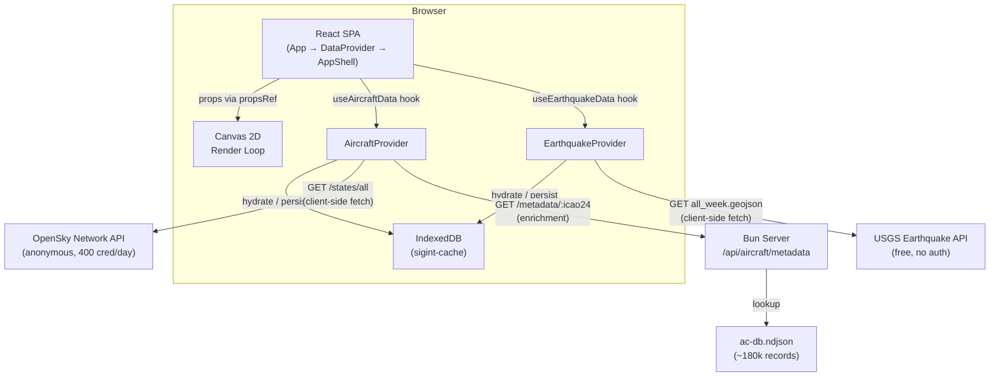
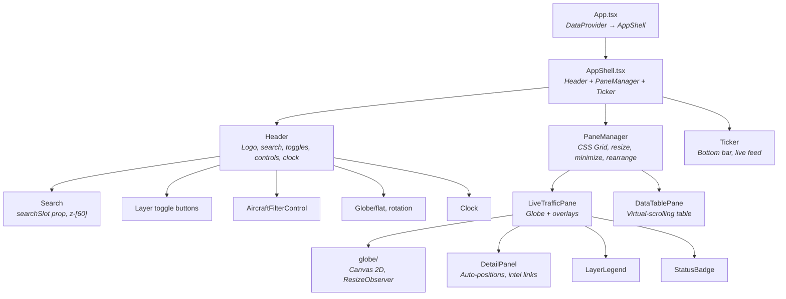

# Architecture Overview

[← Back to Docs Index](./README.md)

**Runtime**: Bun | **Frontend**: React 19, Tailwind 4, Canvas 2D | **Last updated**: March 2026

**Related docs**: [Data Flow](./data-flow.md) · [Feature System](./features.md) · [Pane System](./panes.md) · [Rendering](./rendering.md)

---

## System Overview

SIGINT is a real-time geospatial intelligence dashboard that renders live aircraft tracking data (via OpenSky Network) and live seismic data (via USGS) alongside mock ship and event data onto an interactive globe or flat map projection. A single Bun process serves the bundled React SPA and a small set of API routes used for aircraft metadata enrichment.



### Why client-side fetching?

The OpenSky Network API blocks requests from Heroku's IP ranges. All OpenSky calls are made directly from the browser — anonymous access only, 400 credits/day. The USGS earthquake API is also fetched client-side — free, no auth, no CORS restrictions. The server is involved only for aircraft metadata enrichment via a local NDJSON database.

---

## Directory Structure

```
src/
  index.html                          Entry HTML
  server/
    index.ts                          Dev server (Bun)
    index.prod.ts                     Prod server
    api/
      index.ts                        API route registration
      aircraftMetadata.ts             Metadata lookup from ac-db.ndjson
    data/
      ac-db.ndjson                    Local aircraft database (~180k records)
  client/
    App.tsx                           Thin shell — DataProvider → AppShell
    AppShell.tsx                      Layout: Header + PaneManager + Ticker
    frontend.tsx                      React DOM entry point (async boot with cacheInit)
    config/
      theme.ts                        Color definitions, ThemeColors type, getColorMap()
    context/
      ThemeContext.tsx                 Theme provider (dark/light)
      DataContext.tsx                  Shared data context — all app state lives here
    panes/
      PaneManager.tsx                 Multi-pane layout engine (grid, resize, minimize)
      PaneHeader.tsx                  Pane header bar (title, controls, rearrange)
      live-traffic/
        LiveTrafficPane.tsx           Globe + overlays (detail panel, legend, status badge)
      data-table/
        DataTablePane.tsx             Virtual-scrolling sortable/filterable data table
    features/
      base/
        types.ts                      FeatureDefinition<TData, TFilter> contract
        dataPoints.ts                 DataPoint union type (imports from feature folders)
      tracking/
        aircraft/                     Live data — OpenSky Network
          index.ts, types.ts, definition.ts, detailRows.ts
          ui/                         AircraftFilterControl, AircraftTickerContent
          hooks/                      useAircraftData
          data/                       AircraftProvider, typeLookup
          lib/                        filterUrl, utils
        ships/                        Mock data — AIS planned
          index.ts, types.ts, definition.ts, detailRows.ts
          ui/                         ShipTickerContent
      environmental/
        earthquake/                   Live data — USGS
          index.ts, types.ts, definition.ts, detailRows.ts
          ui/                         EarthquakeTickerContent
          hooks/                      useEarthquakeData
          data/                       EarthquakeProvider
      intel/
        events/                       Mock data — GDELT planned
          index.ts, types.ts, definition.ts, detailRows.ts
          ui/                         EventTickerContent
      registry.tsx                    Feature registry (imports all definitions)
    components/
      globe/                          Canvas 2D visualization (modular)
        GlobeVisualization.tsx        Shell: refs, render loop, effects, tooltip
        types.ts, projection.ts, landRenderer.ts, gridRenderer.ts
        pointRenderer.ts, cameraSystem.ts, inputHandlers.ts
      Search.tsx                      Global search with zoom-to
      Header.tsx                      Top bar: logo, search, toggles, controls, clock
      DetailPanel.tsx                 Selected item detail with intel links
      Ticker.tsx                      Bottom live feed scroll
      LayerLegend.tsx                 Bottom-left layer counts
      StatusBadge.tsx                 Dynamic data source status
      styles.tsx                      Canvas-only constants
    lib/
      storageService.ts               IndexedDB-backed cache
      trailService.ts                 Position recording, interpolation, trails
      landService.ts                  HD coastline data fetch + cache
      tickerFeed.ts                   Builds ticker items from filtered data
      uiSelectors.ts                  Derived counts, active totals, country lists
    data/
      mockData.ts                     Mock ships, events, fallback aircraft
```

---

## Component Hierarchy



### State Architecture

All shared state lives in `DataContext`, exposed via `useData()`. There is no external state management library.

- **`App.tsx`** — wraps everything in `<DataProvider>`, renders `<AppShell>`
- **`AppShell.tsx`** — reads from context, renders Header + PaneManager + Ticker. Gates Header and Ticker on `chromeHidden`.
- **`DataContext.tsx`** — owns all state: data hooks, selection, isolation, layers, filters, view controls, search, derived values. Every component reads from here.
- **`PaneManager.tsx`** — layout engine. Owns pane configs (persisted to IndexedDB). Gates its toolbar and pane headers on `chromeHidden`.
- **`LiveTrafficPane.tsx`** — just the globe + overlays. Reads everything from context. Only local state is `panelSide`.
- **`DataTablePane.tsx`** — reads `allData`, `filters`, `selected` from context. Owns sort/filter state locally.

### Chrome Visibility

When `chromeHidden` is true (toggled by clicking empty globe area): Header, Ticker, PaneManager toolbar, pane headers, DetailPanel, LayerLegend, and StatusBadge all hide. Clicking a data point while chrome is hidden selects it AND unhides chrome automatically.

### Z-Index Stack

| z-index | Component |
|---|---|
| z-10 | LayerLegend, StatusBadge |
| (none) | Header — no stacking context (preserves dropdown rendering) |
| z-30 | Trail waypoint tooltip |
| z-40 | DetailPanel |
| z-50 | PaneManager add-pane menu |
| z-[60] | AircraftFilterControl dropdown, Search dropdown |
