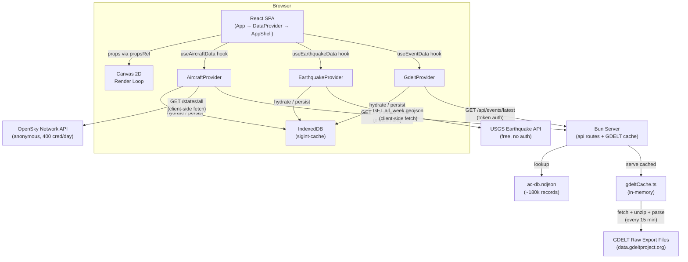
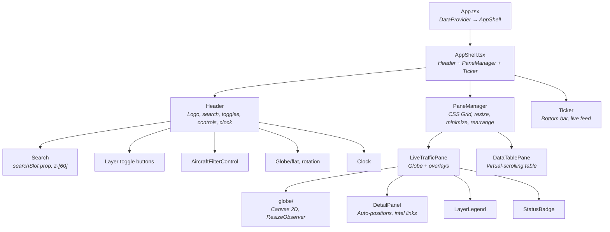

# Architecture Overview

[← Back to Docs Index](./README.md)

**Runtime**: Bun | **Frontend**: React 19, Tailwind 4, Canvas 2D | **Last updated**: March 2026

**Related docs**: [Data Flow](./data-flow.md) · [Feature System](./features.md) · [Pane System](./panes.md) · [Rendering](./rendering.md)

---

## System Overview

SIGINT is a real-time geospatial intelligence dashboard that renders live aircraft tracking data (via OpenSky Network), live seismic data (via USGS), and live geolocated news events (via GDELT 2.0) alongside mock ship data onto an interactive globe or flat map projection. A single Bun process serves the bundled React SPA, fetches and caches GDELT event data server-side, and provides API routes for aircraft metadata enrichment and token-authenticated event delivery.



### Why client-side fetching for some sources?

The OpenSky Network API blocks requests from Heroku's IP ranges. All OpenSky calls are made directly from the browser — anonymous access only, 400 credits/day. The USGS earthquake API is also fetched client-side — free, no auth, no CORS restrictions.

GDELT raw export files have CORS restrictions and are large CSV zips — these are fetched server-side. The server downloads, unzips, and parses the export CSV every 15 minutes, caches the result in memory, and serves it to clients via `/api/events/latest` with token authentication.

### Server API Routes

| Route | Method | Auth | Rate Limit | Purpose |
|-------|--------|------|------------|---------|
| `/api/auth/token` | GET | None | 60 req/min per IP | Issues a signed token (HMAC-SHA256, 30 min TTL) |
| `/api/events/latest` | GET | `X-SIGINT-Token` | 60 req/min per IP | Returns cached GDELT events as GeoJSON |
| `/api/aircraft/metadata/:icao24` | GET | `X-SIGINT-Token` | 60 req/min per IP | Single aircraft metadata lookup |
| `/api/aircraft/metadata/batch` | GET | `X-SIGINT-Token` | 60 req/min per IP | Batch aircraft metadata lookup |

### Auth + Rate Limiting

All API routes are rate limited at 60 requests per minute per IP (sliding window). Protected routes additionally require a valid `X-SIGINT-Token` header. Auth and rate limiting live in `api/auth.ts` — every route calls either `guardAuth` (token + rate limit) or `guardRateLimit` (rate limit only, for the token endpoint).

Clients use a shared `lib/authService.ts` that fetches a token once on first API call, caches it in memory, and auto-refreshes on 401. All server-bound fetches (aircraft metadata, GDELT events) go through `authenticatedFetch()`.

### GDELT Server Pipeline

On boot, `startGdeltPolling()` kicks off a 15-minute interval:

1. Fetch `http://data.gdeltproject.org/gdeltv2/lastupdate.txt` — returns URLs to the latest 15-min export files
2. Download the `.export.CSV.zip` file
3. Extract CSV from ZIP using `zlib.inflateRaw` (zero dependencies — manual ZIP header parsing)
4. Parse tab-delimited CSV (61 columns per GDELT 2.0 Event Codebook)
5. Filter to conflict/crisis CAMEO root codes (10, 13, 14, 15, 17, 18, 19, 20)
6. Extract geocoded events with lat/lon, actors, Goldstein scale, tone, source URL
7. Convert to GeoJSON format matching client expectations
8. Cache in memory — dedupes by checking if the export URL changed since last fetch

Token auth and rate limiting prevent the API from being abused as an open proxy. Tokens are signed with `SIGINT_SERVER_SECRET` (env var, required) using HMAC-SHA256 with constant-time comparison. Rate limiting uses a per-IP sliding window (60 req/min) applied to every route including the token endpoint. Clients fetch a token on boot via `authenticatedFetch()` in `lib/authService.ts` and auto-refresh on 401.

### Environment Variables

| Variable | Required | Description |
|----------|----------|-------------|
| `SIGINT_SERVER_SECRET` | **Yes** | Server-only secret for signing auth tokens. Generate with `openssl rand -hex 32`. Server refuses to start without it. |
| `PORT` | No | Server port (default: 3000) |

---

## Directory Structure

```
src/
  index.html                          Entry HTML
  server/
    index.ts                          Dev server (Bun, HMR) — imports startGdeltPolling
    index.prod.ts                     Prod server — imports startGdeltPolling
    api/
      index.ts                        API route registration (aircraft, auth, events)
      auth.ts                         Token generation/verification + per-IP rate limiting
      aircraftMetadata.ts             Metadata lookup from ac-db.ndjson
      gdeltCache.ts                   GDELT fetch, parse, in-memory cache
    data/
      ac-db.ndjson                    Local aircraft database (~180k records)
  client/
    App.tsx                           Thin shell — DataProvider → AppShell
    AppShell.tsx                      Layout: Header + PaneManager + Ticker
    frontend.tsx                      React DOM entry point (async boot with cacheInit)
    config/
      theme.ts                        Color definitions, ThemeColors type, getColorMap()
    context/
      ThemeContext.tsx                 Theme provider (dark/light)
      DataContext.tsx                  Shared data context — all app state lives here
    panes/
      PaneManager.tsx                 Multi-pane layout engine (grid, resize, minimize, mobile tabs)
      PaneHeader.tsx                  Pane header bar (title, controls, rearrange)
      live-traffic/
        LiveTrafficPane.tsx           Globe + overlays (detail panel, legend, status badge)
      data-table/
        DataTablePane.tsx             Virtual-scrolling sortable/filterable data table
    features/
      base/
        types.ts                      FeatureDefinition<TData, TFilter> contract
        dataPoints.ts                 DataPoint union type (imports from feature folders)
      tracking/
        aircraft/                     Live data — OpenSky Network
          index.ts, types.ts, definition.ts, detailRows.ts
          ui/                         AircraftFilterControl, AircraftTickerContent
          hooks/                      useAircraftData
          data/                       AircraftProvider, typeLookup
          lib/                        filterUrl, utils
        ships/                        Mock data — AIS planned
          index.ts, types.ts, definition.ts, detailRows.ts
          ui/                         ShipTickerContent
      environmental/
        earthquake/                   Live data — USGS
          index.ts, types.ts, definition.ts, detailRows.ts
          ui/                         EarthquakeTickerContent
          hooks/                      useEarthquakeData
          data/                       EarthquakeProvider
      intel/
        events/                       Live data — GDELT 2.0
          index.ts, types.ts, definition.ts, detailRows.ts
          ui/                         EventTickerContent
          hooks/                      useEventData
          data/                       GdeltProvider (client-side caching + server token auth)
      registry.tsx                    Feature registry (imports all definitions)
    components/
      globe/                          Canvas 2D visualization (modular)
        GlobeVisualization.tsx        Shell: refs, render loop, effects, tooltip
        types.ts, projection.ts, landRenderer.ts, gridRenderer.ts
        pointRenderer.ts, cameraSystem.ts, inputHandlers.ts
      Search.tsx                      Global search with zoom-to
      Header.tsx                      Top bar: logo, search, toggles, controls, clock
      DetailPanel.tsx                 Selected item detail with intel links
      Ticker.tsx                      Bottom live feed scroll
      LayerLegend.tsx                 Bottom-left layer counts
      StatusBadge.tsx                 Dynamic data source status
      styles.tsx                      Canvas-only constants
    lib/
      authService.ts                  Shared token management + authenticatedFetch()
      storageService.ts               IndexedDB-backed cache
      trailService.ts                 Position recording, interpolation, trails
      landService.ts                  HD coastline data fetch + cache
      tickerFeed.ts                   Builds ticker items from filtered data
      uiSelectors.ts                  Derived counts, active totals, country lists
    data/
      mockData.ts                     Mock ships, fallback aircraft
```

---

## Component Hierarchy



### State Architecture

All shared state lives in `DataContext`, exposed via `useData()`. There is no external state management library.

- **`App.tsx`** — wraps everything in `<DataProvider>`, renders `<AppShell>`
- **`AppShell.tsx`** — reads from context, renders Header + PaneManager + Ticker. Gates Header and Ticker on `chromeHidden`.
- **`DataContext.tsx`** — owns all state: data hooks (aircraft, earthquake, events), selection, isolation, layers, filters, view controls, search, derived values. Every component reads from here.
- **`PaneManager.tsx`** — layout engine. Owns pane configs (persisted to IndexedDB). Gates its toolbar and pane headers on `chromeHidden`. Mobile responsive — single pane with tab switching under 768px.
- **`LiveTrafficPane.tsx`** — just the globe + overlays. Reads everything from context. Only local state is `panelSide`.
- **`DataTablePane.tsx`** — reads `allData`, `filters`, `selected` from context. Owns sort/filter state locally.

### Chrome Visibility

When `chromeHidden` is true (toggled by clicking empty globe area): Header, Ticker, PaneManager toolbar, pane headers, DetailPanel, LayerLegend, and StatusBadge all hide. Clicking a data point while chrome is hidden selects it AND unhides chrome automatically.

### Z-Index Stack

| z-index | Component |
|---|---|
| z-10 | LayerLegend, StatusBadge |
| (none) | Header — no stacking context (preserves dropdown rendering) |
| z-30 | Trail waypoint tooltip |
| z-40 | DetailPanel |
| z-50 | PaneManager add-pane menu |
| z-[60] | AircraftFilterControl dropdown, Search dropdown |