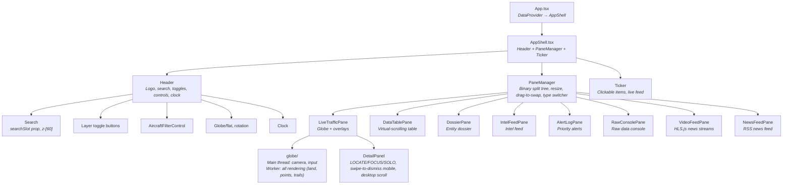

# Architecture Overview

[← Back to Docs Index](./README.md)

**Runtime**: Bun | **Frontend**: React 19, Tailwind 4, Canvas 2D + Web Worker | **Last updated**: March 2026

**Related docs**: [Data Flow](./data-flow.md) · [Feature System](./features.md) · [Pane System](./panes.md) · [Rendering](./rendering.md)

---

## System Overview

SIGINT is a real-time geospatial intelligence dashboard that renders live aircraft tracking data (via OpenSky Network), live seismic data (via USGS), live geolocated news events (via GDELT 2.0), live AIS vessel positions (via aisstream.io), live fire hotspots (via NASA FIRMS), and severe weather alerts (via NOAA) onto an interactive globe or flat map projection. A non-geographic RSS news feed aggregates world news from 6 major sources. A single Bun process serves the bundled React SPA, maintains a persistent WebSocket to aisstream.io for AIS data, fetches and caches GDELT event data, FIRMS fire data, and RSS news feeds server-side, and provides API routes for aircraft metadata enrichment and token-authenticated data delivery.

The rendering pipeline uses a dedicated Web Worker (`public/workers/pointWorker.js`) with its own OffscreenCanvas. The worker renders everything — land, ocean, grid, glow, rim, data points, trails, and selection rings — on a separate CPU core. The main thread handles camera updates, input handling, and composites the finished `ImageBitmap` via a single `drawImage` call.

```mermaid
graph TB
    subgraph Browser
        SPA["React SPA<br/>(App → DataProvider → AppShell)"]
        MainCanvas["Main Canvas<br/>(composite only)"]
        Worker["Web Worker<br/>(pointWorker.js — OffscreenCanvas)<br/>land, grid, ocean, points, trails"]
        IDB["IndexedDB<br/>(sigint-cache)"]
        AircraftProv["AircraftProvider"]
        QuakeProv["earthquakeProvider<br/>(BaseProvider)"]
        GdeltProv["gdeltProvider<br/>(BaseProvider)"]
        ShipProv["shipProvider<br/>(BaseProvider)"]
        FireProv["fireProvider<br/>(BaseProvider)"]
        WeatherProv["weatherProvider<br/>(BaseProvider)"]

        SPA -->|"props via propsRef"| MainCanvas
        MainCanvas -->|"drawImage bitmap"| Worker
        SPA -->|"data + camera msgs"| Worker
        SPA -->|"useAircraftData hook"| AircraftProv
        SPA -->|"useEarthquakeData hook"| QuakeProv
        SPA -->|"useEventData hook"| GdeltProv
        SPA -->|"useShipData hook"| ShipProv
        SPA -->|"useFireData hook"| FireProv
        SPA -->|"useWeatherData hook"| WeatherProv
        AircraftProv -->|"hydrate / persist"| IDB
        QuakeProv -->|"hydrate / persist"| IDB
        GdeltProv -->|"hydrate / persist"| IDB
        ShipProv -->|"hydrate / persist"| IDB
        FireProv -->|"hydrate / persist"| IDB
        WeatherProv -->|"hydrate / persist"| IDB
    end

    OpenSky["OpenSky Network API<br/>(anonymous, 400 cred/day)"]
    USGS["USGS Earthquake API<br/>(free, no auth)"]
    NOAA["NOAA Weather API<br/>(free, User-Agent only)"]
    BunServer["Bun Server<br/>(api routes + GDELT cache + AIS cache + FIRMS cache)"]
    NDJSON["ac-db.ndjson<br/>(~180k records)"]
    GdeltRaw["GDELT Raw Export Files<br/>(data.gdeltproject.org)"]
    AISStream["aisstream.io<br/>(WebSocket, global AIS)"]
    FIRMS["NASA FIRMS API<br/>(VIIRS NOAA-20 CSV)"]

    AircraftProv -->|"GET /states/all<br/>(client-side fetch)"| OpenSky
    AircraftProv -->|"GET /metadata/:icao24<br/>(enrichment)"| BunServer
    QuakeProv -->|"GET all_week.geojson<br/>(client-side fetch)"| USGS
    WeatherProv -->|"GET /alerts/active<br/>(client-side fetch)"| NOAA
    GdeltProv -->|"GET /api/events/latest<br/>(token auth)"| BunServer
    ShipProv -->|"GET /api/ships/latest<br/>(token auth)"| BunServer
    FireProv -->|"GET /api/fires/latest<br/>(token auth)"| BunServer
    BunServer -->|"lookup"| NDJSON
    BunServer -->|"serve cached"| GdeltCache["gdeltCache.ts<br/>(in-memory)"]
    BunServer -->|"serve cached"| AISCache["aisCache.ts<br/>(in-memory)"]
    BunServer -->|"serve cached"| FIRMSCache["firmsCache.ts<br/>(in-memory)"]
    GdeltCache -->|"fetch + unzip + parse<br/>(every 15 min)"| GdeltRaw
    AISCache -->|"persistent WebSocket<br/>(real-time stream)"| AISStream
    FIRMSCache -->|"fetch CSV<br/>(every 30 min)"| FIRMS
```



### Why client-side fetching for some sources?

The OpenSky Network API blocks requests from Heroku's IP ranges. All OpenSky calls are made directly from the browser — anonymous access only, 400 credits/day. The USGS earthquake API is also fetched client-side — free, no auth, no CORS restrictions.

GDELT raw export files have CORS restrictions and are large CSV zips — these are fetched server-side. The server downloads, unzips, and parses the export CSV every 15 minutes, caches the result in memory, and serves it to clients via `/api/events/latest` with token authentication.

AIS data from aisstream.io requires an API key and does not support browser CORS. The server maintains a persistent WebSocket connection to aisstream.io, accumulates vessel positions in an in-memory Map, and serves snapshots to clients via `/api/ships/latest` with token authentication.

NASA FIRMS fire data requires an API key and returns large CSV payloads (30-100k records). Fetched server-side every 30 minutes, parsed, and cached in memory. Served from `/api/fires/latest` with token auth and gzip compression. Clients poll every 600 seconds.

NOAA Weather alerts are fetched client-side directly from `api.weather.gov/alerts/active`. No API key required — only a `User-Agent` header. Free, no CORS restrictions. The NWS API returns a GeoJSON FeatureCollection. Clients poll every 300 seconds.

### Server API Routes

| Route | Method | Auth | Rate Limit | Purpose |
|-------|--------|------|------------|---------|
| `/api/auth/token` | GET | None | 60 req/min per IP | Issues a signed token (HMAC-SHA256, 30 min TTL) |
| `/api/events/latest` | GET | `X-SIGINT-Token` | 60 req/min per IP | Returns cached GDELT events (gzip compressed) |
| `/api/ships/latest` | GET | `X-SIGINT-Token` | 60 req/min per IP | Returns cached AIS vessel positions (gzip compressed) |
| `/api/aircraft/metadata/:icao24` | GET | `X-SIGINT-Token` | 60 req/min per IP | Single aircraft metadata lookup |
| `/api/aircraft/metadata/batch` | GET | `X-SIGINT-Token` | 60 req/min per IP | Batch aircraft metadata lookup |
| `/api/fires/latest` | GET | `X-SIGINT-Token` | 60 req/min per IP | Returns cached NASA FIRMS fire hotspots (gzip compressed) |
| `/api/news/latest` | GET | `X-SIGINT-Token` | 60 req/min per IP | Returns cached RSS news articles (gzip compressed) |
| `/api/dossier/aircraft/:icao24` | GET | `X-SIGINT-Token` | 60 req/min per IP | Aircraft dossier (hexdb.io info + planespotters photos) |

### Auth + Rate Limiting

All API routes are rate limited at 60 requests per minute per IP (sliding window). Protected routes additionally require a valid `X-SIGINT-Token` header. Auth and rate limiting live in `api/auth.ts` — every route calls either `guardAuth` (token + rate limit) or `guardRateLimit` (rate limit only, for the token endpoint).

Clients use a shared `lib/authService.ts` that fetches a token once on first API call, caches it in memory, and auto-refreshes on 401. All server-bound fetches (aircraft metadata, GDELT events, AIS ships, FIRMS fires, RSS news) go through `authenticatedFetch()`.

### GDELT Server Pipeline

On boot, `startGdeltPolling()` kicks off a 15-minute interval:

1. Fetch `http://data.gdeltproject.org/gdeltv2/lastupdate.txt` — returns URLs to the latest 15-min export files
2. Download the `.export.CSV.zip` file
3. Extract CSV from ZIP using `zlib.inflateRaw` (zero dependencies — manual ZIP header parsing)
4. Parse tab-delimited CSV (61 columns per GDELT 2.0 Event Codebook)
5. Filter to conflict/crisis CAMEO root codes (10, 13, 14, 15, 17, 18, 19, 20)
6. Extract geocoded events with lat/lon, actors, Goldstein scale, tone, source URL
7. Convert to GeoJSON format matching client expectations
8. Cache in memory — dedupes by checking if the export URL changed since last fetch

### AIS Server Pipeline

On boot, `startAisPolling()` opens a persistent WebSocket to aisstream.io:

1. Connect to `wss://stream.aisstream.io/v0/stream`
2. Send subscription: API key, global bounding box `[[[-90,-180],[90,180]]]`, filter to `PositionReport` + `ShipStaticData` messages
3. Messages stream in real-time (~300/sec globally)
4. `PositionReport` messages update lat/lon/speed/heading/course/nav status per MMSI
5. `ShipStaticData` messages enrich with name/callsign/IMO/type/destination/draught/dimensions
6. In-memory Map keyed by MMSI — always current, no polling interval
7. Stale vessels (not seen for 60 min) pruned every 5 minutes
8. Auto-reconnect on disconnect with 10s delay
9. `/api/ships/latest` snapshots the Map into an array for client consumption

If `AISSTREAM_API_KEY` is not set, the WebSocket is never opened and `/api/ships/latest` returns 503. Ships layer shows empty. All other features work normally.

### FIRMS Server Pipeline

On boot, `startFirmsPolling()` kicks off a 30-minute interval:

1. Fetch VIIRS NOAA-20 global fire hotspot CSV from `https://firms.modaps.eosdis.nasa.gov/api/area/csv/{MAP_KEY}/VIIRS_NOAA20_NRT/world/1` (last 24 hours)
2. Parse CSV — columns: latitude, longitude, brightness, scan, track, acquisition date/time, satellite, instrument, confidence, version, bright_ti5, FRP, day/night
3. Filter out null-island (0,0) records
4. Cache parsed records in memory
5. Serve via `/api/fires/latest` with token auth and gzip compression

If `FIRMS_MAP_KEY` is not set, polling is skipped and `/api/fires/latest` returns 503. Fires layer shows empty. All other features work normally.

### RSS News Server Pipeline

On boot, `startNewsPolling()` kicks off a 10-minute interval:

1. Fetch RSS/Atom XML from 6 world news sources in parallel (15s timeout per feed)
2. Parse XML — extract title, link, pubDate, description from `<item>` (RSS) or `<entry>` (Atom) elements, strip HTML entities and tags
3. Deduplicate by URL across all sources
4. Sort by publication date (newest first), cap at 200 articles
5. Cache in memory — stale cache retained if all upstream feeds fail

**Feed sources (all verified working):**
- Reuters via Google News RSS: `https://news.google.com/rss/search?q=when:24h+allinurl:reuters.com&ceid=US:en&hl=en-US&gl=US`
- NYT World: `https://rss.nytimes.com/services/xml/rss/nyt/World.xml`
- BBC World: `https://feeds.bbci.co.uk/news/world/rss.xml`
- Al Jazeera: `https://www.aljazeera.com/xml/rss/all.xml`
- The Guardian: `https://www.theguardian.com/world/rss`
- NPR World: `https://feeds.npr.org/1004/rss.xml`

**Dead feeds — DO NOT USE:**
- `feeds.reuters.com/*` — Reuters killed all RSS feeds in June 2020. Domain does not resolve.
- `rsshub.app/*` — Third-party proxy, unreliable, frequently returns 403.
- `reddit.com/r/*/.json` — Returns 403 from server-side without OAuth authentication.

No API key or env var required. All feeds are public. News is non-geographic (no lat/lon) — it does NOT go into the DataPoint union, allData, or the feature registry. It lives in its own self-contained pane.

Token auth and rate limiting prevent the API from being abused as an open proxy. Tokens are signed with `SIGINT_SERVER_SECRET` (env var, required) using HMAC-SHA256 with constant-time comparison. Rate limiting uses a per-IP sliding window (60 req/min) applied to every route including the token endpoint. Clients fetch a token on boot via `authenticatedFetch()` in `lib/authService.ts` and auto-refresh on 401.

### Environment Variables

| Variable | Required | Description |
|----------|----------|-------------|
| `SIGINT_SERVER_SECRET` | **Yes** | Server-only secret for signing auth tokens. Generate with `openssl rand -hex 32`. Server refuses to start without it. |
| `AISSTREAM_API_KEY` | No | Free API key from [aisstream.io](https://aisstream.io) (sign up via GitHub). Enables live global AIS vessel data. Without it, ships layer is empty. |
| `FIRMS_MAP_KEY` | No | Free API key from [firms.modaps.eosdis.nasa.gov](https://firms.modaps.eosdis.nasa.gov/api/map_key/). Enables live NASA FIRMS fire hotspot data. Without it, fires layer is empty. |
| `PORT` | No | Server port (default: 3000) |

---

## Directory Structure

```
public/
  workers/
    pointWorker.js                    Web Worker — point rendering on OffscreenCanvas
  data/
    ne_50m_land.json                  HD coastline geometry
  fonts/
    jetbrains-mono/                   JetBrains Mono woff2 files
  fonts.css                           Font-face declarations
src/
  index.html                          Entry HTML
  server/
    index.ts                          Dev server (Bun, HMR) — routes: fonts, data, workers, API, SPA
    index.prod.ts                     Prod server — routes: fonts, data, workers, API, dist
    api/
      index.ts                        API route registration + gzip response helper
      auth.ts                         Token generation/verification + per-IP rate limiting
      aircraftMetadata.ts             Metadata lookup from ac-db.ndjson
      gdeltCache.ts                   GDELT fetch, parse, in-memory cache
      aisCache.ts                     AIS WebSocket connection, vessel accumulation, in-memory cache
      firmsCache.ts                   NASA FIRMS CSV fetch, parse, in-memory cache
      newsCache.ts                    RSS news feed fetch, parse, in-memory cache
    data/
      ac-db.ndjson                    Local aircraft database (~180k records)
  client/
    App.tsx                           Thin shell — DataProvider → AppShell
    AppShell.tsx                      Layout: Header + PaneManager + Ticker (wires ticker click → select + zoom)
    frontend.tsx                      React DOM entry point (async boot with cacheInit)
    config/
      theme.ts                        Color definitions, ThemeColors type, getColorMap()
    context/
      ThemeContext.tsx                 Theme provider (dark/light)
      DataContext.tsx                  Shared data context — all app state, idMap, spatialGrid, filteredIds
    panes/
      PaneManager.tsx                 Multi-pane layout engine (grid, resize, minimize, mobile tabs)
      PaneHeader.tsx                  Pane header bar (title, controls, rearrange)
      paneLayoutContext.ts            useSyncExternalStore signal (NOT React context)
      live-traffic/
        LiveTrafficPane.tsx           Globe + overlays (detail panel, legend, status badge)
      data-table/
        DataTablePane.tsx             Virtual-scrolling sortable/filterable data table (auto-scrolls to selection)
      dossier/
        DossierPane.tsx               Entity dossier — aircraft photos/route, ship details, event/quake/fire info
      intel-feed/
        IntelFeedPane.tsx             Scrollable intel feed — GDELT events, quakes, fires with severity badges
      alert-log/
        AlertLogPane.tsx              Priority alerts — emergency squawks, high-FRP fires, severe weather, crisis events
      raw-console/
        RawConsolePane.tsx            Raw data console — JSON view with syntax highlighting
        jsonHighlight.tsx             Zero-dep JSON syntax highlighter using CSS vars
      video-feed/
        VideoFeedPane.tsx             Live HLS video streams — iptv-org channels, grid layout, presets
        VideoSlot.tsx                 Single video slot with HLS player and controls
        HlsPlayer.tsx                HLS.js wrapper component
        ChannelPicker.tsx             Channel search + region tabs
        PresetMenu.tsx                Save/load/delete channel presets
        channelService.ts             Fetch + parse iptv-org channel data
        videoFeedPersistence.ts       Grid + channel state persistence
        videoFeedTypes.ts             Video feed type definitions
      news-feed/
        NewsFeedPane.tsx              RSS news feed — list + inline detail, source filters, state persistence
        newsProvider.ts               NewsProvider class (mirrors BaseProvider contract for NewsArticle[])
        useNewsData.ts                useNewsData hook (follows useProviderData pattern)
    features/
      base/
        types.ts                      FeatureDefinition<TData, TFilter> contract
        dataPoints.ts                 DataPoint union type (imports from feature folders)
        BaseProvider.ts               Config-driven base class for non-aircraft providers
        useProviderData.ts            Generic hook replacing per-feature boilerplate hooks
      tracking/
        aircraft/                     Live data — OpenSky Network
          index.ts, types.ts, definition.ts, detailRows.ts
          ui/                         AircraftFilterControl, AircraftTickerContent
          hooks/                      useAircraftData
          data/                       AircraftProvider (class — unique enrichment/mock logic), typeLookup
          lib/                        filterUrl, utils
        ships/                        Live data — aisstream.io AIS
          index.ts, types.ts, definition.ts, detailRows.ts
          ui/                         ShipTickerContent (3-line detail with mph conversion)
          hooks/                      useShipData (thin wrapper around useProviderData)
          data/                       shipProvider (BaseProvider instance)
      environmental/
        earthquake/                   Live data — USGS
          index.ts, types.ts, definition.ts, detailRows.ts
          ui/                         EarthquakeTickerContent
          hooks/                      useEarthquakeData (thin wrapper around useProviderData)
          data/                       earthquakeProvider (BaseProvider instance)
        fires/                        Live data — NASA FIRMS
          index.ts, types.ts, definition.ts, detailRows.ts
          ui/                         FireTickerContent
          hooks/                      useFireData (thin wrapper around useProviderData)
          data/                       fireProvider (BaseProvider instance)
        weather/                      Live data — NOAA Weather
          index.ts, types.ts, definition.ts, detailRows.ts
          ui/                         WeatherTickerContent
          hooks/                      useWeatherData (thin wrapper around useProviderData)
          data/                       weatherProvider (BaseProvider instance)
      intel/
        events/                       Live data — GDELT 2.0
          index.ts, types.ts, definition.ts, detailRows.ts
          ui/                         EventTickerContent
          hooks/                      useEventData (thin wrapper around useProviderData)
          data/                       gdeltProvider (BaseProvider instance, with mergeFn for dedup)
      registry.tsx                    Feature registry (imports all definitions)
    components/
      globe/                          Canvas 2D visualization (modular)
        GlobeVisualization.tsx        Shell: refs, render loop, worker lifecycle, composite
        types.ts                      Shared types + SpatialGrid prop types
        projection.ts                 projGlobe, projFlat, getFlatMetrics, clampFlatPan
        landRenderer.ts               Coastline polygons, globe clipping
        gridRenderer.ts               Lat/lon grid lines
        cameraSystem.ts               Lock-on follow, lerp, shortest-path rotation, auto-rotate
        inputHandlers.ts              Mouse, touch, wheel, keyboard + spatial grid click/hover
      Search.tsx                      Global search with zoom-to
      Header.tsx                      Top bar: logo, search, toggles, controls, clock (single-row on lg+)
      DetailPanel.tsx                 Selected item detail — LOCATE/FOCUS/SOLO, swipe-to-dismiss mobile, desktop scroll
      Ticker.tsx                      Bottom live feed (80-item pool, fires+weather, hover glow, responsive count)
      Tooltip.tsx                     Reusable tooltip wrapper
      LayerLegend.tsx                 DEAD CODE — safe to delete
      styles.tsx                      Canvas-only constants
    lib/
      authService.ts                  Shared token management + authenticatedFetch()
      storageService.ts               IndexedDB-backed cache
      trailService.ts                 Position recording, interpolation, trails
      landService.ts                  HD coastline data fetch + cache
      spatialIndex.ts                 Grid-based spatial hash + inverse projection for click/hover
      tickerFeed.ts                   Ticker items — round-robin interleave, non-moving filtered out
      uiSelectors.ts                  Derived counts, active totals, country lists
    data/
      mockData.ts                     Mock aircraft (fallback only — no mock ships)
```

---

## Component Hierarchy



### State Architecture

All shared state lives in `DataContext`, exposed via `useData()`. There is no external state management library.

- **`App.tsx`** — wraps everything in `<DataProvider>`, renders `<AppShell>`
- **`AppShell.tsx`** — reads from context, renders Header + PaneManager + Ticker. Gates Header and Ticker on `chromeHidden`.
- **`DataContext.tsx`** — owns all state: data hooks (aircraft, earthquake, events, ships, fires, weather), selection, isolation, layers, filters, view controls, search, derived values. Centralizes trail recording via a `useEffect` on `allData` changes. Maintains `idMap` (O(1) selection lookup), `spatialGrid` (for click/hover), and `filteredIds` (pre-computed filter set).
- **`PaneManager.tsx`** — layout engine. Owns pane configs (persisted to IndexedDB). Layout presets (save/load/update/delete named views). Gates its toolbar and pane headers on `chromeHidden`. Mobile responsive — single pane with tab switching under 768px. Touch-friendly button targets (40px minimum).
- **`LiveTrafficPane.tsx`** — just the globe + overlays. Reads everything from context. Only local state is `panelSide`. Passes `spatialGrid` and `filteredIds` to globe.
- **`DataTablePane.tsx`** — reads `allData`, `filters`, `selected` from context. Owns sort/filter state locally. Column header tooltips. Auto-scrolls to selected item when selection changes from external source (ticker, globe).

### Chrome Visibility

When `chromeHidden` is true (toggled by clicking empty globe area): Header, Ticker, PaneManager toolbar, pane headers, and DetailPanel all hide. Clicking a data point while chrome is hidden selects it AND unhides chrome automatically.

### Z-Index Stack

| z-index | Component |
|---|---|
| (none) | Header — no stacking context (preserves dropdown rendering) |
| z-30 | Trail waypoint tooltip |
| z-40 | DetailPanel |
| z-50 | PaneManager add-pane menu |
| z-[60] | AircraftFilterControl dropdown, Search dropdown |