# SIGINT Dashboard — Architecture & Data Flow

Internal technical documentation for the SIGINT OSINT Live Feed dashboard application.

**Runtime**: Bun  
**Frontend**: React 19, Tailwind 4, Canvas 2D  
**Last updated**: March 2026

---

## 1. System Overview

SIGINT is a real-time geospatial intelligence dashboard that renders live aircraft tracking data (via OpenSky Network) and live seismic data (via USGS) alongside mock ship and event data onto an interactive globe or flat map projection. A single Bun process serves the bundled React SPA and a small set of API routes used for aircraft metadata enrichment.

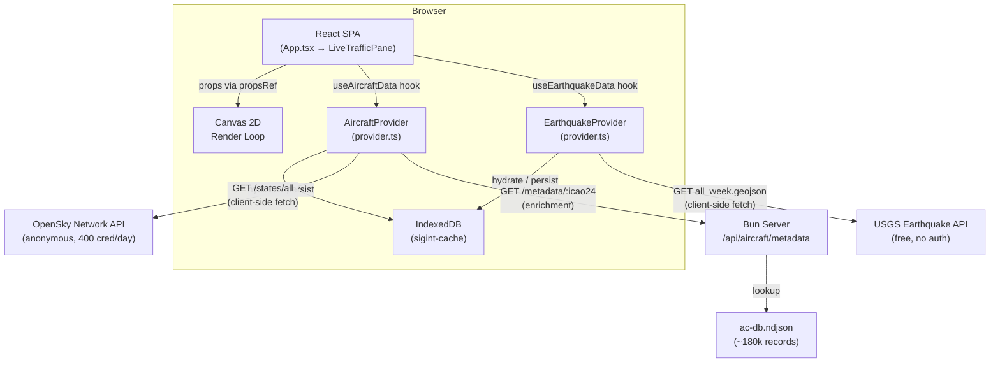

### Why client-side fetching?

The OpenSky Network API blocks requests from Heroku's IP ranges. All OpenSky calls are made directly from the browser. This means API keys cannot be used — only anonymous access at 400 credits/day. The USGS earthquake API is also fetched client-side — it's free, requires no auth, and has no CORS restrictions. The server is involved only for aircraft metadata enrichment (model, registration, operator) via a local NDJSON database.

---

## 2. Directory Structure

```
src/
  index.html                          Entry HTML
  server/
    index.ts                          Dev server (Bun)
    index.prod.ts                     Prod server
    api/
      index.ts                        API route registration
      aircraftMetadata.ts             Metadata lookup from ac-db.ndjson
    data/
      ac-db.ndjson                    Local aircraft database (~180k records)
  client/
    App.tsx                           Thin shell — renders LiveTrafficPane
    frontend.tsx                      React DOM entry point (async boot with cacheInit)
    config/
      theme.ts                        Color definitions, ThemeColors type, getColorMap()
    context/
      ThemeContext.tsx                 Theme provider (dark/light)
    panes/
      live-traffic/
        LiveTrafficPane.tsx           Self-contained live traffic view (all state lives here)
    features/
      base/
        types.ts                      FeatureDefinition<TData, TFilter> contract
        dataPoints.ts                 DataPoint union type (imports types from feature folders)
      tracking/
        aircraft/
          index.ts                    Barrel exports (public API for the feature)
          types.ts                    AircraftData, AircraftFilter, SquawkCode types
          definition.ts               aircraftFeature: FeatureDefinition instance
          detailRows.ts               buildAircraftDetailRows() + intel links
          ui/
            AircraftFilterControl.tsx Filter dropdown UI
            AircraftTickerContent.tsx Ticker rendering for aircraft items
          hooks/
            useAircraftData.ts        React hook — orchestrates polling + enrichment
          data/
            provider.ts               AircraftProvider — fetch, cache, enrich
            typeLookup.ts             getAircraftMetadataBatch() — server enrichment
          lib/
            filterUrl.ts              URL sync for aircraft filter state
            utils.ts                  matchesAircraftFilter(), squawk helpers
        ships/
          index.ts                    Barrel exports
          types.ts                    ShipData type
          definition.ts               shipsFeature: FeatureDefinition instance
          detailRows.ts               buildShipDetailRows()
          ui/
            ShipTickerContent.tsx     Ticker rendering for ship items
      environmental/
        earthquake/
          index.ts                    Barrel exports
          types.ts                    EarthquakeData, EarthquakeFilter types
          definition.ts               earthquakeFeature: FeatureDefinition instance
          detailRows.ts               buildEarthquakeDetailRows() + USGS link
          ui/
            EarthquakeTickerContent.tsx  Ticker rendering for seismic items
          hooks/
            useEarthquakeData.ts      React hook — polls USGS every 7 min
          data/
            provider.ts               EarthquakeProvider — fetch, cache (IndexedDB)
      intel/
        events/
          index.ts                    Barrel exports
          types.ts                    EventData type
          definition.ts               eventsFeature: FeatureDefinition instance
          detailRows.ts               buildEventDetailRows()
          ui/
            EventTickerContent.tsx    Ticker rendering for event items
      registry.tsx                    Feature registry (imports all feature definitions)
    components/
      globe/                          Canvas 2D visualization (modular)
        index.tsx                     Barrel export
        GlobeVisualization.tsx        Shell: refs, render loop, effects, tooltip JSX
        types.ts                      Shared types (Projected, CamState, CamTarget, etc.)
        projection.ts                 projGlobe, projFlat, getFlatMetrics, clampFlatPan
        landRenderer.ts               Land polygon drawing + globe clipping
        gridRenderer.ts               Lat/lon grid lines
        pointRenderer.ts              Data points, trails, quake age rendering, hit targets
        cameraSystem.ts               Lock-on follow, lerp, auto-rotate
        inputHandlers.ts              Mouse, touch, wheel, keyboard handler factory
      Search.tsx                      Global search with zoom-to
      Header.tsx                      Top bar: logo, search, toggles, view controls, clock
      DetailPanel.tsx                 Selected item detail with auto-detected intel links
      Ticker.tsx                      Bottom live feed scroll
      LayerLegend.tsx                 Bottom-left layer counts
      StatusBadge.tsx                 Bottom-right dynamic data source status
      styles.tsx                      Canvas-only constants
    lib/
      storageService.ts               IndexedDB-backed cache (replaces all localStorage)
      trailService.ts                 Position recording, interpolation, trail storage
      landService.ts                  HD coastline data fetch + cache
      tickerFeed.ts                   Builds ticker items from filtered data
      uiSelectors.ts                  Derived counts, active totals, country lists
    data/
      mockData.ts                     Mock ships, events, fallback aircraft
```

---

## 3. The Feature System

Every data type in the application (aircraft, ships, events, quakes) is a **feature** — a self-contained module that implements the `FeatureDefinition` contract. This keeps rendering, filtering, and display logic colocated with the data type it belongs to.

Features are organized by domain: `tracking/` for live position feeds, `environmental/` for natural events, and `intel/` for news/conflict data.

### 3.1 FeatureDefinition Contract

Defined in `features/base/types.ts`:

```typescript
type FeatureDefinition<TData, TFilter> = {
  id: string;                   // Discriminator matching DataPoint.type
  label: string;                // Display name ("AIRCRAFT", "AIS VESSELS")
  icon: LucideIcon;             // Icon component for UI

  matchesFilter(item, filter): boolean;   // Does this item pass the current filter?
  defaultFilter: TFilter;                 // Initial filter state

  buildDetailRows(data, timestamp?): [string, string][];  // Detail panel rows + intel links
  TickerContent: React.ComponentType;     // How this type renders in the ticker

  FilterControl?: React.ComponentType;    // Optional header filter UI
  getSearchText?: (data) => string;       // Optional searchable text builder
};
```

### 3.2 Feature Registry

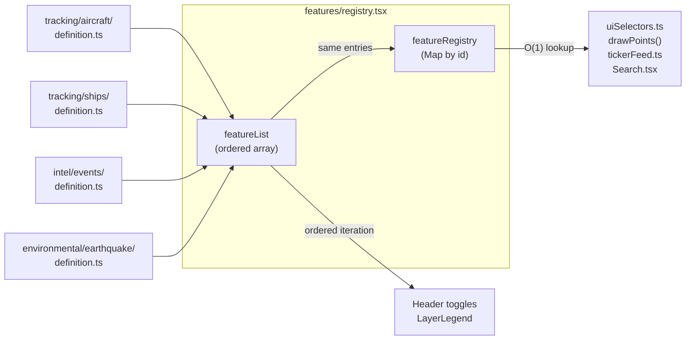

`features/registry.tsx` is a pure registry file — it imports all feature definitions from their respective folders and collects them into two exports:

- **`featureList`** — ordered array for iteration (determines UI rendering order)
- **`featureRegistry`** — `Map<string, FeatureDefinition>` for O(1) lookup by id

All four features (aircraft, ships, events, earthquakes) have their own feature folders. Aircraft and earthquake have full providers, hooks, and UI components for live data. Ships and events have types, definitions, detail rows, and ticker content — ready to gain `hooks/` and `data/` directories when their live data sources are integrated.

### 3.3 Feature Structure

Every feature uses an explicit subdirectory layout. Live features (aircraft, earthquake) have the full set; mock features (ships, events) have the subset they need, and will gain `hooks/` and `data/` when they go live.

| Directory | Purpose | Aircraft | Earthquake | Ships | Events |
|-----------|---------|----------|------------|-------|--------|
| `ui/` | React components | FilterControl, TickerContent | TickerContent | TickerContent | TickerContent |
| `hooks/` | React hooks | useAircraftData | useEarthquakeData | _(when live)_ | _(when live)_ |
| `data/` | Provider + data fetching | AircraftProvider, typeLookup | EarthquakeProvider | _(when live)_ | _(when live)_ |
| `lib/` | Pure utilities | filterUrl, utils | _(none yet)_ | _(none yet)_ | _(none yet)_ |
| _(root)_ | Config & types | index, types, definition, detailRows | index, types, definition, detailRows | index, types, definition, detailRows | index, types, definition, detailRows |

All external imports go through the barrel `index.ts` — consumers import from `@/features/tracking/aircraft`, `@/features/tracking/ships`, `@/features/environmental/earthquake`, or `@/features/intel/events`, never from subdirectories directly.

### 3.4 DataPoint Union

`features/base/dataPoints.ts` defines the discriminated union. It imports each feature's data type from its own feature folder:

```typescript
import type { AircraftData } from "@/features/tracking/aircraft/types";
import type { ShipData } from "@/features/tracking/ships/types";
import type { EventData } from "@/features/intel/events/types";
import type { EarthquakeData } from "@/features/environmental/earthquake/types";

type DataPoint =
  | (BasePoint & { type: "ships";    data: ShipData })
  | (BasePoint & { type: "aircraft"; data: AircraftData })
  | (BasePoint & { type: "events";   data: EventData })
  | (BasePoint & { type: "quakes";   data: EarthquakeData });
```

Every `BasePoint` carries `id`, `type`, `lat`, `lon`, and optional `timestamp`. The `data` field contains type-specific payload. All downstream code switches on `type` to access the correct shape. `ShipData` and `EventData` are re-exported from `dataPoints.ts` for backward compatibility.

---

## 4. Data Flow

### 4.1 Boot & Polling Lifecycle

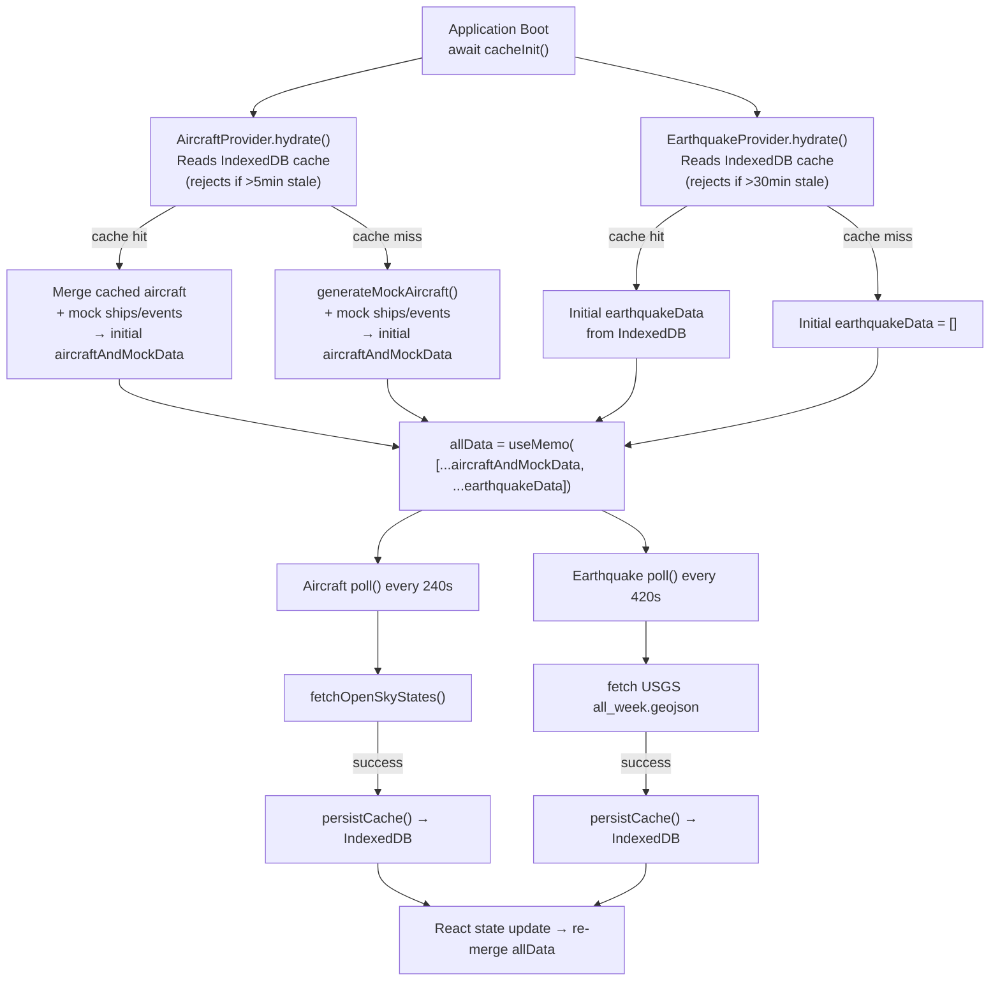

### 4.2 The `allData` Array

`allData` is the **single source of truth** for all renderable points. It is assembled in `LiveTrafficPane` by merging two independent data hooks:

```typescript
const { data: aircraftAndMockData } = useAircraftData();
const { data: earthquakeData } = useEarthquakeData();

const allData = useMemo(
  () => [...aircraftAndMockData, ...earthquakeData],
  [aircraftAndMockData, earthquakeData],
);
```

- **`aircraftAndMockData`**: Live aircraft from OpenSky (refreshed every 240s) + static mock ships and events (generated once on mount via `useRef`).
- **`earthquakeData`**: Live earthquakes from USGS (refreshed every 420s). Covers the past 7 days of global seismic activity.

Each hook independently hydrates from IndexedDB on boot, polls its API, and persists to cache. LiveTrafficPane merges them and passes the result downstream.

### 4.3 Data Distribution from LiveTrafficPane

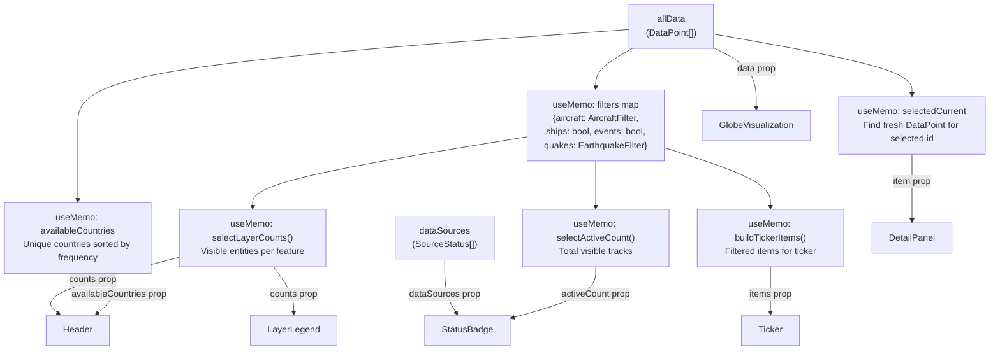

### 4.4 The `filters` Map

`LiveTrafficPane` maintains a unified filter map consumed by `uiSelectors.ts`:

```typescript
const filters = {
  aircraft: aircraftFilter,  // AircraftFilter object (enabled, squawks, countries, etc.)
  ships:    layers.ships,     // boolean
  events:   layers.events,    // boolean
  quakes:   { enabled: layers.quakes ?? true, minMagnitude: 0 },  // EarthquakeFilter
};
```

Each feature's `matchesFilter()` receives its corresponding filter value. Aircraft uses a complex filter object with squawk/country/airborne toggles. Earthquake uses `EarthquakeFilter` with enabled + minMagnitude. Ships and events use simple booleans.

---

## 5. Caching Architecture

The application uses a unified IndexedDB-backed storage service (`lib/storageService.ts`) for all persistent caching. On first run it auto-migrates any existing localStorage data. All reads are synchronous from an in-memory Map (populated at boot via `await cacheInit()`), while writes go to IndexedDB asynchronously (fire-and-forget) to avoid blocking the render loop.

At boot, `cacheInit()` runs a cleanup pass: trail entries older than 24 hours are removed, and trail points are capped at 50 per entity (~3.3 hours at 4-minute intervals) to prevent unbounded growth.

**Every live data provider follows the same caching pattern**: hydrate from IndexedDB on boot (with staleness rejection), persist after every successful fetch, and fall back through memory cache → IndexedDB cache → empty on error.

### 5.1 Cache Overview

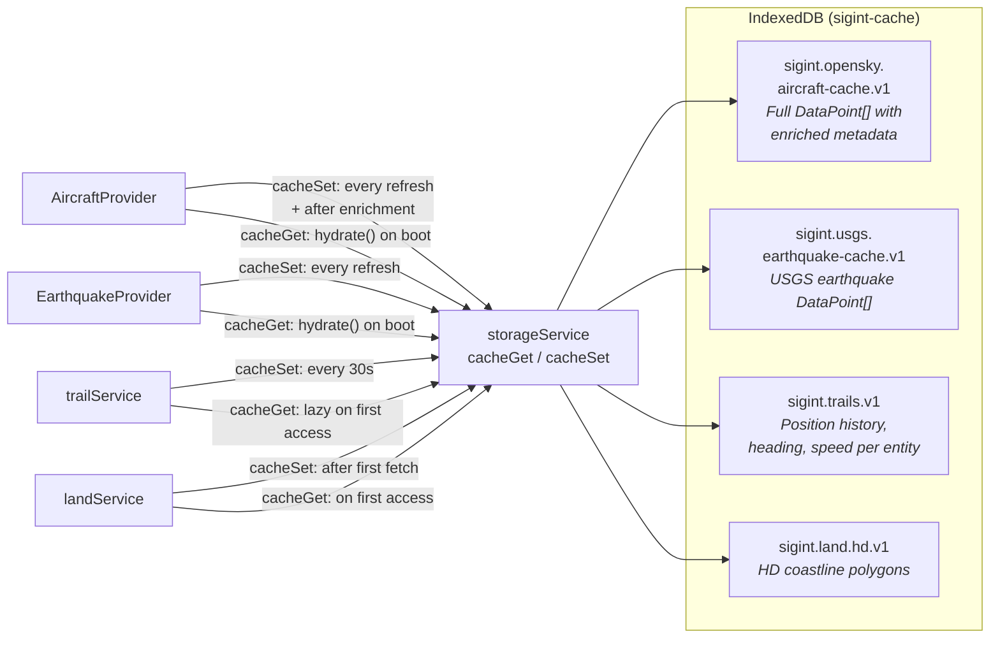

### 5.2 Aircraft Data Cache

| Key | `sigint.opensky.aircraft-cache.v1` |
|---|---|
| Owner | `AircraftProvider` (`tracking/aircraft/data/provider.ts`) |
| Contains | Full `DataPoint[]` array with aircraft positions + any enriched metadata |
| Written | After every successful OpenSky fetch (with metadata applied) and after enrichment |
| Read | On `hydrate()` at boot — provides instant first render before first API call |
| Staleness | Rejected on hydrate if older than 5 minutes (provider skips to fresh fetch). Never deleted from storage — overwritten every 240s on successful refresh. |

The provider has a two-tier cache: an in-memory object (`this.cache`) and IndexedDB via `storageService`. On boot, `hydrate()` checks memory first, then falls back to IndexedDB. The in-memory cache is authoritative during a session; IndexedDB is for cross-session persistence.

When metadata enrichment succeeds, both tiers are updated and re-persisted. This means the cache progressively improves — a callsign that was "Unknown" on first fetch gains its real type, registration, and operator after enrichment, and that enriched data survives page reloads.

### 5.3 Earthquake Data Cache

| Key | `sigint.usgs.earthquake-cache.v1` |
|---|---|
| Owner | `EarthquakeProvider` (`environmental/earthquake/data/provider.ts`) |
| Contains | Full `DataPoint[]` array of USGS earthquake data (7 days) |
| Written | After every successful USGS fetch |
| Read | On `hydrate()` at boot — provides instant first render before first API call |
| Staleness | Rejected on hydrate if older than 30 minutes. Overwritten every 420s on successful refresh. |

Same two-tier pattern as aircraft: in-memory cache is authoritative during a session, IndexedDB is for cross-session persistence. On fetch error, the provider falls back through memory cache → IndexedDB cache → empty array.

### 5.4 Trail Cache

| Key | `sigint.trails.v1` |
|---|---|
| Owner | `trailService.ts` |
| Contains | Map of entity ID → `{ points[], lastSeen, missedRefreshes, heading, speedMps }` |
| Written | Every 30 seconds (`PERSIST_INTERVAL_MS`) |
| Read | On first access (lazy load) |
| Staleness | Entries purged after 3 consecutive missed refreshes. Entries older than 24 hours removed at boot. Points capped at 50 per entity. |

Each trail point stores `{ lat, lon, ts, altitude?, speed?, heading? }` — the optional snapshot fields are captured at each data refresh for use by the trail waypoint tooltip feature.

The trail service records actual positions from each data refresh and uses speed + heading for between-refresh interpolation. It is consumed both for drawing trail lines behind selected items and for smoothly animating all moving points between 240-second refresh intervals.

### 5.5 Land Data Cache

| Key | `sigint.land.hd.v1` |
|---|---|
| Contains | HD coastline polygon data |
| Written | After first successful fetch |
| Read | On every render frame via `getLand()` |

Fetched once in the background when GlobeVisualization mounts. The render loop calls `getLand()` each frame — if HD data hasn't loaded yet, it falls back to a simpler built-in dataset.

### 5.6 Metadata Deduplication

`AircraftProvider` also maintains two in-memory-only structures for metadata enrichment:

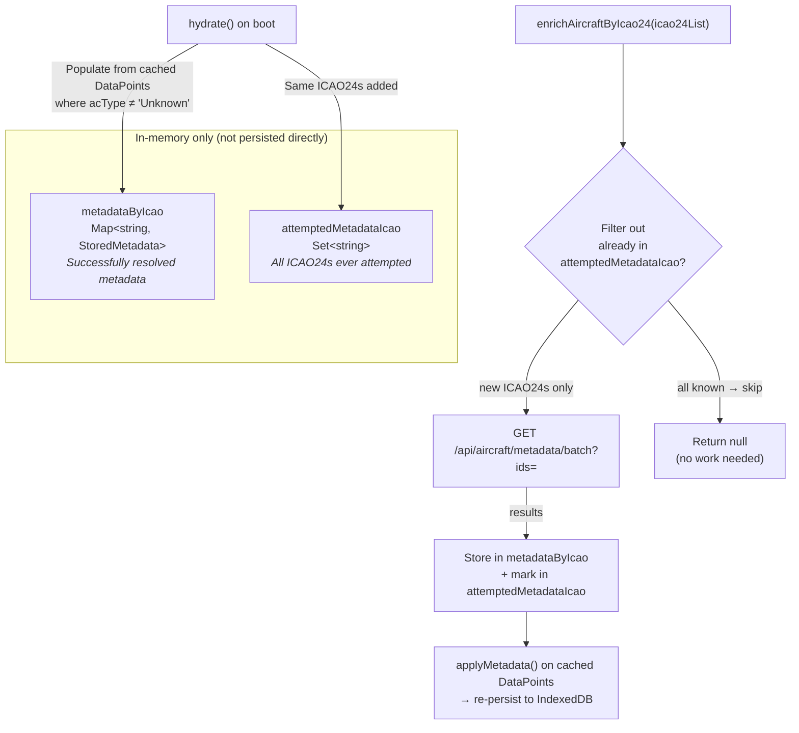

On boot, `hydrate()` populates both maps from the cached `DataPoint[]` — any entity whose `acType` is not "Unknown" is treated as already resolved. This prevents re-fetching metadata the server already returned in a previous session.

During a session, `enrichAircraftByIcao24()` filters out any ICAO24 already in `attemptedMetadataIcao` before hitting the server. This means:

1. First refresh: all aircraft have `acType: "Unknown"`
2. Selecting an aircraft triggers enrichment for that ICAO24
3. Server returns metadata, `metadataByIcao` is populated
4. `applyMetadata()` merges it into the DataPoint array
5. Cache is re-persisted with enriched data
6. On next page load, `hydrate()` restores both the data and the deduplication maps

---

## 6. Rendering Pipeline

### 6.1 GlobeVisualization Architecture

The globe visualization is split into a modular `components/globe/` directory. The main component (`GlobeVisualization.tsx`, ~400 lines) is a thin shell that manages refs, the render loop, effects, and tooltip JSX. All rendering logic is extracted into pure functions in separate files.

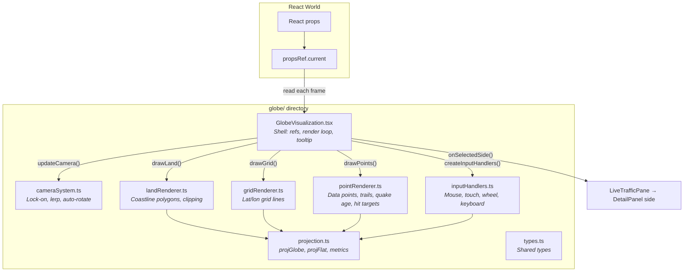

The key insight: **React never directly drives rendering.** Props are synced into `propsRef` on every React render, but the animation loop reads from the ref independently at ~60fps. This means data updates (which trigger React re-renders) are picked up on the next animation frame without any useEffect dependencies or re-registration of the render loop.

### 6.2 Camera System

The camera uses a target + lerp model for smooth transitions. The `updateCamera()` pure function in `cameraSystem.ts` handles all camera state mutation each frame.

- **`camRef`** — current camera state: `{ rotY, rotX, vy, zoomGlobe, zoomFlat, panX, panY }`
- **`camTargetRef`** — animation target: `{ rotY, rotX, zoom, panX, panY, active, lockedId }`

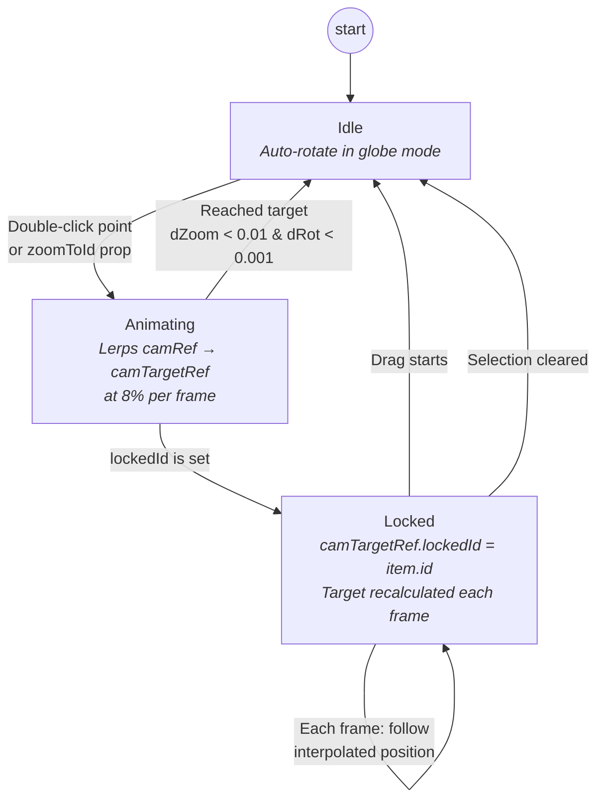

| Action | Effect |
|---|---|
| Double-click a point | Set `camTargetRef` to point's position, set `lockedId`, zoom to 35 (globe) or 40 (flat) |
| Drag | Breaks lock-on (`lockedId = null`, `active = false`) |
| Scroll wheel (locked) | Adjusts `camTargetRef.zoom`, stays locked |
| Scroll wheel (unlocked) | Directly modifies `camRef` zoom |
| Auto-rotate | Only active when: globe mode, not dragging, not animating to target |

When locked onto an item in flat map mode, the pan target is calculated using `camTarget.zoom` (the destination zoom) rather than `cam.zoomFlat` (the mid-lerp zoom) to prevent pan/zoom fighting during transitions.

### 6.3 Input Handlers

All input handling is extracted into `inputHandlers.ts` as a factory function:

```typescript
const handlers = createInputHandlers({
  canvas, camRef, camTargetRef, dragRef, sizeRef, propsRef, setTrailTooltip,
});
attachInputHandlers(canvas, handlers);
// cleanup:
detachInputHandlers(canvas, handlers);
```

This keeps the main component's useEffect clean — just create, attach, and return a detach cleanup.

**Click priority**: Trail waypoint dots on the selected item's trail are checked before data points. This prevents random overlapping aircraft from stealing clicks when you're inspecting a trail. If no trail waypoint is hit, normal data point hit-testing runs. The hover handler follows the same priority for cursor changes.

### 6.4 Interpolation

All moving entities (aircraft, ships) have their positions interpolated between data refreshes for smooth animation:

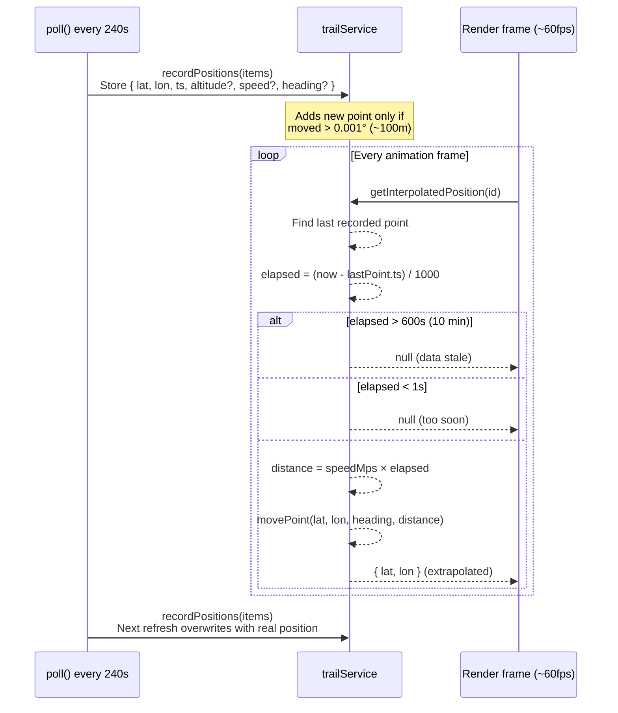

This means even though OpenSky data refreshes every 4 minutes, aircraft appear to move continuously on screen.

### 6.5 Trail Waypoint Tooltip

When a trail is drawn for the selected item, each waypoint dot is stored as a hit target with its screen coordinates and `TrailPoint` data. The click handler in `inputHandlers.ts` checks trail waypoints first — if the click is near a waypoint dot, a tooltip is shown. Data point hit-testing only runs if no trail dot was hit.

The tooltip is rendered as an absolutely positioned `<div>` over the canvas. Its position is updated every frame by the render loop via a DOM ref (not React state) — the `TrailPoint`'s lat/lon is reprojected to screen coordinates each frame, keeping the tooltip anchored to the waypoint as the user pans and zooms. The tooltip defaults to the left side of the waypoint dot (away from the detail panel) and flips to the right only when near the left screen edge. Vertically centered on the dot, clamped to the viewport. The tooltip hides when the point goes behind the globe.

The hover handler also checks trail waypoints first, showing `pointer` cursor over trail dots before checking data points.

### 6.6 Projection Functions

Two projection modes, selected by the `flat` prop:

- **Globe** (`projGlobe`): Orthographic projection onto a sphere. Points behind the globe (`z <= 0`) are culled.
- **Flat** (`projFlat`): Equirectangular projection. Supports pan and zoom via `cam.panX`, `cam.panY`, `cam.zoomFlat`.

Both return `{ x, y, z }` where `z` is used for depth sorting (globe) or always positive (flat).

### 6.7 Earthquake Age-Based Rendering

Earthquake points are rendered with visual properties that encode both magnitude and age, making it easy to distinguish a fresh M6 from a week-old M2 at a glance.

**Magnitude → Size** (exponential scaling):

| Magnitude | Dot Size |
|-----------|----------|
| < M1 | 2px |
| M1-2 | 2.5px |
| M2-3 | 3.5px |
| M3-4 | 5px |
| M4-5 | 7px |
| M5-6 | 9.5px |
| M6-7 | 12px |
| M7+ | 15px |

**Age → Color & Opacity**:

| Age | Color | Opacity Factor |
|-----|-------|---------------|
| < 1 hour | Base green (`#66ff44`) | 1.0 |
| 1-6 hours | `#44dd33` | 0.9 |
| 6-24 hours | `#33aa33` | 0.8 |
| 1-3 days | `#2d8835` | 0.65 |
| 3-7 days | `#2d8835` | 0.5 (floor) |

The opacity factor is multiplied with the depth-based alpha, so even the oldest quakes at the back of the globe remain visible — just noticeably dimmer and more muted than fresh ones.

**Magnitude → Pulse**: Earthquakes above M2.5 get a pulsing glow effect. The pulse intensity scales with magnitude — a M3 gets a gentle wobble, a M7 gets an aggressive throb. The glow radius also scales, making larger earthquakes visually dominant.

Quake rendering is handled in its own block within `pointRenderer.ts` with an early return, keeping it separate from the aircraft/ship/event rendering path.

---

## 7. Isolation Modes

Two modes for focusing on specific data, controlled by `isolateMode` state in `LiveTrafficPane`:

| Mode | Icon | Color | Behavior |
|---|---|---|---|
| **FOCUS** | Eye | Cyan | Shows only the selected item's layer type. Other layers hidden. Filters within the layer still apply. |
| **SOLO** | Crosshair | Red | Shows only the single selected point. Everything else is gone. |

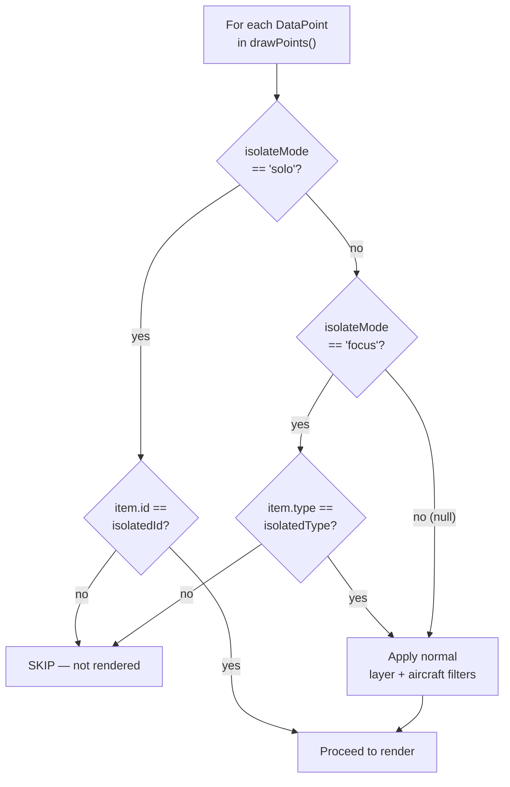

The detail panel controls toggling between modes. Closing the panel clears isolation.

---

## 8. Enrichment Pipeline

Aircraft metadata enrichment runs as a side effect in `LiveTrafficPane`, scoped to the currently selected aircraft only. This prevents the aircraft cache from bloating with enrichment data for thousands of aircraft.

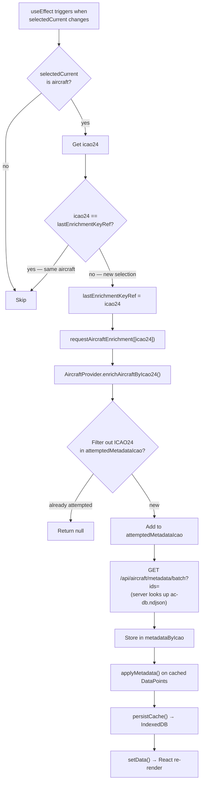

---

## 9. Global Search

Search provides a unified way to find, filter, and zoom to entities across all data layers. It operates in two phases: live dropdown preview while typing, and globe-wide filtering on execution.

### 9.1 Architecture

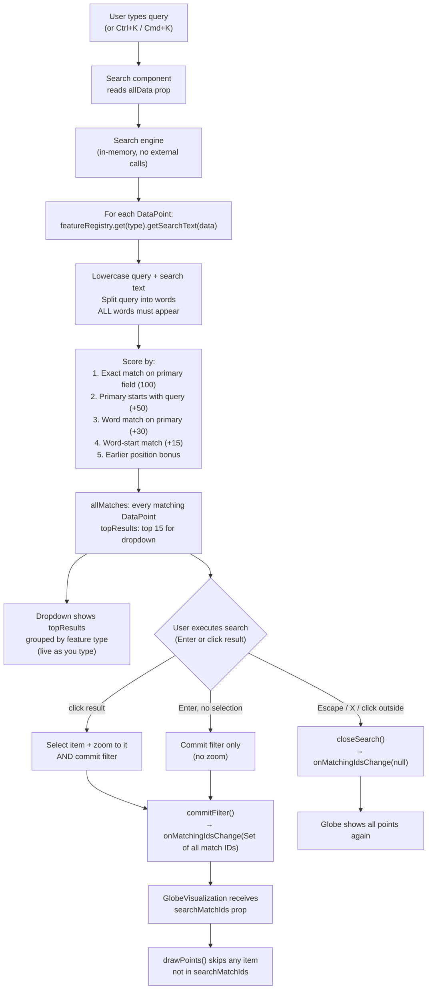

### 9.2 Two-Phase Behavior

| Phase | What happens | Globe affected? |
|---|---|---|
| **Typing** | Dropdown shows top 15 results live, grouped by feature type | No — globe is untouched |
| **Execute** (Enter or click result) | Commits filter: all matching IDs sent to GlobeVisualization via `searchMatchIds` prop | Yes — only matching points rendered |
| **Close** (Escape / X / click outside) | Filter cleared, `searchMatchIds` set to null | Yes — all points visible again |

Clicking a result selects + zooms to that specific point AND commits the filter. Pressing Enter with no result highlighted commits the filter without selecting or zooming to anything — useful for queries like "737" where you want to see all matches on the globe.

### 9.3 Selection Stash/Restore

When a search filter is committed, if the currently selected item is not in the match set, the selection is stashed in a ref (`stashedSelectionRef`) along with the isolate mode. When the search is cleared, the stashed selection is restored — so the user's pre-search selection comes back automatically.

### 9.4 Search Text per Feature

Each feature provides a `getSearchText(data)` method that concatenates all searchable fields into a single string:

| Feature | Fields |
|---|---|
| Aircraft | callsign, icao24, acType, registration, operator, manufacturerName, model, categoryDescription, originCountry, squawk |
| Ships | name, flag, vesselType |
| Events | headline, category, source |
| Quakes | location, magnitude, alert, eventType |

### 9.5 UI Integration

Search is rendered into the Header via a `searchSlot` prop — the Header doesn't know about search internals, it just renders a React node in the correct position (left of layer toggles). This keeps the components loosely coupled.

On desktop, the search button shows a search icon + "SEARCH" label. Clicking it expands into an input with a results dropdown showing the match count. On mobile, the icon alone is shown to save space. The dropdown is z-[60] to sit above the detail panel and layer legend.

Keyboard support: arrow keys navigate results, Enter executes search (with or without a selected result), Escape closes and clears filter, Ctrl+K/Cmd+K opens from anywhere.

### 9.6 Globe Filter Mechanism

The filter flows through the existing `propsRef` bridge:

1. Search calls `onMatchingIdsChange(Set<string>)` on execute
2. LiveTrafficPane stores it as `searchMatchIds` state
3. Passed to GlobeVisualization as a prop, synced into `propsRef`
4. `drawPoints()` checks `searchMatchIds` before any other filter — if the set exists and the item's ID isn't in it, the item is skipped
5. Isolation modes (FOCUS/SOLO) and layer toggles still apply on top of the search filter

### 9.7 Zoom-to Mechanism

When a specific search result is clicked, two things happen simultaneously:

1. `setSelected(item)` — opens the detail panel with the item's data
2. `setZoomToId(item.id)` — triggers a `useEffect` in GlobeVisualization that sets `camTargetRef` with the item's position (using interpolated position if available) and locks the camera onto it

`zoomToId` is cleared after 100ms via `setTimeout` so the same item can be re-searched. The `lastZoomToIdRef` inside GlobeVisualization prevents duplicate triggers within the same cycle.

---

## 10. Component Hierarchy

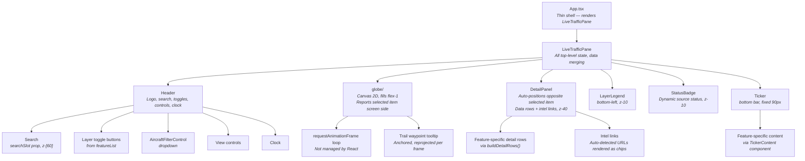

### Pane Architecture

The application uses a pane-based layout designed for future multi-pane support:

- **`App.tsx`** — thin shell that renders the active pane(s). Currently renders `LiveTrafficPane` full-screen. Will become the layout manager when multi-pane support is added (PaneManager with resize handles, minimize, rearrange).
- **`LiveTrafficPane`** — self-contained pane owning all globe-related state, data fetching, filtering, selection, and UI. Takes no props — it manages everything internally. Merges data from multiple independent hooks (`useAircraftData`, `useEarthquakeData`) and builds a `dataSources` array reflecting each provider's real status.

This separation means adding a second pane (e.g., ships, intel feed) requires no changes to App.tsx beyond adding it to the layout. Each pane owns its own state and subscribes to shared data providers independently.

### Detail Panel & Intel Links

The detail panel renders feature-specific data rows from `buildDetailRows()`. Any row whose value starts with `https://` is automatically detected as a URL and rendered separately as a clickable chip with an external link icon (`target="_blank" rel="noopener noreferrer"`). This keeps the feature system simple — features just return `[label, url]` tuples alongside normal data rows, and the panel handles rendering.

Current intel links:
- **Aircraft**: FlightAware (by callsign), FlightRadar24 (by callsign), ADS-B Exchange (by icao24)
- **Earthquake**: USGS event page (direct URL from API)

### Dynamic Data Source Status

`StatusBadge` receives a `dataSources` array of `SourceStatus` objects, each with `{ id, label, status }` where status is one of `"loading" | "live" | "cached" | "mock" | "error" | "empty"`. LiveTrafficPane builds this array from the actual hook state of each data source:

```typescript
const dataSources = [
  { id: "aircraft", label: "AIRCRAFT", status: dataSource },
  { id: "quakes",   label: "SEISMIC",  status: earthquakeSource },
  { id: "ships",    label: "SHIPS",    status: "mock" },
  { id: "events",   label: "EVENTS",   status: "mock" },
];
```

StatusBadge dynamically groups these into LIVE, SIMULATED, and OFFLINE lines. No hardcoded strings — when a new live source is added, it automatically appears in the correct category.

### Detail Panel Auto-Positioning

The globe's render loop projects the selected item's screen position each frame and calls `onSelectedSide("left" | "right")` to report which side of the screen the item is on. LiveTrafficPane tracks this in `panelSide` state and passes it to DetailPanel as a `side` prop. The desktop card renders `right-3.5` or `left-3.5` accordingly — always on the opposite side from the selected item so it never covers what you're tracking. On mobile, the panel is always a bottom sheet regardless of side.

### Z-Index Stack

| z-index | Component |
|---|---|
| z-10 | LayerLegend, StatusBadge |
| (none) | Header — uses `relative` only, no stacking context that could trap dropdowns |
| z-30 | Trail waypoint tooltip |
| z-40 | DetailPanel |
| z-[60] | AircraftFilterControl dropdown, Search dropdown |

The Header deliberately avoids a z-index to prevent creating a stacking context that would clip dropdown menus appearing below it.

---

## 11. State Management

All state lives in `LiveTrafficPane` as React hooks. There is no external state management library. `App.tsx` is a stateless shell.

| State | Type | Purpose |
|---|---|---|
| `flat` | `boolean` | Globe vs flat map toggle |
| `autoRotate` | `boolean` | Globe auto-rotation |
| `rotationSpeed` | `number` | Rotation speed multiplier |
| `chromeHidden` | `boolean` | Toggle all UI overlays (click empty globe area) |
| `selected` | `DataPoint \| null` | Currently selected item |
| `isolateMode` | `null \| "solo" \| "focus"` | Active isolation mode |
| `layers` | `Record<string, boolean>` | Non-aircraft layer toggles |
| `aircraftFilter` | `AircraftFilter` | Complex aircraft filter (squawks, countries, airborne/ground) |
| `zoomToId` | `string \| null` | Triggers camera zoom-to in GlobeVisualization, cleared after one tick |
| `searchMatchIds` | `Set<string> \| null` | When non-null, globe only renders points whose IDs are in this set |
| `panelSide` | `"left" \| "right"` | Which side of the screen the detail panel renders on (driven by globe) |
| `stashedSelectionRef` | `Ref<DataPoint \| null>` | Pre-search selection, restored when search clears |

Derived values computed via `useMemo`:

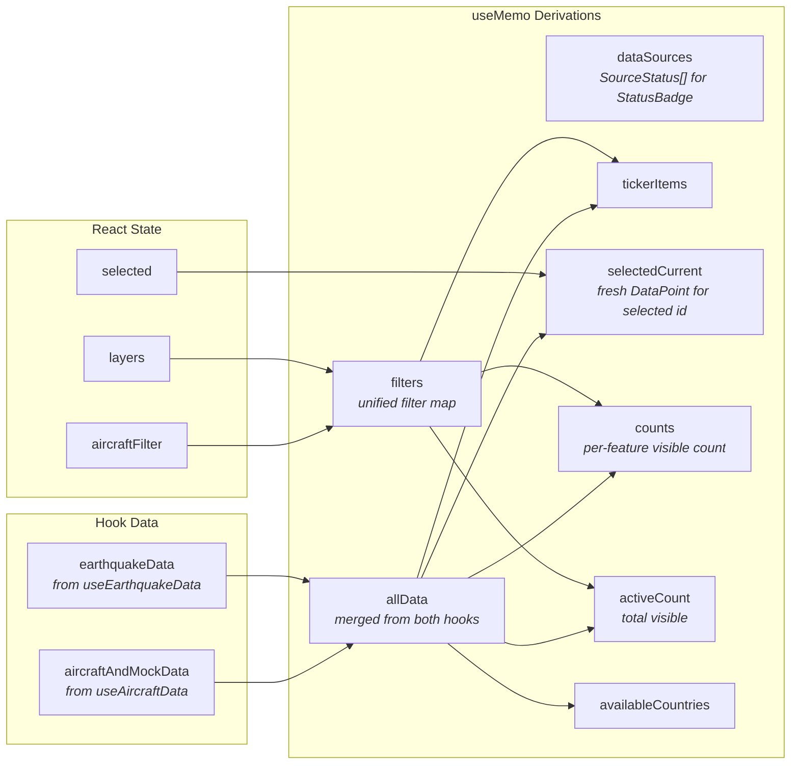

| Derived | Recomputes when |
|---|---|
| `allData` | Either hook's data changes |
| `dataSources` | Either hook's dataSource status changes |
| `filters` | `aircraftFilter` or `layers` changes |
| `tickerItems` | Data refresh or filter change |
| `selectedCurrent` | Data refresh or selection change |
| `counts` | Data refresh or filter change |
| `activeCount` | Data refresh or filter change |
| `availableCountries` | Data refresh |

`selectedCurrent` is notable: when data refreshes, the previously selected item's `DataPoint` object is replaced by a new one with the same `id`. `selectedCurrent` finds the updated version so the detail panel always shows fresh data.

---

## 12. Key Constraints & Gotchas

**OpenSky rate limiting**: Anonymous access = 400 credits/day. Each `/states/all` call costs credits. The 240-second poll interval is chosen to stay well under the limit for a full day of use.

**USGS rate limiting**: Responses are cached server-side for 60 seconds — checking more frequently won't return new data. The feed updates every 5 minutes. Our 420-second (7 minute) poll interval ensures every request gets fresh data while staying well under any rate limit. Exceeding limits returns a 429 response.

**Client-side fetching**: Cannot proxy through the server. Cannot add authentication headers. Any OpenSky or USGS-related code must run in the browser.

**Canvas vs React**: The globe is pure Canvas 2D. React components (Header, DetailPanel, etc.) are overlaid on top with absolute/fixed positioning. They communicate with the canvas via refs and props, not DOM events on canvas elements.

**propsRef pattern**: The animation loop never re-registers. It reads `propsRef.current` each frame, which is synced from React props on every render. This means there's a max 1-frame delay between a React state change and the canvas reflecting it — imperceptible to users.

**Metadata enrichment is best-effort**: If the server is down or the ICAO24 isn't in the database, the aircraft just shows "Unknown" type. The UI never blocks on enrichment. Enrichment only fires for the currently selected aircraft to prevent cache bloat.

**Trail purging**: If an aircraft disappears from OpenSky data for 3 consecutive refreshes (~12 minutes), its trail is deleted. Trail entries older than 24 hours are removed at boot. Points are capped at 50 per entity.

**IndexedDB migration**: On first run, `storageService` auto-migrates any existing localStorage data to IndexedDB and removes the old keys. This is a one-time operation. IndexedDB has no practical size limit (browser-dependent, typically hundreds of MB to GB), eliminating the 5MB localStorage quota that previously caused trail persistence failures.

**Storage cleanup**: At boot, `cacheInit()` removes trail entries older than 24 hours and trims remaining trails to the last 50 points per entity. The aircraft cache is self-managing — it overwrites itself every 240 seconds during active use and is never deleted from storage. The earthquake cache overwrites itself every 420 seconds.

**All providers cache to IndexedDB**: This is a non-negotiable pattern. Every live data provider implements `hydrate()` (read from IndexedDB on boot), `persistCache()` (write after every successful fetch), and a fallback chain (memory → IndexedDB → empty/mock) on error. New providers must follow this pattern.