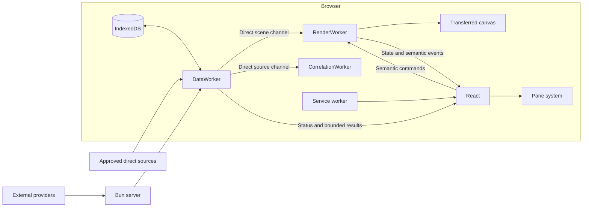

# Architecture Overview

[Back to the documentation index](./README.md)

Related documents: [Data flow](./data-flow.md), [Rendering](./rendering.md), [Pane system](./panes.md), and [Constraints](./constraints.md).

## Purpose

SIGINT is a geospatial intelligence application. It presents live source data in an interactive globe, tables, feeds, and dossiers.

The application uses Bun, React 19, TypeScript, Tailwind CSS, Canvas 2D, and Web Workers.

## System topology


```mermaid
flowchart LR
    subgraph Browser
        D[DataWorker]
        R[RenderWorker]
        K[CorrelationWorker]
        X[React]
        P[Pane system]
        C[Transferred canvas]
        I[(IndexedDB)]
        W[Service worker]

        I <--> D
        D -->|Direct scene channel| R
        D -->|Direct source channel| K
        R --> C
        X --> P
        X -->|Semantic commands| R
        D -->|Status and bounded results| X
        R -->|State and semantic events| X
        W --> X
    end

    U[External providers] --> S[Bun server]
    Q[Approved direct sources] --> D
    S --> D
```

Geographic record arrays do not pass through React.

## Authoritative owners

| Owner | Responsibilities |
| --- | --- |
| Bun server | Protect credentials, consolidate provider budgets, normalize responses, enrich records, and keep disposable server caches |
| DataWorker | Fetch browser sources, validate records, own source datasets, own IndexedDB access, answer bounded queries, and publish render data |
| RenderWorker | Own the canvas context, camera, globe state, scene stores, hit tests, drawing, and frame schedule |
| CorrelationWorker | Own geographic analysis copies and compute correlation results |
| React | Own pane layout, accessible controls, news state, bounded query results, and pane presentation |
| Service worker | Own build-scoped application assets, offline responses, and update activation |

## Server boundary

The Bun server serves the React application and the API. It also handles sources that need credentials, CORS support, enrichment, or a shared request budget.

The server owns these types of work:

- Aircraft tile sweeps and aircraft metadata enrichment
- AIS WebSocket collection
- GDELT collection
- NASA FIRMS collection
- NHC cyclone collection
- RSS collection
- Authentication and rate limits
- Security headers
- Static application files

The server memory cache is disposable. A server restart rebuilds live source state.

The embedded aircraft SQLite database is a read-only build artifact. The browser does not receive this database.

## Browser boot

`frontend.tsx` registers the render-surface custom element. It then renders the React application.

Cache initialization starts during module evaluation. The shared DataWorker client opens IndexedDB and starts all geographic source owners.

React does not wait for all geographic sources before it renders the application shell. Source status and bounded results arrive independently.

News remains a React provider because news articles are not geographic scene records.

## Pane and window system

`PaneManager` owns the desktop pane layout. It stores the layout as a binary split tree.

Each leaf is a pane. A split node contains two child nodes, a direction, and a size ratio. The manager supports split, close, minimize, restore, swap, resize, and preset operations.

The pane types include the globe, data table, dossier, intelligence feed, news feed, alert log, raw console, and video feed.

The globe is one pane. It is not the owner of the application layout or the selected dossier.

Desktop and mobile layouts use different persisted keys. The mobile layout uses `PaneMobile` and vertical content blocks. A mobile selection requests the dossier pane.

Lazy pane mounting limits work for hidden panes. See [Pane system](./panes.md) for the complete layout contract.

## React structure

```text
frontend.tsx
  -> ThemeProvider
    -> App
      -> LayoutModeProvider
        -> DataProvider
          -> UIProvider
            -> DataContext.Provider
              -> WatchProvider
                -> AppShell
                  -> ConnectionStatus
                  -> Header
                  -> PaneManager or PaneMobile
                  -> Ticker
```

`DataProvider` does not own geographic record sets. It combines bounded worker projections for existing consumers.

`UIProvider` stores one selected record copy for pane use. The RenderWorker remains the authoritative owner of the render selection.

## DataWorker

`src/client/workers/dataWorker.ts` is the browser data composition root.

The DataWorker owns these operations:

- Source cache hydration
- Source fetch and validation
- Snapshot reconciliation
- Source versions and status
- IndexedDB compression and persistence
- Record lookup and bounded UI queries
- Trail recording
- Aircraft dossier caching
- Render search
- Scene publication
- Correlation source publication

`SourceCatalog` registers each queryable source. Each source owner attaches to one source runtime and one render binding.

## RenderWorker

`src/client/workers/pointWorker.ts` is the RenderWorker composition root.

The RenderWorker owns these operations:

- `OffscreenCanvas` and Canvas 2D context
- Viewport backing dimensions
- Camera and projection
- Globe filters
- Selection and isolation
- Search visibility
- Scene stores
- Motion projection
- Layer order
- Hit tests
- Trails and routes
- Frame invalidation
- Drawing

The render surface transfers the canvas one time for each session. The DataWorker sends scene commands through a direct `MessageChannel`.

See [Rendering](./rendering.md) for the complete render path.

## CorrelationWorker

The CorrelationWorker receives geographic source rebases directly from the DataWorker. React sends news and the regional baseline with each analysis request.

The CorrelationWorker returns intelligence products, alerts, and the next baseline. Geographic record arrays do not pass through React for correlation.

## State boundaries

The application uses typed commands and bounded projections across ownership boundaries.

| State | Authoritative owner | React projection |
| --- | --- | --- |
| Geographic source records | DataWorker | Bounded pages, counts, facets, status, and one selected record |
| Canvas and camera | RenderWorker | Bounded globe-state snapshot and camera events |
| Layer and render filters | RenderWorker | Bounded globe-state snapshot |
| Render selection | RenderWorker | One selected record copy |
| Pane layout | React pane system | Full pane layout |
| News articles | React news provider | Full bounded news collection |
| Correlation result | CorrelationWorker | Products, alerts, and baseline |

## Render surface

The render surface is a custom element. It owns browser APIs that are adjacent to rendering.

Its adapters handle these inputs:

- Element size
- Pointer input
- Touch input
- Wheel input
- Keyboard input
- Theme colors
- Reduced-motion preference
- Aircraft-filter URL state

The render surface converts these inputs to semantic or bounded worker commands. It does not own scene records.

## Directory map

```text
src/
  client/
    components/globe/        React host, commands, events, and DOM tooltip
    context/                 React pane and presentation state
    features/                Feature definitions, codecs, queries, and UI
    panes/                   Desktop and mobile pane implementations
    render-surface/          Custom element, session, and browser adapters
    workers/
      data/                  Source owners, datasets, queries, and scene codecs
      render/                Camera, globe state, scene stores, and render layers
      correlation/           Correlation data protocol
      dataWorker.ts          DataWorker composition root
      pointWorker.ts         RenderWorker composition root
      correlationWorker.ts   CorrelationWorker composition root
  server/
    api/                     Server source caches, auth, and API routes
    data/                    Read-only build data
    index.ts                 Development composition root
    index.prod.ts            Production composition root
  shared/                    Shared domain and protocol types
public/
  data/                      Static geographic data
  fonts/                     Local fonts
  icons/                     PWA icons
  workers/                   Built worker entry files
```

## Persistence

The DataWorker owns the IndexedDB database. It stores geographic source caches, trails, and other worker-owned records.

Main-thread services use the DataWorker client for compatible cache operations. Pane layout and user preferences remain main-thread concerns.

The service worker does not cache API responses. It caches application assets and navigation responses.

## Architecture rules

- Give each mutable datum one authoritative owner.
- Keep geographic record sets out of React.
- Use bounded queries for panes.
- Use the common scene protocol for all render sources.
- Use direct worker channels for render and correlation records.
- Transfer each visible canvas one time.
- Keep frame-affecting state in the RenderWorker.
- Keep browser adapters in the render surface.
- Keep pane layout independent from globe rendering.
- Keep server credentials and shared provider budgets on the server.
