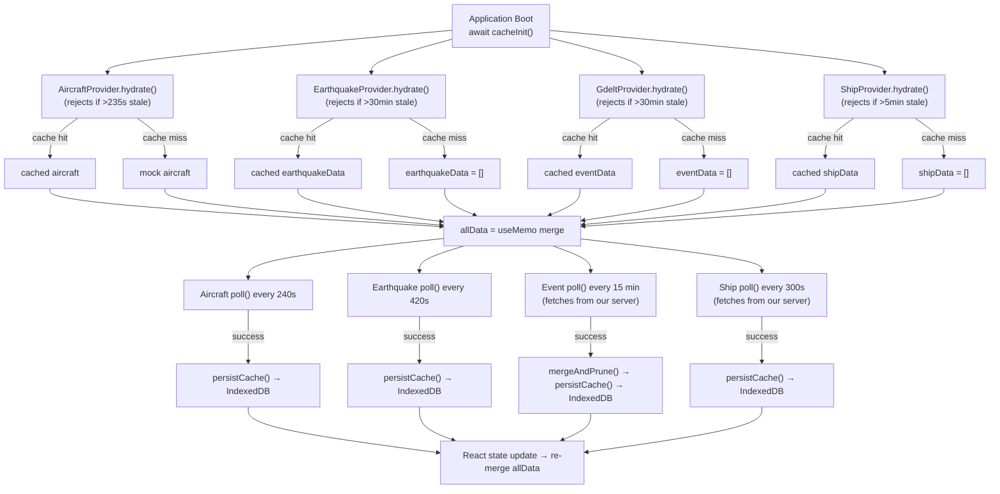
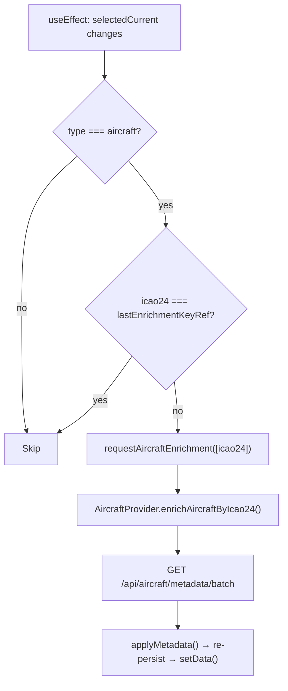

# Data Flow

[← Back to Docs Index](./README.md)

**Related docs**: [Architecture](./architecture.md) · [Feature System](./features.md) · [Caching](./caching.md) · [Pane System](./panes.md)

---

## Shared Data Context

All application state lives in `context/DataContext.tsx`, exposed via the `useData()` hook. The context provider calls the data hooks (`useAircraftData`, `useEarthquakeData`, `useEventData`, `useShipData`), merges their output into `allData`, centralizes trail recording, and computes all derived values. Every component — Header, PaneManager, LiveTrafficPane, DataTablePane, Ticker — reads from this single context.

### What lives in DataContext

| Category | State | Purpose |
|---|---|---|
| **Raw data** | `allData` | Merged aircraft + ships + earthquake + GDELT event DataPoints |
| **Selection** | `selected`, `selectedCurrent`, `setSelected` | Currently selected item (selectedCurrent stays fresh across data refreshes) |
| **Isolation** | `isolateMode`, `setIsolateMode` | FOCUS (layer only) or SOLO (single point) |
| **Layers** | `layers`, `toggleLayer` | Per-feature on/off toggles |
| **Aircraft filter** | `aircraftFilter`, `setAircraftFilter` | Complex filter (squawks, countries, airborne/ground) |
| **Filters** | `filters` | Unified filter map consumed by uiSelectors |
| **Derived** | `counts`, `activeCount`, `tickerItems`, `availableCountries`, `dataSources` | Computed via useMemo |
| **View controls** | `flat`, `autoRotate`, `rotationSpeed` + setters | Globe-specific but toggled from Header |
| **Chrome** | `chromeHidden`, `setChromeHidden` | Toggle all UI overlays |
| **Search** | `searchMatchIds`, `handleSearchMatchIds`, `handleSearchSelect`, `handleSearchZoomTo` | Search filter + zoom |
| **Zoom** | `zoomToId`, `setZoomToId` | Triggers camera zoom-to |
| **Enrichment** | `requestAircraftEnrichment` | On-demand metadata lookup |

### Derived values

| Derived | Recomputes when |
|---|---|
| `allData` | Any hook's data changes |
| `dataSources` | Any hook's dataSource status changes |
| `filters` | `aircraftFilter` or `layers` changes |
| `tickerItems` | Data refresh or filter change |
| `selectedCurrent` | Data refresh or selection change |
| `counts` | Data refresh or filter change |
| `activeCount` | Data refresh or filter change |
| `availableCountries` | Data refresh |

`selectedCurrent` is notable: when data refreshes, the previously selected item's `DataPoint` object is replaced by a new one with the same `id`. `selectedCurrent` finds the updated version so the detail panel always shows fresh data.

---

## Boot & Polling Lifecycle



All four hooks skip the immediate fetch on boot if hydration returned fresh data. Staleness thresholds are set to match or be tighter than poll intervals so stale cache is rejected and the immediate fetch fires.

---

## Trail Recording (Centralized)

Trail recording is centralized in `DataContext` as a `useEffect` on `allData` changes. When `allData` updates (any source refreshes), the effect filters for moving entity types (aircraft and ships) and calls `recordPositions()` from the trail service. This feeds the interpolation system and trail rendering.

Previously trail recording was embedded in `useAircraftData`. It was moved to DataContext when ships became a separate hook to ensure both aircraft and ships feed trails from a single location with no duplication.

---

## The `allData` Array

`allData` is the **single source of truth** for all renderable points:

```typescript
const { data: aircraftData } = useAircraftData();
const { data: shipData } = useShipData();
const { data: earthquakeData } = useEarthquakeData();
const { data: eventData } = useEventData();

const allData = useMemo(
  () => [...aircraftData, ...shipData, ...earthquakeData, ...eventData],
  [aircraftData, shipData, earthquakeData, eventData],
);
```

- **`aircraftData`**: Live aircraft from OpenSky (refreshed every 240s). Falls back to mock aircraft on fetch failure.
- **`shipData`**: Live AIS vessels from our server (refreshed every 300s). Server streams from aisstream.io WebSocket. Empty array if `AISSTREAM_API_KEY` not set.
- **`earthquakeData`**: Live earthquakes from USGS (refreshed every 420s). Covers the past 7 days of global seismic activity.
- **`eventData`**: Live GDELT events from our server (refreshed every 15 min). Client-side 7-day rolling window with URL-based dedup. Server fetches GDELT raw export files, parses geocoded conflict/crisis events, caches in memory.

---

## The `filters` Map

```typescript
const filters = {
  aircraft: aircraftFilter,  // AircraftFilter object
  ships:    layers.ships,     // boolean
  events:   { enabled: layers.events ?? true, minSeverity: 0 },  // EventFilter
  quakes:   { enabled: layers.quakes ?? true, minMagnitude: 0 },  // EarthquakeFilter
};
```

Each feature's `matchesFilter()` receives its corresponding filter value. Aircraft uses a complex filter object with squawk/country/airborne toggles. Earthquake uses `EarthquakeFilter` with enabled + minMagnitude. Events use `EventFilter` with enabled + minSeverity. Ships use a simple boolean.

---

## AIS Ship Data Flow

The AIS pipeline has both server-side and client-side components:

**Server** (`aisCache.ts`): On boot, opens a persistent WebSocket to `wss://stream.aisstream.io/v0/stream`. Subscribes to global `PositionReport` and `ShipStaticData` messages. Accumulates latest position per MMSI in an in-memory Map. `PositionReport` provides lat/lon/speed/heading/course/nav status. `ShipStaticData` enriches with name/callsign/IMO/type/destination/draught/dimensions. Stale vessels (not seen for 60 min) pruned every 5 min. Auto-reconnects on disconnect. Serves snapshot via `/api/ships/latest` with token auth.

**Client** (`ShipProvider`): Polls `/api/ships/latest` every 300 seconds using `authenticatedFetch()` from `lib/authService.ts`. Converts server vessel records to DataPoints with `id: S{mmsi}`, type `ships`. Persists to IndexedDB. Hydrates on boot with 5-min staleness threshold.

---

## GDELT Event Data Flow

The GDELT pipeline has both server-side and client-side components:

**Server** (`gdeltCache.ts`): Every 15 minutes, fetches `lastupdate.txt` from GDELT, downloads the latest `.export.CSV.zip`, extracts and parses the tab-delimited CSV, filters to conflict/crisis CAMEO codes, converts to GeoJSON, and caches in memory. Serves via `/api/events/latest` with token auth.

**Client** (`GdeltProvider`): Polls `/api/events/latest` every 15 minutes using `authenticatedFetch()` from `lib/authService.ts`, which handles token acquisition and auto-refresh. Incoming events are merged with existing cache (URL-based dedup), events older than 7 days are pruned, and the result is persisted to IndexedDB.

---

## Enrichment Pipeline

Aircraft metadata enrichment runs as a side effect in `DataContext`, scoped to the currently selected aircraft only (prevents cache bloat).



---

## Ticker Feed

The live ticker at the bottom of the screen shows a round-robin interleave of the most recent items from each active data type. Items are sorted by recency within each type, then interleaved: one aircraft, one ship, one event, one quake, repeat. Emergency aircraft (squawk 7700/7600/7500) always appear first. The ticker cycles through 24 items, displaying 1-3 at a time depending on screen width, rotating every 6.5 seconds.