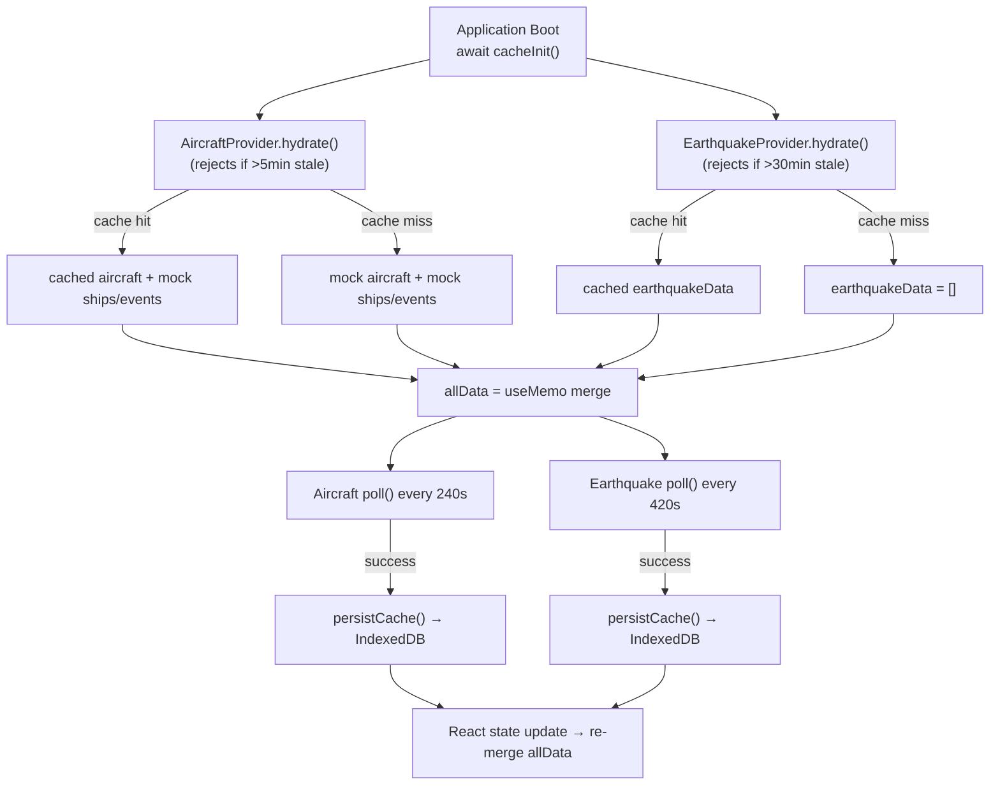
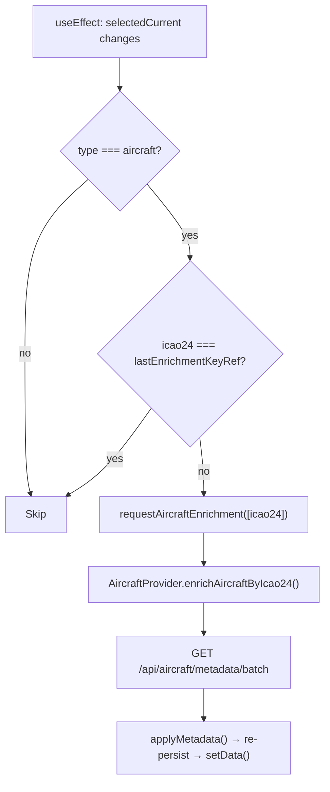

# Data Flow

[← Back to Docs Index](./README.md)

**Related docs**: [Architecture](./architecture.md) · [Feature System](./features.md) · [Caching](./caching.md) · [Pane System](./panes.md)

---

## Shared Data Context

All application state lives in `context/DataContext.tsx`, exposed via the `useData()` hook. The context provider calls the data hooks (`useAircraftData`, `useEarthquakeData`), merges their output into `allData`, and computes all derived values. Every component — Header, PaneManager, LiveTrafficPane, DataTablePane, Ticker — reads from this single context.

### What lives in DataContext

| Category | State | Purpose |
|---|---|---|
| **Raw data** | `allData` | Merged aircraft + mock + earthquake DataPoints |
| **Selection** | `selected`, `selectedCurrent`, `setSelected` | Currently selected item (selectedCurrent stays fresh across data refreshes) |
| **Isolation** | `isolateMode`, `setIsolateMode` | FOCUS (layer only) or SOLO (single point) |
| **Layers** | `layers`, `toggleLayer` | Per-feature on/off toggles |
| **Aircraft filter** | `aircraftFilter`, `setAircraftFilter` | Complex filter (squawks, countries, airborne/ground) |
| **Filters** | `filters` | Unified filter map consumed by uiSelectors |
| **Derived** | `counts`, `activeCount`, `tickerItems`, `availableCountries`, `dataSources` | Computed via useMemo |
| **View controls** | `flat`, `autoRotate`, `rotationSpeed` + setters | Globe-specific but toggled from Header |
| **Chrome** | `chromeHidden`, `setChromeHidden` | Toggle all UI overlays |
| **Search** | `searchMatchIds`, `handleSearchMatchIds`, `handleSearchSelect`, `handleSearchZoomTo` | Search filter + zoom |
| **Zoom** | `zoomToId`, `setZoomToId` | Triggers camera zoom-to |
| **Enrichment** | `requestAircraftEnrichment` | On-demand metadata lookup |

### Derived values

| Derived | Recomputes when |
|---|---|
| `allData` | Either hook's data changes |
| `dataSources` | Either hook's dataSource status changes |
| `filters` | `aircraftFilter` or `layers` changes |
| `tickerItems` | Data refresh or filter change |
| `selectedCurrent` | Data refresh or selection change |
| `counts` | Data refresh or filter change |
| `activeCount` | Data refresh or filter change |
| `availableCountries` | Data refresh |

`selectedCurrent` is notable: when data refreshes, the previously selected item's `DataPoint` object is replaced by a new one with the same `id`. `selectedCurrent` finds the updated version so the detail panel always shows fresh data.

---

## Boot & Polling Lifecycle



---

## The `allData` Array

`allData` is the **single source of truth** for all renderable points:

```typescript
const { data: aircraftAndMockData } = useAircraftData();
const { data: earthquakeData } = useEarthquakeData();

const allData = useMemo(
  () => [...aircraftAndMockData, ...earthquakeData],
  [aircraftAndMockData, earthquakeData],
);
```

- **`aircraftAndMockData`**: Live aircraft from OpenSky (refreshed every 240s) + static mock ships and events (generated once on mount via `useRef`).
- **`earthquakeData`**: Live earthquakes from USGS (refreshed every 420s). Covers the past 7 days of global seismic activity.

---

## The `filters` Map

```typescript
const filters = {
  aircraft: aircraftFilter,  // AircraftFilter object
  ships:    layers.ships,     // boolean
  events:   layers.events,    // boolean
  quakes:   { enabled: layers.quakes ?? true, minMagnitude: 0 },
};
```

Each feature's `matchesFilter()` receives its corresponding filter value. Aircraft uses a complex filter object with squawk/country/airborne toggles. Earthquake uses `EarthquakeFilter` with enabled + minMagnitude. Ships and events use simple booleans.

---

## Enrichment Pipeline

Aircraft metadata enrichment runs as a side effect in `DataContext`, scoped to the currently selected aircraft only (prevents cache bloat).


