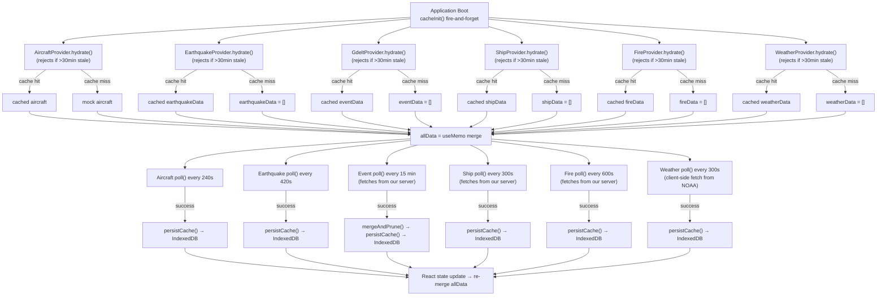
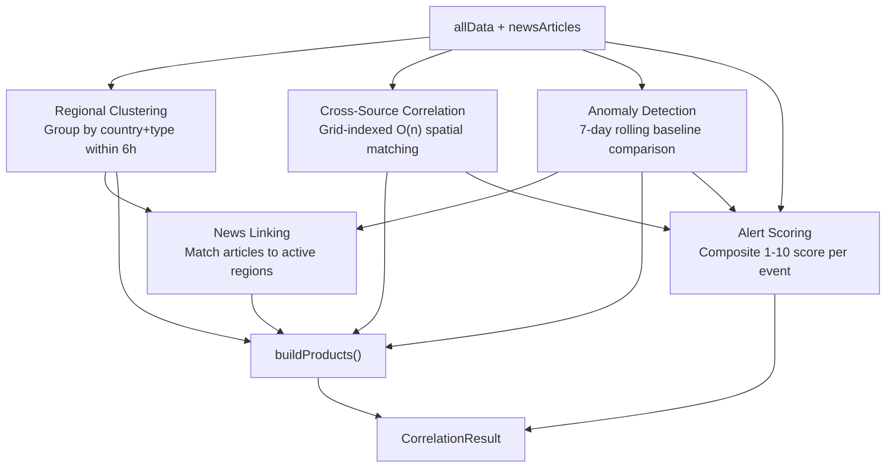
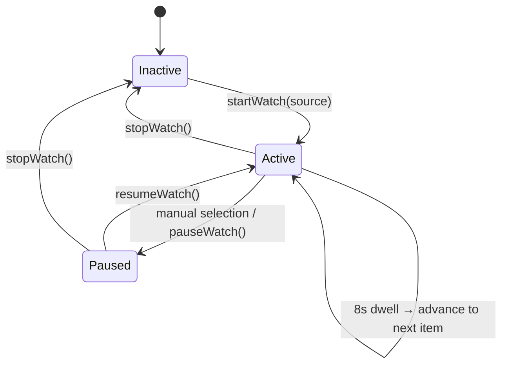
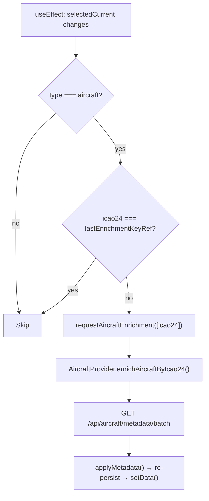

# Data Flow

[← Back to Docs Index](./README.md)

**Related docs**: [Architecture](./architecture.md) · [Feature System](./features.md) · [Caching](./caching.md) · [Pane System](./panes.md)

---

## Shared Data Context

All application state lives in `context/DataContext.tsx`, exposed via the `useData()` hook. The context provider calls the data hooks (`useAircraftData`, `useEarthquakeData`, `useEventData`, `useShipData`, `useFireData`, `useWeatherData`), merges their output into `allData`, centralizes trail recording, and computes all derived values. Every component — Header, PaneManager, LiveTrafficPane, DataTablePane, Ticker — reads from this single context.

### What lives in DataContext

| Category | State | Purpose |
|---|---|---|
| **Raw data** | `allData` | Merged aircraft + ships + earthquake + GDELT event + FIRMS fire + NOAA weather DataPoints |
| **News** | `newsArticles` | RSS news articles from `useNewsData()` — non-geographic, not in allData. Lifted to context for correlation engine + cross-pane access |
| **Correlation** | `correlation` | `CorrelationResult` from correlation engine — intel products + scored alerts + regional baseline. Computed once via `useMemo`, shared by all panes |
| **Selection** | `selected`, `selectedCurrent`, `setSelected` | Currently selected item (selectedCurrent stays fresh across data refreshes) |
| **Isolation** | `isolateMode`, `setIsolateMode` | FOCUS (layer only) or SOLO (single point) |
| **Layers** | `layers`, `toggleLayer` | Per-feature on/off toggles |
| **Aircraft filter** | `aircraftFilter`, `setAircraftFilter` | Complex filter (squawks, countries, airborne/ground, military) |
| **Filters** | `filters` | Unified filter map consumed by uiSelectors |
| **Derived** | `counts`, `activeCount`, `tickerItems`, `availableCountries`, `dataSources` | Computed via useMemo |
| **Spatial** | `idMap`, `spatialGrid`, `filteredIds` | O(1) selection lookup, spatial hash for click/hover, pre-computed filter set |
| **View controls** | `flat`, `autoRotate`, `rotationSpeed` + setters | Globe-specific but toggled from Header. Default rotation is paused. |
| **Chrome** | `chromeHidden`, `setChromeHidden` | Toggle all UI overlays |
| **Search** | `searchMatchIds`, `handleSearchMatchIds`, `handleSearchSelect`, `handleSearchZoomTo` | Search filter + zoom |
| **Zoom** | `zoomToId`, `setZoomToId` | Triggers camera zoom-to (deep zoom, lock-on) |
| **Reveal** | `revealId`, `setRevealId` | Triggers gentle ISS-level reveal (rotate to show point at 2.5x zoom, no lock-on). Used by pane clicks. |
| **Watch** | `watchMode`, `watchActive`, `watchPaused`, `watchProgress`, `startWatch`, `stopWatch`, `pauseWatch`, `resumeWatch` | Shared watch mode — auto-tour through alerts/intel/all on globe. See Watch Mode section. |
| **Enrichment** | `requestAircraftEnrichment` | On-demand metadata lookup |

### Derived values

| Derived | Recomputes when |
|---|---|
| `allData` | Any hook's data changes |
| `newsArticles` | News hook data changes |
| `correlation` | `allData` or `newsArticles` changes |
| `dataSources` | Any hook's dataSource status changes (includes news) |
| `filters` | `aircraftFilter` or `layers` changes |
| `tickerItems` | Data refresh or filter change |
| `selectedCurrent` | Data refresh or selection change |
| `counts` | Data refresh or filter change |
| `activeCount` | Data refresh or filter change |
| `availableCountries` | Data refresh |
| `idMap` | Data refresh |
| `spatialGrid` | Data refresh |
| `filteredIds` | Data refresh or filter change |
| `watchItems` | `correlation` or `watchState.source` changes |
| `watchProgress` | 100ms tick during active watch |

`selectedCurrent` is notable: when data refreshes, the previously selected item's `DataPoint` object is replaced by a new one with the same `id`. `selectedCurrent` uses `idMap.get()` for O(1) lookup of the updated version so the detail panel always shows fresh data.

---

## Boot & Polling Lifecycle



Boot is non-blocking. `cacheInit()` fires without awaiting, the app renders immediately. Providers use async `hydrate()` via `cacheGet()` (memory first, IndexedDB fallback). Hooks start empty, data arrives as providers resolve. All providers use a uniform 30-minute staleness threshold.

---

## Trail Recording (Centralized)

Trail recording is centralized in `DataContext` as a `useEffect` on `allData` changes. When `allData` updates (any source refreshes), the effect filters for moving entity types (aircraft and ships) and calls `recordPositions()` from the trail service. This feeds the interpolation system and trail rendering.

Previously trail recording was embedded in `useAircraftData`. It was moved to DataContext when ships became a separate hook to ensure both aircraft and ships feed trails from a single location with no duplication.

---

## The `allData` Array

`allData` is the **single source of truth** for all renderable points:

```typescript
const { data: aircraftData } = useAircraftData();
const { data: shipData } = useShipData();
const { data: earthquakeData } = useEarthquakeData();
const { data: eventData } = useEventData();
const { data: fireData } = useFireData();
const { data: weatherData } = useWeatherData();

const allData = useMemo(
  () => [...aircraftData, ...shipData, ...earthquakeData, ...eventData, ...fireData, ...weatherData],
  [aircraftData, shipData, earthquakeData, eventData, fireData, weatherData],
);
```

- **`aircraftData`**: Live aircraft from OpenSky (refreshed every 240s). Falls back to mock aircraft on fetch failure.
- **`shipData`**: Live AIS vessels from our server (refreshed every 300s). Server streams from aisstream.io WebSocket. Empty array if `AISSTREAM_API_KEY` not set.
- **`earthquakeData`**: Live earthquakes from USGS (refreshed every 420s). Covers the past 7 days of global seismic activity.
- **`eventData`**: Live GDELT events from our server (refreshed every 15 min). Client-side 7-day rolling window with URL-based dedup. Server fetches GDELT raw export files, parses geocoded conflict/crisis events, caches in memory.
- **`fireData`**: Live fire hotspots from our server (refreshed every 600s). Server fetches NASA FIRMS VIIRS CSV every 30 min, parses global fire detections from the last 24 hours. Empty array if `FIRMS_MAP_KEY` not set.
- **`weatherData`**: Live NOAA severe weather alerts (refreshed every 300s). Client-side fetch from `api.weather.gov/alerts/active`. US-only. No API key, just User-Agent header.

---

## The `filters` Map

```typescript
const filters = {
  aircraft: aircraftFilter,  // AircraftFilter object
  ships:    layers.ships,     // boolean
  events:   { enabled: layers.events ?? true, minSeverity: 0 },  // EventFilter
  quakes:   { enabled: layers.quakes ?? true, minMagnitude: 0 },  // EarthquakeFilter
  fires:    { enabled: layers.fires ?? true, minConfidence: 0 },  // FireFilter
  weather:  { enabled: layers.weather ?? true, minSeverity: 0 },  // WeatherFilter
};
```

Each feature's `matchesFilter()` receives its corresponding filter value. Aircraft uses a complex filter object with squawk/country/airborne toggles. Earthquake uses `EarthquakeFilter` with enabled + minMagnitude. Events use `EventFilter` with enabled + minSeverity. Ships use a simple boolean. Fires use `FireFilter` with enabled + minConfidence. Weather uses `WeatherFilter` with enabled + minSeverity.

---

## AIS Ship Data Flow

The AIS pipeline has both server-side and client-side components:

**Server** (`aisCache.ts`): On boot, opens a persistent WebSocket to `wss://stream.aisstream.io/v0/stream`. Subscribes to global `PositionReport` and `ShipStaticData` messages. Accumulates latest position per MMSI in an in-memory Map. `PositionReport` provides lat/lon/speed/heading/course/nav status. `ShipStaticData` enriches with name/callsign/IMO/type/destination/draught/dimensions. Stale vessels (not seen for 60 min) pruned every 5 min. Auto-reconnects on disconnect. Serves snapshot via `/api/ships/latest` with token auth.

**Client** (`ShipProvider`): Polls `/api/ships/latest` every 300 seconds using `authenticatedFetch()` from `lib/authService.ts` . Converts server vessel records to DataPoints with `id: S{mmsi}`, type `ships`. Persists to IndexedDB. Hydrates on boot with 30-min staleness threshold.

---

## GDELT Event Data Flow

**Server** (`gdeltCache.ts`): Fetches GDELT export CSV every 15 min, filters to conflict/crisis CAMEO codes. See [Architecture](./architecture.md) for full pipeline.

**Client** (`GdeltProvider`): Polls `/api/events/latest` every 15 min via `authenticatedFetch()`. Merges with existing cache (URL dedup), prunes events older than 7 days. Persists to IndexedDB.

---

## NASA FIRMS Fire Data Flow

**Server** (`firmsCache.ts`): Fetches VIIRS NOAA-20 CSV every 30 min. See [Architecture](./architecture.md) for full pipeline.

**Client** (`FireProvider`): Polls `/api/fires/latest` every 600s via `authenticatedFetch()`. Converts to DataPoints (`id: FI{idx}-{lat}-{lon}`, type `fires`). Persists to IndexedDB, 30-min staleness.

---

## NOAA Weather Data Flow

Client-side fetch from `api.weather.gov/alerts/active`. No API key, just `User-Agent` header.

**Client** (`WeatherProvider`): Polls every 300s. Extracts centroid from GeoJSON geometry. Maps to DataPoints (`id: WX{nws_id}`, type `weather`). US-only. Persists to IndexedDB, 30-min staleness.

---

## RSS News Data Flow

**Important**: News is a non-geographic data source. It does NOT participate in `allData`, the feature registry, or the globe rendering pipeline. However, news data IS lifted to `DataContext` — the `useNewsData()` hook is called in the DataProvider, and `newsArticles` is exposed on the context value. This enables the correlation engine and any pane to access news without duplicate hook instances.

**Server** (`newsCache.ts`): Fetches 6 RSS feeds every 10 min, deduplicates, caps at 200 articles. See [Architecture](./architecture.md) for feed list and details.

**Client** (`NewsProvider`): Mirrors the `BaseProvider` contract for `NewsArticle[]` (not `DataPoint[]`): `hydrate()` reads asynchronously from IndexedDB via `cacheGet()` with 12-hour staleness rejection, `refresh()` fetches from `/api/news/latest` via `authenticatedFetch()` (HttpOnly cookie auth) and persists to IndexedDB, `getData()` returns cache if fresh or triggers background refresh, `getSnapshot()` returns current state. The `useNewsData` hook starts empty and calls `getData()` in a `useEffect`.

**Context integration**: `DataContext` calls `useNewsData()` and exposes `newsArticles` on the context value. `NewsFeedPane` reads from `useData()` instead of calling the hook directly. News also appears in the `dataSources` array as `{ id: "news", label: "NEWS" }` for status reporting.

---

## Correlation Engine

`lib/correlationEngine.ts` derives intelligence products from raw `DataPoint[]` + `NewsArticle[]`. Runs as a `useMemo` in `DataContext` keyed on `[allData, newsArticles]` — recomputes on every data refresh. The result is shared across all panes via `correlation` on the context value.

### Three Outputs

| Output | Type | Purpose |
|---|---|---|
| `products` | `IntelProduct[]` | Correlated intelligence insights for the Intel Feed |
| `alerts` | `ScoredAlert[]` | Context-scored alerts for the Alert Log |
| `baseline` | `RegionBaseline` | Rolling per-country event counts (persisted to IndexedDB) |

### Five Correlation Stages



**1. Regional Clustering**: Groups events by country + type within 6-hour windows. "5 conflict events in Sudan in 3h" becomes one cluster instead of 5 raw entries.

**2. Cross-Source Correlation**: Spatial-temporal matching across data types using a 2° grid index (same cell approach as `spatialIndex.ts`). Builds a grid per data type, then queries neighboring cells — O(n) not O(n²). Correlation rules:
- GDELT conflict (severity ≥3) + FIRMS fire within 75km/12h → conflict-related fire
- Earthquake (M4.5+) + subsequent fire within 75km/12h → secondary fire
- Severe weather + 3+ ships within 75km → maritime risk
- Military aircraft within 200km of conflict events → deployment activity

**3. Anomaly Detection**: Rolling 7-day per-country baseline (168 hourly buckets). Current 6h activity compared against historical average. 3× baseline = activity spike. A M3.5 in Virginia scores higher than M5 in Chile because Virginia's baseline shows no seismic activity. Baseline persisted to IndexedDB under `sigint.intel.baseline.v1` — accumulates over days of use.

**4. News Linking**: Matches RSS article titles/descriptions against country names from active clusters and anomalies. Links news coverage to intelligence products (up to 3 articles per country).

**5. Alert Scoring**: Composite 1-10 score built from base measurement (magnitude, FRP, severity, squawk), regional baseline deviation, cross-source correlation boost, and military classification boost. Post-scoring dedup pass collapses same country + type within 1-hour into single alert (e.g., "CRISIS EVENT (+4 similar)") with highest score and merged factors.

### Grid-Indexed Spatial Matching

The cross-source correlation uses a 2° grid (same approach as `spatialIndex.ts`) to avoid O(n²) comparisons. For each correlation rule, the "query" type is iterated and the "target" type is indexed in a grid. Each query point checks only the ~9 neighboring cells, making the total cost O(n) regardless of dataset size.

```typescript
// 75km ≈ 0.7° at equator — 2° cells with 1-ring neighbor query covers it
const GRID_CELL_DEG = 2;
function gridQuery(grid, lat, lon, radiusDeg): DataPoint[] { ... }
```

### ScoredAlert Type

```typescript
type ScoredAlert = {
  item: DataPoint;
  label: string;           // "CRISIS EVENT (+4 similar)"
  score: number;           // 1-10 composite
  factors: string[];       // ["Severity 5/5", "Region elevated (5.0× baseline)", "Correlated with other source"]
  count: number;           // Number of deduped events (1 = single)
  groupedItems?: DataPoint[];  // All items in the dedup group
};
```

### Regional Baseline Persistence

The baseline survives page reloads via IndexedDB (`sigint.intel.baseline.v1`). It accumulates over days of use — the longer the app runs, the smarter the anomaly detection gets. Users can clear it from Settings like any other cache entry. Hourly buckets older than 7 days are pruned on each computation.

---

## Watch Mode

Watch mode is a shared auto-tour system that cycles through alerts and/or intel products on the globe. State lives in `DataContext`, controlled from the globe overlay, consumed by all panes.

### WatchMode State

```typescript
type WatchSource = "alerts" | "intel" | "all";

type WatchMode = {
  active: boolean;
  paused: boolean;
  source: WatchSource;
  index: number;
  items: DataPoint[];
  currentId: string | null;
  currentItemSource: "alerts" | "intel" | null;  // which list the current item came from
};
```

### Watch Lifecycle



**Start**: `startWatch(source)` sets active, calls `requestWatchLayout()` (ensures dossier + alerts + intel panes are open via PaneManager), enables globe rotation.

**Cycling**: Every 8 seconds, advances to the next item. Calls `setSelected(item)` + `setRevealId(item.id)` (ISS-level reveal — rotates globe to show point, no deep zoom). Dossier updates automatically since it reads `selectedCurrent`.

**ALL mode interleaving**: Alerts and intel products merged into one list sorted by score descending, deduped by ID. Each item tracks its origin (`"alerts"` or `"intel"`). `currentItemSource` tells panes which list the current item came from — only the matching pane highlights/scrolls.

**Pause**: Manual selection (clicking globe, ticker, data table) auto-pauses watch. Globe shows ▶ RESUME + ✕ stop buttons. Resume picks up where it left off. Pause also available programmatically via `pauseWatch()`.

**Progress**: `watchProgress` (0-1) ticks every 100ms, exposed on context. Panes render a progress bar that fills left-to-right over 8 seconds, resets on each advance.

### Watch Layout

`requestWatchLayout()` fires on watch start and every 3 seconds during active watch. PaneManager handles it by ensuring three panes exist:

1. **Dossier** — right of globe (75/25 ratio)
2. **Alert Log** — below globe (65/35 ratio)
3. **Intel Feed** — right of alert log (50/50 ratio)

Each pane is restored from minimized if available, or created fresh. `ensurePane` scans the current tree by pane type on each call — handles cases where panes are closed during watch (re-created within 3 seconds). If the anchor pane for a child (e.g., alert-log for intel-feed) doesn't exist, falls back to splitting on root.

### ISS-Level Reveal

Watch mode uses `setRevealId()` instead of `selectAndZoom()`. The reveal effect in `GlobeVisualization`:

- Always rotates the globe to show the point (no visibility guessing)
- Sets `camTarget.zoom` to max(current, 2.5) — ISS altitude, not street level
- Does NOT set `camTarget.lockedId` — camera remains free after the pan completes
- Clears `lastRevealIdRef` when `revealId` goes null, allowing re-reveal of the same ID

Pane clicks (alert log, intel feed, data table) also use ISS reveal. The LOCATE button in the detail panel/dossier still does full deep zoom via `selectAndZoom()`.

---

## Enrichment Pipeline

Aircraft metadata enrichment runs as a side effect in `DataContext`, scoped to the currently selected aircraft only (prevents cache bloat).



---

## Ticker Feed

The live ticker at the bottom of the screen shows a continuous marquee of items from each active data type. Items are sorted by recency within each type, then interleaved: one aircraft, one ship, one event, one quake, one fire, one weather alert, repeat. Emergency aircraft (squawk 7700/7600/7500) always appear first. Non-emergency items are Fisher-Yates shuffled for variety. Grounded aircraft and moored ships (SOG < 0.5) are filtered out. The ticker draws from a pool of 80 items rendered as fixed-width cards (280px desktop, 220px mobile) scrolling left at a configurable speed (default 10 px/s, adjustable 0–100 in Settings → Appearance). Speed 0 stops scrolling and swaps the visible set every 8 seconds. Hover pauses the scroll. Below 640px, items render as compact single-line strips. Ticker items are clickable — clicking selects the item and zooms the globe to it. Speed setting persisted to `sigint.ticker.speed.v1`.