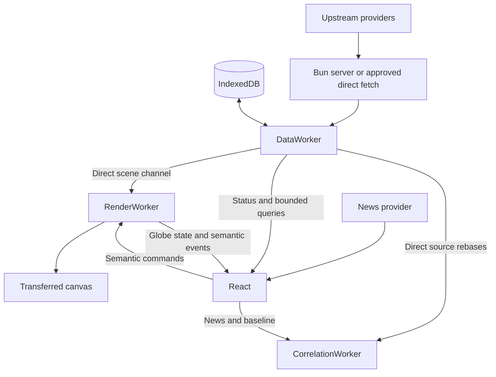

# Data Flow

[Back to the documentation index](./README.md)

Related documents: [Architecture](./architecture.md), [Rendering](./rendering.md), [Caching](./caching.md), and [Feature system](./features.md).

## Purpose

This document describes browser data ownership. It also describes each path from a source record to the renderer or React.

The DataWorker owns all geographic source records. React does not own a merged geographic record array.

## Ownership

| Owner | Data |
| --- | --- |
| Bun server | Server poll state, protected credentials, normalized provider responses, and disposable server caches |
| DataWorker | Geographic source records, source versions, source status, IndexedDB records, trails, aircraft dossiers, render searches, and scene publication |
| CorrelationWorker | Worker-local copies of geographic records for analysis |
| RenderWorker | Packed scene records, render selection, search visibility, camera state, and frame state |
| React | News articles, pane state, controls, bounded query results, and one selected record copy |

Each owner publishes a typed projection. A consumer does not mutate the owner data.

## Browser topology


```mermaid
flowchart TB
    U[Upstream providers] --> B[Bun server or approved direct fetch]
    B --> D[DataWorker]
    I[(IndexedDB)] <--> D

    D -->|Direct scene channel| R[RenderWorker]
    R --> C[Transferred canvas]

    D -->|Direct source rebases| K[CorrelationWorker]
    N[News provider] --> X[React]
    X -->|News and baseline| K

    D -->|Status and bounded queries| X
    R -->|Globe state and semantic events| X
    X -->|Semantic commands| R
```

## Boot

`frontend.tsx` starts the React application immediately. It also starts cache initialization.

`storageService.ts` requests the shared DataWorker client. The client creates `/workers/dataWorker.js` and sends the initialization command.

The DataWorker performs these operations:

1. Open the `sigint-cache` IndexedDB database.
2. Return only main-thread cache entries to `storageService.ts`.
3. Hydrate the trail recorder.
4. Hydrate each geographic source from its worker-owned cache.
5. Publish cached source status and scene rebases when data is available.
6. Start each source refresh schedule.

News is not a geographic source. The React news provider still hydrates and refreshes news articles.

## Source lifecycle

Each geographic source attaches to a source runtime. The runtime owns one `DatasetStore`.

The source runtime performs these operations:

1. Read and parse the source cache.
2. Fetch and validate a source snapshot.
3. Apply the snapshot to the `DatasetStore`.
4. Persist the accepted source records.
5. Publish a small source-status snapshot to the main thread.
6. Publish a `DatasetPatch` to the source scene binding.
7. Schedule the next refresh or retry.

The runtime deduplicates concurrent refresh requests. It retains valid records after a failed refresh.

## Snapshot reconciliation

A source snapshot declares whether it is complete or partial.

- A complete snapshot can delete records that are absent from the new snapshot.
- A partial snapshot can add or update records. It cannot infer a deletion.
- An explicit empty complete snapshot clears the source.
- A failed refresh does not clear retained records.

The `DatasetStore` indexes records by stable entity identifier. It rejects duplicate identifiers and non-increasing versions.

The first accepted snapshot creates a rebase patch. Later snapshots create incremental patches with upserts and deleted identifiers.

## Render-data path

The render-data path does not use React.

```text
source snapshot
  -> DatasetStore
  -> DatasetPatch
  -> source scene binding
  -> ScenePatchCodec
  -> ScenePublisher
  -> direct MessageChannel
  -> source render layer
  -> SceneStore
  -> Canvas 2D frame
```

The scene codec converts source records to render records. It packs positions, unit vectors, timestamps, attributes, motion positions, and geometry.

The scene publisher adds the protocol version, render session identifier, and sequence. It transfers eligible buffers to the RenderWorker.

The RenderWorker routes each command by source. The source render layer applies the command to its `SceneStore`.

See [Rendering](./rendering.md) for the canvas lifecycle and the frame path.

## Main-thread data path

React receives small source-status snapshots. A snapshot contains the source identifier, version, status, loading state, record count, update time, and error.

React requests bounded data for a specific UI purpose:

- One source entity
- One query page
- One count
- One facet list
- One ticker page
- One selected trail
- One aircraft dossier

`useSourceQuery()` reruns a query when the source version changes. It keeps the last valid page while a new request is active.

The DataWorker limits query results. React never subscribes to the complete geographic collection.

## React contexts

`DataProvider` nests three contexts.

| Context | Responsibilities |
| --- | --- |
| `DataContext` | Source status, counts, bounded ticker items, news, filters, and correlation results |
| `UIContext` | Selected record copy, pane-facing globe controls, search text, focus intent, and chrome visibility |
| `WatchContext` | Watch mode, dwell state, progress, and watch source |

`useData()` combines these contexts for existing consumers. This combined hook does not create a second data owner.

`DataContext` does not hold geographic source records. It reads source versions and bounded query results from the DataWorker.

## Globe state path

`RenderGlobeStateController` in the RenderWorker owns globe state.

The render surface keeps a bounded state snapshot for React controls. A control dispatches a semantic command through `globeStateStore.ts`. The RenderWorker applies the command and publishes a new state snapshot.

Layer filters, projection, rotation, and isolation do not use React as their authoritative owner.

## Selection path

The RenderWorker performs hit tests and owns the render selection.

The selection path is:

```text
canvas input
  -> RenderWorker hit test
  -> semantic selection event
  -> render surface
  -> DataWorker getSourceEntity query
  -> one current record
  -> React selection and dossier panes
```

React stores one bounded record copy for pane presentation. `useFreshEntity()` requests a new copy when the source version changes.

The RenderWorker also sends selection interest directly to the DataWorker. The DataWorker publishes the selected trail and aircraft route through the scene channel.

## Search path

React performs bounded search-result queries for the search interface. A selected search result is one bounded record.

A committed globe search uses a separate worker path:

```text
search text
  -> RenderWorker
  -> search interest
  -> DataWorker
  -> source-specific matching identifiers
  -> scene handles
  -> RenderWorker visibility state
```

React does not store or relay the complete render match set.

## Trail path

The DataWorker records aircraft and ship observations. `ObservedTrailBinding` receives accepted source patches and updates the trail recorder.

The trail recorder owns these operations:

- Cache hydration
- Position validation
- Movement thresholds
- Point limits
- Stale-entry removal
- Deferred persistence
- Selected-trail queries

The render selection activates `SelectionInterestService`. The service publishes one bounded selection overlay to the RenderWorker.

## Correlation path

The DataWorker sends complete source rebases directly to the CorrelationWorker. A source-status publication triggers the corresponding rebase.

React sends only news articles and the regional baseline with a correlation request. Geographic record arrays do not pass through React.

The CorrelationWorker returns products, alerts, and the next baseline. React stores the result and persists the baseline.

## News path

News articles are not geographic render records.

The news provider performs these operations:

1. Hydrate articles from cache.
2. Refresh articles from the server.
3. Publish articles to React.
4. Supply articles to the news pane and the correlation request.

News does not enter the scene protocol or the RenderWorker.

## Data rules

- Keep one authoritative owner for each record set.
- Use `DatasetPatch` for geographic source changes.
- Use the common scene codec and scene protocol for rendering.
- Keep complete and partial snapshot rules explicit.
- Keep source versions monotonic.
- Keep UI query results bounded.
- Do not create a React-owned merged geographic array.
- Do not relay render records through React.
- Do not use pane queries as the render-data path.
