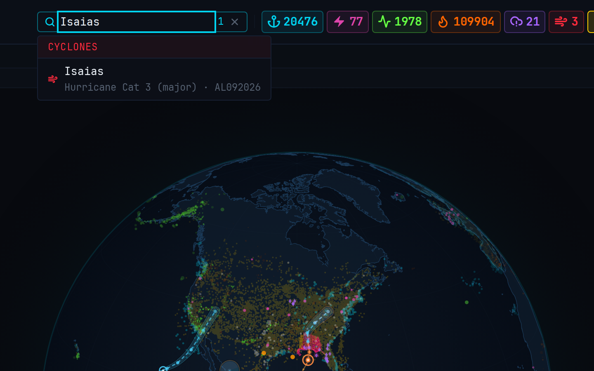
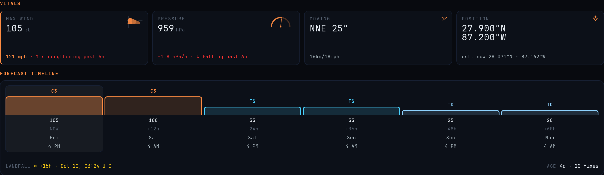
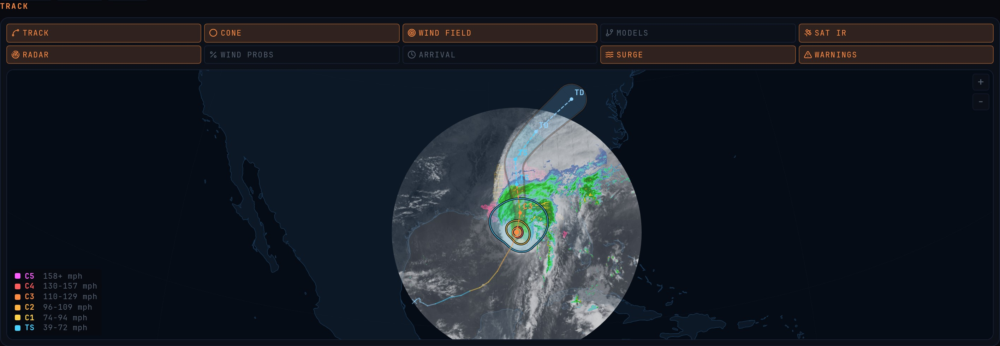
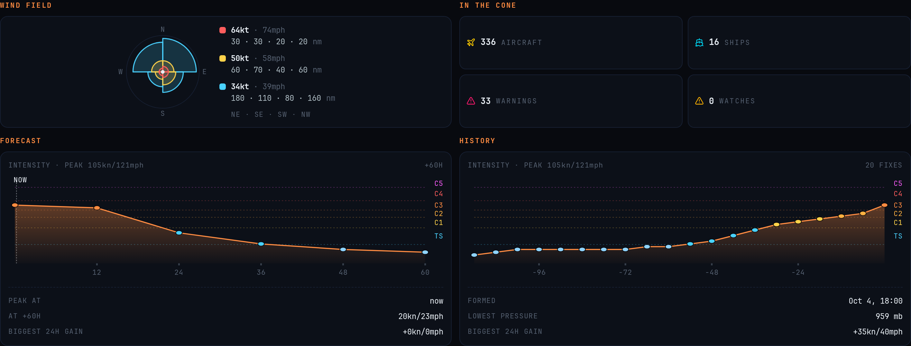
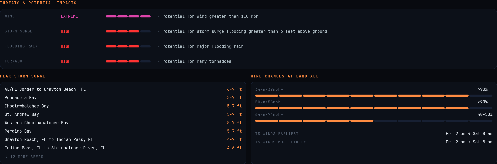
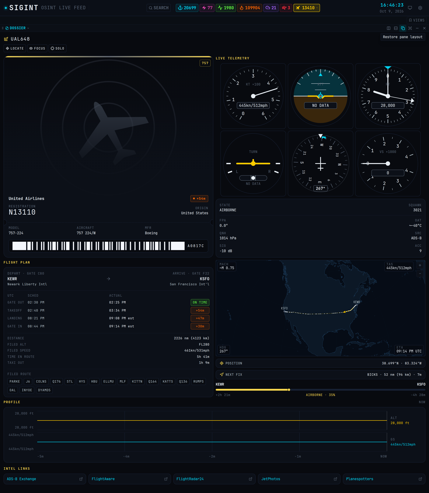
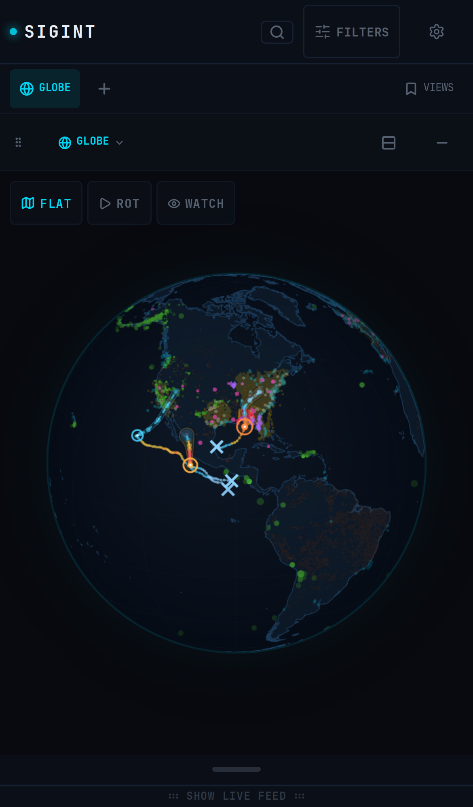
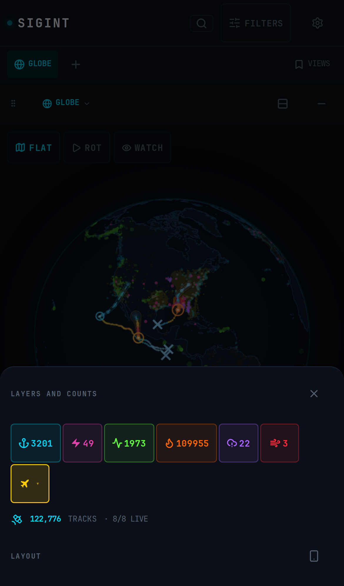
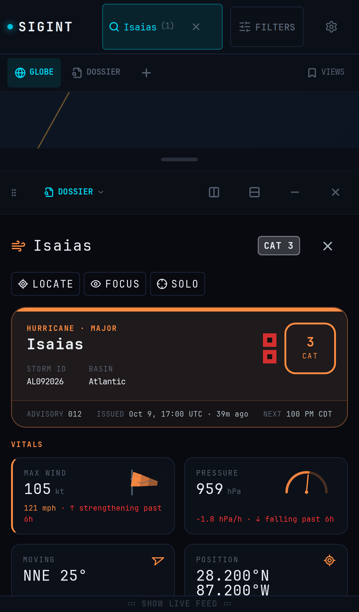

# Using SIGINT

[Back to the documentation index](./README.md)

Related documents: [Pane system](./panes.md), [Global search](./search.md), and [Feature system](./features.md).

## Purpose

This guide shows how to use the SIGINT interface. It covers the header, the globe, search, the storm and aircraft dossiers, panes, and the mobile layout.

## Header and layers

The header contains search, the layer toggles, the layout mode, and settings.

Each layer toggle shows the live record count for its source. Select a toggle to show or hide that layer on the globe. A warning icon in place of the count means the source is offline. Hover over the toggle to read the reason.

The aircraft toggle also opens the aircraft filter. Use it to show all, military, civilian, or reconnaissance aircraft, or aircraft from one country.

The monitor icon cycles the layout mode: automatic, mobile, and desktop.

## Globe

The globe pane shows every visible layer.

| Control | Action |
| --- | --- |
| Drag | Rotate the globe or pan the flat map |
| Scroll or pinch | Zoom |
| Select a marker or area | Open its dossier |
| FLAT | Switch between the globe and the flat map |
| ROT | Start or stop automatic rotation |
| SPD | Set the rotation speed |
| WATCH | Start watch mode, an automated tour of active events |

## Search

Select SEARCH and type a name, callsign, registration, place, or identifier. Results are grouped by source.

While text is in the search box, the globe shows only matching records. Select a result to open it. Select the clear button to remove the filter and show all records again.

## Storm dossier

Select a storm on the globe or in search, then select OPEN IN DOSSIER.

The dossier toolbar has three actions:

- LOCATE moves the globe to the storm.
- FOCUS hides the other layers.
- SOLO hides every record except this storm.

### Vitals and forecast timeline

Vitals show maximum wind, pressure, motion, and position. The wind and pressure cards show the trend since the previous best-track fix. The position card shows the advisory position and the estimated position now.

The forecast timeline shows the category and wind at each forecast point. Select a point to open its forecast dossier. The footer shows the expected landfall and the storm age.

### Track map and layers

The track map has ten layer toggles. Each toggle changes both the map and the globe.

| Layer | Content |
| --- | --- |
| TRACK | Past track colored by intensity at each fix, and the forecast track |
| CONE | Official NHC forecast cone, colored by forecast category |
| WIND FIELD | Tropical-storm, 50 kt, and hurricane-force wind radii |
| MODELS | Forecast tracks from the NHC model guidance |
| SAT IR | GOES infrared satellite loop around the storm |
| RADAR | MRMS radar loop around the storm |
| WIND PROBS | Chance of tropical-storm-force winds |
| ARRIVAL | Arrival time of tropical-storm-force winds |
| SURGE | Peak storm surge areas |
| WARNINGS | Tropical warnings and watches |

Satellite and radar draw under the cone, wind field, and track, so the track stays readable with every layer on.

### Wind field and intensity

The wind field shows the radius of each wind threshold in each quadrant. IN THE CONE counts the aircraft, ships, warnings, and watches inside the forecast cone.

FORECAST shows the forecast intensity. HISTORY shows the best-track intensity since the storm formed. Both charts use the same Saffir-Simpson scale.

### Threats, surge, and wind chances

Threats come from the National Weather Service hurricane threat products. Peak storm surge lists the forecast surge for each coastal area. Wind chances show the probability of each wind threshold at the expected landfall point.

The NHC PRODUCTS section below shows the public advisory, the forecast discussion, and the wind probability text.

## Aircraft dossier

Select an aircraft to open its dossier. The dossier shows:

- Identity, registration, type, operator, and photo
- Live telemetry on six flight instruments
- The flight plan with gate times and delays
- The route map with the filed route, position, next fix, and progress
- The altitude and speed profile

## Panes and views

Each pane header has a type menu and pane actions.

| Action | Result |
| --- | --- |
| Type menu | Change the pane to the globe, data table, dossier, intel feed, news feed, alerts, console, or video feed |
| Split right or split down | Add a pane beside or below this pane |
| Maximize | Fill the window with this pane. Select it again to restore the layout |
| Fullscreen | Show this pane in browser fullscreen |
| Minimize or close | Hide or remove this pane |

Drag the handle at the left of a pane header to move the pane. Drag a divider to resize two panes.

Select VIEWS to save, load, update, or delete a saved layout.

## Mobile

| Globe | Filters | Dossier |
| --- | --- | --- |
|  |  |  |

On a phone, the top bar holds the logo, search, Filters, and settings. The view tabs stay pinned below it. Select a tab to scroll to that view. Select + to add a view.

Views stack in one scrolling column. The globe, dossier, and video open one screen tall. Tables and feeds open half a screen tall. Drag the bar under a view to resize it.

One finger scrolls the page, also over the globe. Use two fingers to zoom and move the globe. Tap a marker to open its dossier.

Select Filters to show or hide layers, read the live count for each layer, and change the layout mode.
