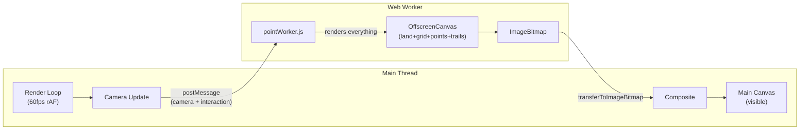
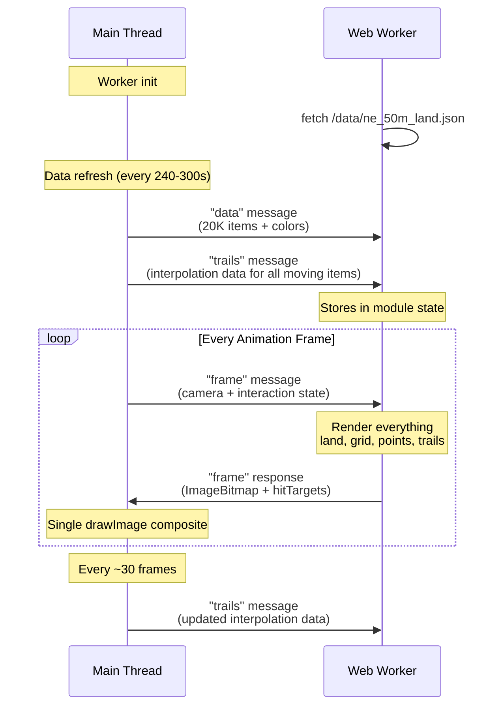
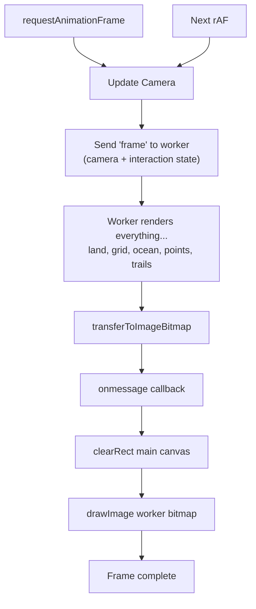

# Rendering Pipeline

[← Back to Docs Index](./README.md)

**Related docs**: [Architecture](./architecture.md) · [Data Flow](./data-flow.md) · [Constraints](./constraints.md)

---

## Overview

The rendering pipeline offloads all drawing to a dedicated Web Worker (`public/workers/pointWorker.js`) with its own OffscreenCanvas. The worker renders everything — land, ocean, grid, glow, rim, coordinate labels, data points, trails, and selection rings — on a separate CPU core. The main thread handles only camera updates, input handling, and compositing the finished bitmap via a single `drawImage` call. The worker fetches its own land data (`/data/ne_50m_land.json`) on init.

---

## GlobeVisualization Architecture

The globe visualization is split into a modular `components/globe/` directory. The main component (`GlobeVisualization.tsx`) manages refs, the render loop, camera updates, worker communication, trail tooltip positioning, and tooltip JSX. All rendering is done by the worker.

**React never directly drives rendering.** Props are synced into `propsRef` on every React render, but the animation loop reads from the ref independently at ~60fps.

The globe uses a ResizeObserver on its parent container, so it correctly handles being resized by the PaneManager grid.

| File | Purpose |
|---|---|
| `GlobeVisualization.tsx` | Shell: refs, render loop, worker lifecycle, camera, input, tooltip JSX |
| `cameraSystem.ts` | Lock-on follow, lerp, shortest-path rotation, auto-rotate |
| `inputHandlers.ts` | Mouse, touch, wheel, keyboard handler factory |
| `pointRenderer.ts` | Legacy — rendering logic now lives in the Web Worker |
| `landRenderer.ts` | Coastline polygons, globe clipping |
| `gridRenderer.ts` | Lat/lon grid lines |
| `projection.ts` | projGlobe, projFlat, getFlatMetrics, clampFlatPan |
| `types.ts` | Shared types (Projected, CamState, CamTarget, DragState, etc.) |

| File (public) | Purpose |
|---|---|
| `public/workers/pointWorker.js` | Web Worker — owns OffscreenCanvas, all point rendering |

---

## Worker Rendering Architecture



The worker renders everything to a single OffscreenCanvas:

- Land polygons (globe-clipped with horizon arc interpolation, flat with antimeridian segment splitting)
- Ocean gradient, atmospheric glow, globe rim
- Grid lines (projected for globe, direct for flat)
- Flat map border, coordinate labels
- Position interpolation (speed + heading extrapolation for moving items)
- Projection (orthographic globe or equirectangular flat)
- Filtering (layers, aircraft filter, isolation modes, search)
- Depth sorting (globe mode only — flat mode skips since z is always 1)
- Trail rendering (glow pass, main line, waypoint dots, hit targets)
- All shape drawing (quake pulses, event glows, ship diamonds, aircraft triangles, selection rings)

The worker fetches land data (`/data/ne_50m_land.json`) on init, parses the GeoJSON, and stores the polygon arrays. No land data crosses `postMessage`.

The worker uses `requestAnimationFrame` internally with a pending frame pattern — if multiple "frame" messages arrive while the worker is busy, it skips to the most recent one. Points always render with the latest camera state.

The main thread composites the finished `ImageBitmap` via a single `drawImage` call in the worker's `onmessage` callback.

### Split Messaging



Communication between main thread and worker uses two message types to minimize serialization overhead:

**"data" message** — sent only when the data array reference changes (on data refresh, ~240-300s). Carries the full item array + theme colors. Trail interpolation data for all moving items is also sent alongside. Interaction state (selection, filters, layers, isolation) is NOT included here — it goes with the frame message for instant responsiveness.

**"frame" message** — sent every animation frame. Contains camera state, timing, viewport dimensions, DPR, and all interaction state (selectedId, isolateMode, layers, aircraftFilter, searchMatchIds, selectedItem with trail). The worker uses stored data from the last "data" message combined with the frame's interaction state to render.

This means toggling Focus/Solo, changing filters, or selecting items is instant — no re-serialization of 20K items.

### Composite Flow



1. Main thread render loop runs at 60fps — updates camera, sends "frame" message to worker
2. Worker renders everything (land, grid, ocean, glow, points, trails, rim) to its OffscreenCanvas, transfers bitmap
3. Worker's `onmessage` callback on main thread composites: clears main canvas, draws worker bitmap

### Trail Data Sync

Trail interpolation data is synced from the main thread to the worker on every data change and every ~30 frames (~500ms). The worker maintains its own trail Map for interpolation. The selected item's full trail point array is sent with each frame message for trail line rendering.

Trail hit targets (for click detection on waypoint dots) are sent back from the worker with each bitmap and stored on the canvas element for the input handlers to use.

---

## Progressive Data Loading

When a data source refreshes and delivers a new array, the `renderLimitRef` resets to 3000. Each frame it grows by 3000 until it covers all data. This spreads the cost of a 20K item data refresh across ~6-7 frames (~100ms) instead of one frame spike. Once fully loaded, no slicing occurs.

---

## Camera System

Target + lerp model for smooth transitions. `updateCamera()` in `cameraSystem.ts` handles all camera state mutation each frame.

- **`camRef`** — current camera state: `{ rotY, rotX, vy, zoomGlobe, zoomFlat, panX, panY }`
- **`camTargetRef`** — animation target: `{ rotY, rotX, zoom, panX, panY, active, lockedId }`

| Action | Effect |
|---|---|
| Single-click a point | Select + lock camera at current zoom + stop auto-rotate |
| Double-click a point | Select + lock + progressive zoom (8x current, min 80, max 500 flat / 350 globe). Globe snaps rotation, lerps zoom only. |
| Drag | Breaks lock-on (`lockedId = null`, `active = false`) |
| Scroll wheel (locked) | Adjusts `camTargetRef.zoom`, stays locked and centered |
| Scroll wheel (unlocked) | Directly modifies `camRef` zoom |
| Pinch zoom | Breaks camera lock. Anchored to finger midpoint on flat map (same math as wheel). |
| Auto-rotate | Only active when: globe mode, not dragging, not animating to target. Stops permanently on point selection. |
| Click empty area | Deselects current item, clears isolation |

**Zoom limits**: Globe mode min 0.55, max 350. Flat mode min 0.85, max 500.

**Double-click zoom**: Uses a `lastClickItem` closure variable to store the DataPoint on first click — does not depend on React state (which may not have updated by the second click). Synthesized mouse events from mobile touch are suppressed via `lastTouchTime` guard to prevent false double-clicks.

**Detail panel side hysteresis**: Panel starts on the right for each new selection. Only flips to left when the selected point crosses past 65% of viewport width, flips back below 35%. Points in the middle 30% never trigger a flip. Resets on new selection.

**Shortest-path rotation**: The `rotY` lerp normalizes the difference to `[-π, π]` before interpolating, ensuring the camera always takes the shortest path around the globe.

---

## Input Handlers

All input handling is extracted into `inputHandlers.ts` as a factory function:

```typescript
const handlers = createInputHandlers({
  canvas, camRef, camTargetRef, dragRef, sizeRef, propsRef, setTrailTooltip,
});
attachInputHandlers(canvas, handlers);
// cleanup:
detachInputHandlers(canvas, handlers);
```

**Click priority**: Trail waypoint dots on the selected item's trail are checked before data points.

**Spatial grid acceleration**: Click and hover handlers use the spatial grid (`spatialIndex.ts`) to narrow candidates from O(n) full scan to ~50 nearby points via inverse screen-to-latlon projection + grid query. Falls back to full scan if inverse projection fails (click outside globe).

**Mobile touch**: Synthesized mouse events suppressed via `lastTouchTime`. Pinch detection handles late second-finger arrival (touchmove sees 2 fingers before touchstart). Tap-vs-drag threshold is 15px to absorb finger wobble.

---

## Interpolation

All moving entities (aircraft, ships) have their positions interpolated between data refreshes for smooth animation. The trail service records actual positions at each refresh and uses speed + heading to extrapolate between them. If data is older than 10 minutes, interpolation returns null (stale). If less than 1 second old, it also returns null (too soon — use raw position).

The Web Worker maintains its own copy of trail data for interpolation, synced from the main thread every ~30 frames.

---

## Spatial Index

`lib/spatialIndex.ts` provides a grid-based spatial hash (2° cells, 16,200 cells total) for O(1) geographic lookups. Used by click/hover handlers to find nearby points without scanning all data. Also provides inverse projection functions (`screenToLatLonGlobe`, `screenToLatLonFlat`) to convert screen coordinates back to geographic coordinates.

The spatial grid is rebuilt in `DataContext` whenever `allData` changes and passed to `GlobeVisualization` as a prop.

---

## Trail Waypoint Tooltip

When a trail is drawn for the selected item, each waypoint dot is stored as a hit target. Clicking near a waypoint shows an anchored tooltip with altitude, speed, heading, and coordinates at that point in time. The tooltip is repositioned every frame via DOM ref (not React state). Hides when the point goes behind the globe.

---

## Projection Functions

Two modes, selected by the `flat` prop:

- **Globe** (`projGlobe`): Orthographic projection onto a sphere. Points behind the globe (`z <= 0`) are culled.
- **Flat** (`projFlat`): Equirectangular projection. Supports pan and zoom.

Both return `{ x, y, z }` where `z` is used for depth sorting (globe) or always 1 (flat — sort skipped).

The worker inlines its own copies of these projection functions (plain JS, no imports).

---

## Point Rendering by Type

Each data type has its own rendering block in the worker with a `continue`, keeping rendering logic cleanly separated. The rendering logic is identical to the original `pointRenderer.ts`.

### Earthquake Rendering (Age-Based)

**Magnitude → Size** (exponential): M1=2px, M3=3.5px, M5=7px, M7+=15px

**Age → Color & Opacity**: Fresh (<1hr) bright green at full opacity, fading to muted green at 0.5 alpha for 7-day-old events.

**Magnitude → Pulse**: Earthquakes above M2.5 get a pulsing glow. Intensity scales with magnitude.

### Event Rendering (Age-Based)

**Severity → Size**: Severity 1=2.5px, 2=3.5px, 3=5px, 4=7px, 5=9.5px

**Age → Color & Opacity**: Fresh (<1hr) bright at full opacity, fading to muted at 0.45 alpha. Color shifts through progressively dimmer amber tones.

**Severity → Pulse**: Events with severity ≥3 get a pulsing glow.

### Ship Rendering (Heading-Rotated Diamond)

Heading-rotated diamond shapes — pointed nose forward, narrow beam, blunt stern. Base size 3.5px, scales 1.8x when selected. Selection ring matches other types.

### Aircraft Rendering (Heading-Rotated Triangle)

Heading-rotated triangles pointing in direction of travel. Base size 4px, scales 1.8x when selected. Emergency squawk codes override base color: 7700 (emergency) = red, 7600 (radio failure) = orange, 7500 (hijack) = purple.

---

## Isolation Modes

| Mode | Behavior |
|---|---|
| **FOCUS** | Shows only the selected item's layer type. Other layers hidden. Filters still apply. |
| **SOLO** | Shows only the single selected point. Everything else gone. |

Controlled by `isolateMode` state in DataContext. Detail panel controls toggling between modes. Closing the panel clears isolation.