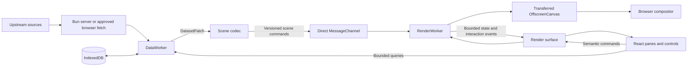

# Rendering Pipeline

[Back to the documentation index](./README.md)

Related documents: [Architecture](./architecture.md), [Data flow](./data-flow.md), [Constraints](./constraints.md), and [Pane system](./panes.md).

## Purpose

This document describes the current globe rendering system. The RenderWorker owns the canvas, camera, render state, and frame schedule. React does not produce frames or relay render data.

The implementation uses Canvas 2D on a transferred `OffscreenCanvas`. The browser compositor presents each completed worker draw on the visible `HTMLCanvasElement`. The system does not transfer an `ImageBitmap` to the main thread.

## Ownership

| Owner | Responsibilities |
| --- | --- |
| DataWorker | Fetch, validate, reconcile, cache, and index source records. Publish scene patches, search results, trails, and routes. |
| RenderWorker | Own the canvas context, camera, projection, filters, selection, hit tests, animation, drawing, and frame schedule. |
| Render surface | Own the custom element, canvas lifecycle, worker lifecycle, direct worker channel, viewport adapter, input adapter, theme adapter, and URL adapter. |
| React | Own panes and accessible controls. Send semantic commands. Render bounded query results and semantic worker events. |

## Runtime topology


```mermaid
flowchart LR
    U[Upstream sources] --> S[Bun server or approved browser fetch]
    S --> D[DataWorker]
    I[(IndexedDB)] <--> D
    D -->|DatasetPatch| C[Scene codec]
    C -->|Versioned scene commands| P[Direct MessageChannel]
    P --> R[RenderWorker]
    R --> O[Transferred OffscreenCanvas]
    O --> B[Browser compositor]

    X[React panes and controls] -->|Semantic commands| H[Render surface]
    H --> R
    R -->|Bounded state and interaction events| H
    H --> X
    X -->|Bounded queries| D
```

The DataWorker and the RenderWorker use a direct `MessageChannel`. Render records do not pass through React.

## Canvas lifecycle

`frontend.tsx` registers the `sigint-render-surface` custom element. `GlobeVisualization.tsx` mounts `RenderSurfaceHost` and renders the React trail tooltip. `RenderSurfaceHost` renders only the custom element.

The custom element performs these steps:

1. It creates one `HTMLCanvasElement` in its shadow root.
2. It creates one `RenderSurfaceSession`.
3. The session creates `/workers/pointWorker.js`.
4. The session calls `transferControlToOffscreen()` one time.
5. The session transfers the `OffscreenCanvas` to the RenderWorker.
6. The session creates a `MessageChannel`.
7. The session transfers one port to the RenderWorker.
8. The session transfers the other port to the DataWorker.

Each session has a random session identifier. Main-thread commands also have a monotonic sequence number. The workers reject messages for a different session or an invalid sequence.

When the custom element disconnects, the session stops its browser adapters. The session sends a dispose command and terminates the RenderWorker. A new element creates a new canvas and a new session.

## Datum path

Each geographic source has one owner in the DataWorker. The owner attaches to a source runtime and a scene binding.

The current path is:

```text
source fetch
  -> source parser and validation
  -> source runtime
  -> DatasetStore
  -> DatasetPatch
  -> source scene binding
  -> ScenePatchCodec
  -> ScenePublisher
  -> scene protocol
  -> direct MessageChannel
  -> RenderLayerCatalog
  -> source render layer
  -> SceneStore
  -> project, filter, hit test, and draw
```

The `DatasetStore` owns records by stable entity identifier. It accepts complete and partial snapshots.

- A complete snapshot can add, update, and delete records.
- A partial snapshot can add and update records. It cannot infer deletions.
- The first accepted snapshot creates a rebase patch.
- Later snapshots create incremental patches.
- Each source version must increase.

The source scene binding converts each `DatasetPatch` to the common scene protocol. The codec allocates stable scene handles and packs render fields into typed arrays.

A scene source patch can contain these fields:

- Scene handles and scene identifiers
- Entity identifiers
- Geographic positions
- Unit-sphere vectors
- Observation timestamps
- Numeric attributes
- String attributes and dictionary additions
- Motion positions for moving records
- Polygon or polyline geometry
- Deleted handles

The publisher transfers eligible `ArrayBuffer` objects. It does not copy a full object array through the main thread.

## Source registration

The DataWorker registers queryable sources in `SourceCatalog`. The RenderWorker registers render layers in `RenderLayerCatalog`.

The current render sources are:

- Aircraft
- Ships
- Fires
- Events
- Earthquakes
- Cyclone warnings
- Weather alerts
- Cyclones

Each render layer owns its scene schema and presentation behavior. The common scene store owns packed record storage and identity indexes.

`RenderLayerCatalog` owns point-layer draw order. Each point source declares
one typed marker policy for its size, age, animation, alpha, glow, and selection
behavior. The shared marker renderer applies that policy; it does not redeclare
Earthquake, event, or fire values.

The Fire scene carries radiative power as its only numeric attribute. Fire
confidence remains presentation metadata in the DataWorker record and does not
control RenderWorker visibility. The Fire layer visibility switch shows every
confidence level.

## RenderWorker data handling

The RenderWorker binds the direct data port during its initialization. It creates a `SceneProtocolState` for that session.

For each valid scene command, the worker performs these actions:

1. It verifies the protocol version, session identifier, and sequence.
2. It routes the command through `RenderLayerCatalog`.
3. The source layer applies the command to its `SceneStore`.
4. The store verifies the source and source version.
5. The store applies the rebase or incremental patch.
6. The worker schedules one render frame.

The scene store uses handles as stable array positions. It maintains indexes for scene identifiers and entity identifiers. A delete removes the record and its indexes.

## Render state

The RenderWorker owns all state that changes a frame:

- Projection mode
- Camera rotation, pan, and zoom
- Automatic rotation and rotation speed
- Layer visibility
- Aircraft filters
- Earthquake thresholds
- Cyclone filters
- Selection and isolation
- Search visibility
- Theme colors
- Reduced-motion preference
- Viewport dimensions and device pixel ratio

`RenderGlobeStateController` is the authoritative owner of globe state. The render surface keeps a bounded snapshot for React controls. A React control sends a semantic globe command. The RenderWorker applies the command and returns a new snapshot.

React does not send a complete frame description.

## Input and viewport

The render surface converts browser events to small worker commands.

- `viewport.ts` observes the host size and sends width, height, and device pixel ratio.
- `input.ts` sends pointer, pinch, wheel, and keyboard input.
- `reducedMotion.ts` sends the media preference.
- `renderTheme.ts` sends render colors.
- `aircraftFilterUrl.ts` synchronizes the aircraft filter with the URL.

The RenderWorker applies camera input. The main thread does not calculate camera movement or projection.

## Frame schedule

The RenderWorker uses its own `requestAnimationFrame` callback. `_frameScheduled` prevents duplicate pending frames.

A command schedules a frame when the command changes visible state. The worker schedules another frame only when one of these conditions is true:

- The camera still moves.
- A scene layer has motion.
- A visible animation is active.
- A selected item needs an animation and reduced motion is off.

An idle scene does not run a continuous main-thread or worker frame loop.

## Frame production

For each frame, the RenderWorker performs these operations:

1. Read the current viewport, theme, and globe-state snapshot.
2. Advance camera motion and selected-target motion.
3. Resize the canvas backing store when the viewport changes.
4. Calculate flat-map metrics or the globe rotation matrix.
5. Draw static land, ocean, grid, glow, and frame elements.
6. Project and filter each registered scene layer.
7. Calculate the selected screen position.
8. Draw area overlays.
9. Draw the selected route and trail when the selection is visible.
10. Draw point layers in the configured order.
11. Draw the frame edge.
12. Publish bounded camera and interaction information.
13. Schedule another frame only when necessary.

The browser compositor shows the completed draw. The main thread does not clear a second canvas or call `drawImage`.

## Land geometry

The RenderWorker fetches `/data/ne_50m_land.json` after initialization. It parses the land polygons and calculates unit-sphere vectors one time for the worker session.

The current implementation uses JSON land geometry. It does not use a packed static-geometry artifact.

## Projection

The RenderWorker supports two projections.

- Globe mode uses an orthographic projection and unit-sphere vectors. The worker removes geometry behind the globe.
- Flat mode uses an equirectangular projection. The worker applies the flat-map pan and zoom state.

The camera module owns rotation, pan, zoom, drag, pinch, focus, and automatic rotation. The render layer stores reusable projected arrays. React does not own projected coordinates.

## Selection and hit tests

The RenderWorker performs point, area, and trail hit tests. It returns a semantic selection identity. The identity contains the source, entity identifier, interaction identifier, and point type.

When React receives a selection event, it requests one current entity from the DataWorker. React uses that bounded result for the dossier and other pane content.

The RenderWorker remains the authoritative owner of the render selection. React keeps one bounded record copy for pane presentation.

## Search

React sends search text to the RenderWorker. The RenderWorker sends a search-interest command to the DataWorker through the direct channel.

The DataWorker performs source-specific search and converts matching entity identifiers to scene handles. It sends a `SourceSearch` command to the RenderWorker. Each render layer uses those handles to control visibility.

Search match sets do not pass through React.

## Trails and routes

The DataWorker records aircraft and ship observations. The DataWorker also owns trail retention and aircraft route data.

When the render selection changes, the RenderWorker sends selection interest to the DataWorker. The DataWorker publishes a bounded selection overlay. The overlay contains the selected trail and route.

The RenderWorker stores this overlay separately from source scene data. It uses the overlay for trail drawing, route drawing, and trail hit tests.

Aircraft and ship scene patches contain motion positions. Their render layers use these positions for between-refresh motion.

React can request a selected trail for a pane. This query does not supply the render trail.

## React boundary

`GlobeVisualization.tsx` has three tasks:

1. Mount the render surface.
2. Send semantic selection, search, focus, and reveal commands.
3. Subscribe to bounded render-surface events.

React does not perform these tasks:

- Own the visible canvas context
- Run the globe frame loop
- Relay source arrays to the renderer
- Project geographic coordinates
- Maintain render search-match sets
- Maintain the render selection
- Build trail geometry
- Composite worker frames

React renders the trail tooltip because the tooltip is accessible DOM content. The RenderWorker sends only the bounded tooltip position and data.

## Important files

| File | Responsibility |
| --- | --- |
| `src/client/render-surface/element.ts` | Custom-element and canvas lifecycle |
| `src/client/render-surface/session.ts` | RenderWorker session and direct data channel |
| `src/client/render-surface/input.ts` | Browser input adapter |
| `src/client/render-surface/viewport.ts` | Host-size adapter |
| `src/client/render-surface/globeStateStore.ts` | Bounded globe-state projection for controls |
| `src/client/components/globe/GlobeVisualization.tsx` | React host and tooltip shell |
| `src/client/components/globe/bridge/useRenderCommands.ts` | Semantic React commands |
| `src/client/components/globe/bridge/useSurfaceEvents.ts` | Bounded worker events and entity lookup |
| `src/client/workers/dataWorker.ts` | Browser data composition root |
| `src/client/workers/data/datasetStore.ts` | Versioned source reconciliation |
| `src/client/workers/data/render-codecs/sceneCodec.ts` | Common scene encoder |
| `src/client/workers/data/render-codecs/scenePublisher.ts` | Ordered transferable scene publication |
| `src/client/workers/render/sceneProtocol.ts` | Direct worker protocol |
| `src/client/workers/render/sceneStore.ts` | Packed render record storage |
| `src/client/workers/render/scene/renderLayerCatalog.ts` | Render-layer registration and routing |
| `src/client/workers/pointWorker.ts` | RenderWorker composition root and Canvas 2D frame production |

## Change rules

Use one render-data path:

```text
DatasetPatch -> scene codec -> scene publisher -> scene protocol -> scene store
```

Do not add a React data relay or a source-specific worker protocol. Do not add a second canvas owner. Keep pane queries bounded and separate from render-data publication.
